# Curriculum Learning for Velocity Tracking on the Unitree Go2 Quadruped

**Author:** Phakin Boonchanachai (66340500037)
**Course:** FRA503 Deep Reinforcement Learning

---

## Table of Contents

- [1. Introduction](#1-introduction)
  - [1.1 Motivation](#11-motivation)
  - [1.2 Problem statement](#12-problem-statement)
  - [1.3 Objectives](#13-objectives)
  - [1.4 Scope and limitations](#14-scope-and-limitations)
  - [1.5 Contributions](#15-contributions)
  - [1.6 Structure of the report](#16-structure-of-the-report)
- [2. Background](#2-background)
  - [2.1 PPO and Isaac Lab in brief](#21-ppo-and-isaac-lab-in-brief)
  - [2.2 Velocity-command curricula](#22-velocity-command-curricula)
    - [2.2.1 Box Adaptive curriculum (task-specific)](#221-box-adaptive-curriculum-task-specific)
    - [2.2.2 LP-ACRL (teacher-guided)](#222-lp-acrl-teacher-guided)
    - [2.2.3 Structural comparison](#223-structural-comparison)
  - [2.3 Reward design for wide-range velocity tracking](#23-reward-design-for-wide-range-velocity-tracking)
    - [2.3.1 Structure of a locomotion reward](#231-structure-of-a-locomotion-reward)
    - [2.3.2 The upstream IsaacLab Go2 16-term reward](#232-the-upstream-isaaclab-go2-16-term-reward)
  - [2.4 Synthesis](#24-synthesis)
- [3. Methodology](#3-methodology)
  - [3.1 Experimental setup and reward configuration](#31-experimental-setup-and-reward-configuration)
    - [3.1.1 Simulator, training budget, and parallelism](#311-simulator-training-budget-and-parallelism)
    - [3.1.2 Velocity command space](#312-velocity-command-space)
    - [3.1.3 Action interface and observation](#313-action-interface-and-observation)
    - [3.1.4 Reward configuration and the standing-still derivation](#314-reward-configuration-and-the-standing-still-derivation)
  - [3.2 The three curriculum conditions](#32-the-three-curriculum-conditions)
    - [3.2.1 Uniform (baseline)](#321-uniform-baseline)
    - [3.2.2 Box Adaptive (task-specific)](#322-box-adaptive-task-specific)
    - [3.2.3 LP-ACRL (teacher-guided)](#323-lp-acrl-teacher-guided)
  - [3.3 Evaluation protocol](#33-evaluation-protocol)
  - [3.4 Hyperparameter summary](#34-hyperparameter-summary)
- [4. Results](#4-results)
  - [4.1 Three curricula under the sprint-retune reward](#41-three-curricula-under-the-sprint-retune-reward)
    - [4.1.1 Per-bin tracking-reward convergence](#411-per-bin-tracking-reward-convergence)
    - [4.1.2 Per-bin EPTE-SP](#412-per-bin-epte-sp)
    - [4.1.3 Qualitative behaviour at evaluation](#413-qualitative-behaviour-at-evaluation)
  - [4.2 From sprint-retune to energy regularisation](#42-from-sprint-retune-to-energy-regularisation)
    - [4.2.1 The Liang energy-regularised reward](#421-the-liang-energy-regularised-reward)
    - [4.2.2 Calibrating the energy scale](#422-calibrating-the-energy-scale)
  - [4.3 Three curricula under the energy-regularised reward](#43-three-curricula-under-the-energy-regularised-reward)
    - [4.3.1 Per-bin tracking-reward convergence](#431-per-bin-tracking-reward-convergence)
    - [4.3.2 Per-bin EPTE-SP](#432-per-bin-epte-sp)
    - [4.3.3 Qualitative behaviour at evaluation](#433-qualitative-behaviour-at-evaluation)
    - [4.3.4 Gait classification](#434-gait-classification)
- [5. Conclusion](#5-conclusion)
- [References](#references)

---

## 1. Introduction

### 1.1 Motivation

The Unitree Go2 is a small quadruped robot. To be useful in the field, it needs a single controller that works across a wide speed range, from a standstill up to a sprint at around 4 m/s. A controller that only runs at one fixed speed is not practical for real deployment.

Modern locomotion controllers are usually trained with deep reinforcement learning (DRL). A neural-network policy is trained in simulation against a reward that depends on how well it tracks a commanded velocity, and the trained policy is then transferred to hardware (Rudin et al., 2022). Recent simulators such as Isaac Lab (Mittal et al., 2023) make this practical on a single workstation by running thousands of robots in parallel.

Training one policy across a wide speed range is not the same as training a policy at a single target speed. The control problem is harder at high speed than at low speed:

- At low speed, the robot can balance easily. The reward signal is dense and the policy learns from the very first iteration.
- At high speed, the dynamics change. Ground reaction forces grow, the gait pattern has to shift from walk to trot to run, and the robot is more likely to fall over.

If velocity commands are sampled uniformly across the full range from the start of training, most high-speed commands return almost no reward, because the policy cannot yet run and fails immediately. The gradient is dominated by these useless failures, and the policy ends up specialising on the easy low-speed end of the range while never learning the sprint end (Margolis et al., 2022).

This is the *sparse-signal problem* at high speed, and it motivates **curriculum learning**: actively choosing which velocity commands the policy sees during training, so that compute is spent where the policy can still make progress.

Two different curriculum philosophies have appeared in the recent quadrupedal-locomotion literature:

- **Box Adaptive** (Margolis et al., 2022). Start at low velocity. Expand the sampling window outward only after each bin's tracking reward crosses a mastery threshold. The rule only adds weight to bins; it never removes weight.
- **LP-ACRL** (Li, Li, & Hutter, 2026). Reallocate sampling mass continuously using a softmax over per-task learning progress. When a bin stops improving, its weight is automatically reduced and reallocated to bins that are still improving.

Although both rules have been published individually (Box Adaptive on the MIT Mini Cheetah, LP-ACRL on the ANYmal D), no matched comparison of the two has been reported on the Unitree Go2, to the author's knowledge.

> **Terminology used throughout this report.** Following the naming used in the project's implementation, the Box Adaptive rule of Margolis et al. (2022) is referred to as the *task-specific* curriculum, and the LP-ACRL rule of Li, Li, & Hutter (2026) as the *teacher-guided* curriculum. The baseline that gives every bin the same sampling probability is referred to as the *uniform* condition. All later chapters use these three names (*uniform*, *task-specific*, *teacher-guided*) when referring to the conditions of the matched comparison.

There is also a hardware-safety reason to care about which curriculum strategy is used. The Go2's joint motors have finite torque and velocity limits. A policy that solves the simulated tracking reward by spinning its legs at unphysical speeds, or by snapping its feet down at uncontrolled action rates, will damage the robot once deployed. The curriculum does not just decide *which* speeds are learned. It also shapes *how* they are learned.

### 1.2 Problem statement

This report trains and evaluates a single PPO policy (Schulman et al., 2017) on the Unitree Go2 to track forward velocity commands across the range $v_x^{\mathrm{cmd}} \in [0, 4]$ m/s in simulation.

- Lateral velocity command $v_y^{\mathrm{cmd}}$ is fixed at $0$.
- Yaw-rate command $\omega_z^{\mathrm{cmd}}$ is fixed at $0$.
- The forward range is split into $N = 8$ bins of width $\Delta v = 0.5$ m/s.

The central question: **which command-sampling strategy lets the single policy reach the high-velocity bins under a fixed training budget on a flat-ground simulation of the Go2?**

### 1.3 Objectives

- **O1.** Implement three velocity-command sampling strategies for a single PPO policy on the Go2 in Isaac Lab:
  - *Uniform*: a baseline that gives every bin the same sampling probability throughout training.
  - *Task-specific*: Box Adaptive (Margolis et al., 2022).
  - *Teacher-guided*: LP-ACRL (Li, Li, & Hutter, 2026).
- **O2.** Run a matched comparison of the three strategies across three independent random seeds on $[0, 4]$ m/s partitioned into $8$ bins. All non-curriculum components (reward, observations, terminations, PPO hyperparameters, domain randomisation) are held fixed across conditions.
- **O3.** Evaluate the three strategies using four per-bin metrics:
  - Mean tracking reward.
  - EPTE-SP: expected per-step tracking error, normalised by commanded speed.
  - Task-sampling distribution over training.
  - Iterations-to-mastery.

### 1.4 Scope and limitations

The work is bounded as follows.

- **Velocity axis.** Only the forward velocity command is studied. Lateral velocity and yaw rate are fixed at zero throughout training and evaluation.
- **Terrain.** Training and evaluation are on a flat ground plane. No terrain generator, no height scanner, no terrain-difficulty curriculum.
- **Simulation only.** All experiments run in Isaac Lab. No sim-to-real transfer or hardware deployment is attempted in this report.
- **Single platform.** Only the Unitree Go2 is used. No cross-platform validation against other quadrupeds.
- **Single algorithm.** PPO is the only RL algorithm used. No comparison against alternative policy-optimisation methods.
- **Single-run cells.** Each (curriculum, seed) cell is run once. The matched comparison uses three seeds per condition; broader hyperparameter sweeps are out of scope.

### 1.5 Contributions

This report contributes:

- A matched three-way comparison of the uniform baseline, task-specific (Box Adaptive; Margolis et al., 2022), and teacher-guided (LP-ACRL; Li, Li, & Hutter, 2026) sampling strategies on the Unitree Go2 across $[0, 4]$ m/s, with every non-curriculum component held fixed across conditions.
- A per-bin analysis of tracking accuracy and learning progress for each condition, including evidence on which strategies reach the high-velocity bins under the fixed iteration budget and which fail.
- A discussion of where the observed task-sampling distributions and iterations-to-mastery patterns agree or diverge from the hypotheses underlying the two published curriculum rules.

### 1.6 Structure of the report

The remainder of the report is organised as follows.

- **Chapter 2: Background.** Deep RL for legged locomotion. The two curriculum strategies under comparison. The gait-taxonomy framework used later in the report to interpret locomotion behaviour.
- **Chapter 3: Methodology.** Experimental design, robot and simulator setup, reward function, command space, curriculum operator parameters, PPO hyperparameters, and evaluation metrics.
- **Chapter 4: Results and discussion.** Quantitative results for the three curricula, followed by discussion.

---

## 2. Background

### 2.1 PPO and Isaac Lab in brief

**Proximal Policy Optimisation (PPO)** is the policy-gradient algorithm used to train every policy in this report (Schulman et al., 2017). PPO is an on-policy actor-critic method. The actor outputs an action distribution conditioned on the current observation; the critic estimates the value function used to compute the advantage of each action. At every update, PPO collects a fresh batch of trajectories from the current policy and maximises a clipped surrogate objective:

$$
L^{\mathrm{CLIP}}(\theta) = \hat{\mathbb{E}}_t \left[ \min\!\left( r_t(\theta)\, \hat{A}_t,\; \mathrm{clip}\!\left( r_t(\theta),\, 1 - \epsilon,\, 1 + \epsilon \right) \hat{A}_t \right) \right],
$$

where $r_t(\theta) = \pi_\theta(a_t \mid s_t) / \pi_{\theta_{\mathrm{old}}}(a_t \mid s_t)$ is the importance-sampling ratio between the new and old policies, $\hat{A}_t$ is the estimated advantage, and $\epsilon$ is the clip range. The clip prevents updates from moving the policy too far in a single iteration, which trades a small amount of optimisation speed for substantially improved stability. In practice this makes PPO robust to hyperparameter choices and reliable enough to train large simulated systems without manual tuning of the trust region.

**Isaac Lab** is the simulator used for every experiment in this report (Mittal et al., 2023). It is a modular robot-learning framework layered over NVIDIA Isaac Sim that exposes thousands of parallel simulation environments on a single GPU. Each parallel environment runs an independent copy of the robot, the terrain, and the reward computation, and PPO collects gradient information from the union of all environments at every step. This parallelism is the reason a wide-range velocity-tracking policy can be trained on a single workstation in roughly an hour rather than over days (Rudin et al., 2022). Isaac Lab also provides standard interfaces for observation composition, command sampling, termination conditions, and domain randomisation, all of which are used in this work.

### 2.2 Velocity-command curricula

Both curriculum rules studied in this report operate on the same input: a per-task tracking-reward signal computed over recently observed trajectories. They differ in how that signal is consumed to produce the next sampling distribution over commands. This section presents each rule in the notation of its source paper.

#### 2.2.1 Box Adaptive curriculum (task-specific)

Margolis et al. (2022) consider a velocity command sampled at the start of each episode from a probability distribution over a two-dimensional command space spanned by the forward linear-velocity command $\mathbf{v}_x^{\mathrm{cmd}}$ and the yaw-rate command $\boldsymbol{\omega}_z^{\mathrm{cmd}}$. The command space is represented as a discrete grid with resolution $[0.5\ \mathrm{m/s},\ 0.5\ \mathrm{rad/s}]$ centered at $[0\ \mathrm{m/s},\ 0\ \mathrm{rad/s}]$. The sampling distribution at episode $k$ is denoted $p_{\mathbf{v}_x,\boldsymbol{\omega}_z}^{k}(\cdot, \cdot)$.

The **Box Adaptive** variant maintains the joint distribution as a product of independent marginals,

$$
p_{\mathbf{v}_x,\boldsymbol{\omega}_z}^{k}(\cdot, \cdot) = p_{\mathbf{v}_x}^{k}(\cdot)\, p_{\boldsymbol{\omega}_z}^{k}(\cdot),
$$

with the per-component update rules

$$
p_{\mathbf{v}_x}^{k+1}(\cdot) \leftarrow f_v\!\left( p_{\mathbf{v}_x}^{k}(\cdot),\, r_{v_x^{\mathrm{cmd}}} \right),
\qquad (8\text{a})
$$

$$
p_{\boldsymbol{\omega}_z}^{k+1}(\cdot) \leftarrow f_\omega\!\left( p_{\boldsymbol{\omega}_z}^{k}(\cdot),\, r_{\omega_z^{\mathrm{cmd}}} \right),
\qquad (8\text{b})
$$

where $r_{v_x^{\mathrm{cmd}}}$ and $r_{\omega_z^{\mathrm{cmd}}}$ are the velocity-tracking rewards on the most recent episode whose command was $\mathbf{v}_x^{\mathrm{cmd}},\, \boldsymbol{\omega}_z^{\mathrm{cmd}}$. The specific Box Adaptive update is

$$
p_{\mathbf{v}_x}^{k+1}(\mathbf{v}_x^n) \leftarrow
\begin{cases}
p_{\mathbf{v}_x}^{k}(\mathbf{v}_x^n) & r_{v_x^{\mathrm{cmd}}} < \gamma, \\
1 & \text{otherwise},
\end{cases}
\qquad (10\text{a})
$$

$$
p_{\boldsymbol{\omega}_z}^{k+1}(\boldsymbol{\omega}_z^n) \leftarrow
\begin{cases}
p_{\boldsymbol{\omega}_z}^{k}(\boldsymbol{\omega}_z^n) & r_{\omega_z^{\mathrm{cmd}}} < \gamma, \\
1 & \text{otherwise},
\end{cases}
\qquad (10\text{b})
$$

where $\gamma \in (0, 1)$ is a success threshold, and the neighbouring commands $\mathbf{v}_x^n,\, \boldsymbol{\omega}_z^n$ are the adjacent discretised cells on each axis:

$$
\mathbf{v}_x^n \in \{\mathbf{v}_x^{\mathrm{cmd}} - 0.5,\ \mathbf{v}_x^{\mathrm{cmd}} + 0.5\}, \qquad
\boldsymbol{\omega}_z^n \in \{\boldsymbol{\omega}_z^{\mathrm{cmd}} - 0.5,\ \boldsymbol{\omega}_z^{\mathrm{cmd}} + 0.5\}.
$$

The structural property of this rule is that probability mass is only added; it is never removed. Once a cell is unlocked, it remains in the sampling distribution for the rest of training. The curriculum therefore expands outward from the initialisation in a monotone fashion.

In this report, the Box Adaptive rule is implemented over a one-dimensional command axis (forward linear velocity only, with lateral velocity and yaw rate fixed at zero per §1.2) and is referred to as the **task-specific** curriculum.

#### 2.2.2 LP-ACRL (teacher-guided)

Li, Li, and Hutter (2026) formulate curriculum learning as an explicit task-sampling problem. The task space is denoted $\mathcal{T}$, and the curriculum is a sequence of task-sampling distributions

$$
\mathcal{C} = (c_0, c_1, \ldots, c_j, \ldots), \qquad c_j \in \Delta(\mathcal{T}),
\qquad (1)
$$

where $c_j$ is the task-sampling distribution at curriculum stage $j$. A task instance is denoted $\zeta \in \mathcal{T}$.

The agent's performance on task instance $\zeta$ is measured by the expected episodic reward when training under distribution $c_j$:

$$
R_{c_j}(\zeta) = \mathbb{E}_{\tau \sim c_j}\!\left[ R_\tau \right],
\qquad (5)
$$

where $R_\tau$ is the cumulative reward of a trajectory $\tau$ of length $H$.

**Learning progress** on a task instance is defined as the change in expected episodic reward between two consecutive curriculum stages:

$$
LP_{c_j}(\zeta) = R_{c_j}(\zeta) - R_{c_{j-1}}(\zeta).
\qquad (6)
$$

A task instance with positive $LP$ is improving; a task instance with $LP$ near zero has plateaued, either because it has been mastered or because it is currently unlearnable.

The task-sampling distribution at the next curriculum stage is then a softmax over learning progress:

$$
c_{j+1}(\zeta) = \frac{\exp\!\left( LP_{c_j}(\zeta) / \beta \right)}{\sum_{\zeta' \in \mathcal{T}} \exp\!\left( LP_{c_j}(\zeta') / \beta \right)},
\qquad (7)
$$

where $\beta$ is a temperature parameter that controls the sharpness of the distribution. Small $\beta$ produces a near winner-take-all distribution; large $\beta$ produces a near-uniform distribution.

The structural property of this rule is that probability mass is *reallocated* at every curriculum stage. When a task instance plateaus, its softmax weight collapses, and the freed mass is redistributed across whichever instances are currently improving fastest.

In this report, LP-ACRL is implemented on the same one-dimensional command axis as the Box Adaptive variant (forward linear velocity, 8 discrete task instances of width $0.5$ m/s) and is referred to as the **teacher-guided** curriculum.

#### 2.2.3 Structural comparison

The two rules differ in three properties that have direct consequences for the analysis in later chapters.

- **Reversibility.** Box Adaptive adds probability mass to cells and never removes it. LP-ACRL reweights the entire distribution at every stage based on current learning progress.
- **Trigger.** Box Adaptive uses a fixed-threshold trigger ($\gamma$): a cell unlocks the moment its tracking reward crosses $\gamma$. LP-ACRL has no fixed threshold; sampling weight is allocated proportionally to recent improvement.
- **Dilution.** Once $k$ cells are unlocked under Box Adaptive, each unlocked cell receives roughly $1/k$ of the sampling budget regardless of which cells are still improving. Under LP-ACRL, sampling weight follows learning progress, so a plateaued cell shares minimal budget regardless of how many other cells are being sampled.

These three differences appear repeatedly in the analysis of Chapter 4.

### 2.3 Reward design for wide-range velocity tracking

#### 2.3.1 Structure of a locomotion reward

A locomotion reward for velocity tracking is typically a weighted sum of three families of terms (Rudin et al., 2022).

- **Tracking terms** that produce a positive scalar when the actual body velocity matches the commanded velocity. The standard form is an exponential kernel on velocity error.
- **Smoothness and effort penalties** that produce a negative scalar when the policy commands jerky or high-torque actions. Typical members of this family penalise joint velocity, joint acceleration, joint torque, and the change in the policy's output action between consecutive control steps.
- **Bonus terms** that reward specific gait-pattern features, most commonly a feet-air-time bonus that pays out when a foot is in swing phase for at least a threshold duration.

The total reward at step $t$ is

$$
r_t = \sum_{i} w_i\, r_i(\zeta_t),
$$

where $r_i$ is the $i$-th term and $w_i$ is its weight. Tracking terms have $w_i > 0$, penalty terms have $w_i < 0$, and bonus terms have $w_i > 0$. The relative magnitudes of these weights determine which solution the policy converges to.

#### 2.3.2 The upstream IsaacLab Go2 16-term reward

The starting point of this work is the upstream IsaacLab Go2 reward function published by Unitree Robotics (2024), composed of 16 weighted terms. The two tracking terms are exponential kernels on linear and angular velocity error:

$$
r_{\mathrm{lin}} = \exp\!\left( -\, \frac{\| v_{xy}^{\mathrm{cmd}} - v_{xy} \|^2}{\sigma_{\mathrm{lin}}^{2}} \right), \qquad w_{\mathrm{lin}} = 1.5, \quad \sigma_{\mathrm{lin}} = 0.5\ \mathrm{m/s},
$$

$$
r_{\mathrm{ang}} = \exp\!\left( -\, \frac{(\omega_z^{\mathrm{cmd}} - \omega_z)^2}{\sigma_{\mathrm{ang}}^{2}} \right), \qquad w_{\mathrm{ang}} = 0.75, \quad \sigma_{\mathrm{ang}} = 0.25\ \mathrm{rad/s}.
$$

Both kernels saturate at $1$ when the actual velocity matches the command, so the maximum reward contribution from the two tracking terms combined is $w_{\mathrm{lin}} + w_{\mathrm{ang}} = 2.25$.

The smoothness and effort group is

$$
r_{\mathrm{smooth}} = -\,|w_{\dot{q}}|\, \|\dot{q}\|^2 \;-\; |w_{\ddot{q}}|\, \|\ddot{q}\|^2 \;-\; |w_\tau|\, \|\tau\|^2 \;-\; |w_{\Delta a}|\, \|a_t - a_{t-1}\|^2 \;\le\; 0,
$$

with all four weights $w_{\dot{q}},\, w_{\ddot{q}},\, w_\tau,\, w_{\Delta a}$ negative in the configuration, so that the leading sign of each term in $r_{\mathrm{smooth}}$ is negative.

The remaining ten terms cover orientation, height stability, contact bonuses (including feet-air-time), and termination penalties. The upstream values for all 16 weights, and the specific modifications adopted in this work, are reported in Chapter 3.

### 2.4 Synthesis

The three streams above set up the experimental setting of Chapter 3 and the comparisons of Chapter 4. PPO and Isaac Lab (§2.1) supply the optimisation algorithm and the parallel simulator under which a curriculum comparison is feasible. The two curriculum rules (§2.2) provide qualitatively different hypotheses about how training compute should be allocated across a wide command range: Box Adaptive grows the sampling support monotonically with measured per-bin success, while LP-ACRL reallocates probability mass continuously based on observed learning progress. The reward function (§2.3) defines what succeeding on a per-bin task actually means in scalar terms, and its 16 weighted components are the surface on which both tracking quality and locomotion style are eventually scored.

---

## 3. Methodology

This chapter specifies the concrete experimental setting under which the three curricula of Chapter 2 are compared. The setting has four parts: the simulator and command space, the reward configuration actually used in this work (which deviates from the upstream Go2 defaults of §2.3.2 for a reason that is derived below), the three curriculum conditions, and the evaluation protocol. A consolidated hyperparameter summary is given at the end of the chapter.

### 3.1 Experimental setup and reward configuration

#### 3.1.1 Simulator, training budget, and parallelism

All experiments are run in Isaac Lab on a single workstation with 2048 parallel environments collecting rollouts in lockstep. Each PPO update consumes a batch of 24 environment steps per env, and training runs for 3000 PPO iterations per (condition, seed). Three independent random seeds are drawn for every condition, so each curriculum is compared on three runs and reported statistics are taken across seeds.

The choice of 2048 parallel envs is empirical rather than theoretical: pilot timing on the same hardware showed that 4096 envs ran slower per iteration than 2048, opposite to what raw GPU throughput would predict. The cause was not isolated, so 2048 was kept for the sweep as the conservative choice. The 3000-iteration budget is half of what a longer pilot run at 6000 iterations had used, and is short by the standard of comparable wide-range velocity-tracking studies. The choice is a wall-clock compromise: a three-condition, three-seed sweep at 3000 iterations occupies one GPU for roughly one day per reward configuration, and the experimental design of this report requires two such sweeps (one for the sprint-retune reward of §3.1.4, one for the energy-regularised reward of §4.2). Where the 3000-iteration budget visibly truncates a learning curve before it plateaus, this is flagged in §4.1 and §4.3.

#### 3.1.2 Velocity command space

The robot is given a command vector $(v_x^{\mathrm{cmd}}, v_y^{\mathrm{cmd}}, \omega_z^{\mathrm{cmd}})$. The lateral and yaw components are held at zero in both training and evaluation:

$$
v_y^{\mathrm{cmd}} = 0, \qquad \omega_z^{\mathrm{cmd}} = 0.
$$

The forward command is discretised into eight contiguous bins of width $0.5$ m/s spanning the full velocity envelope:

$$
B_0 = [0.0,\, 0.5),\ B_1 = [0.5,\, 1.0),\ \ldots,\ B_6 = [3.0,\, 3.5),\ B_7 = [3.5,\, 4.0].
$$

Bin 7 is closed on the right so that the upper bound $4.0$ m/s is sampleable. Each bin index $j \in \{0, 1, \ldots, 7\}$ defines a per-bin task in the sense of §2.2: the per-bin tracking reward, per-bin success threshold, and per-bin learning-progress signal used by the two curricula are all computed over the eight bins defined here. The command is resampled every 20 simulated seconds, and the fraction of environments holding a standing-still command is set to zero (the upstream default of 10 percent stand-still environments was removed to keep all training samples on the discrete bin grid).

#### 3.1.3 Action interface and observation

The policy emits a 12-dimensional joint position action $a_t$. Joint targets are computed as $q^{\mathrm{target}} = q^{\mathrm{default}} + s \cdot a_t$, with action scale $s$. The upstream scale of $0.25$ is retained for every joint except that the scalar $s$ itself is raised from the upstream value:

$$
s : \quad 0.25 \;\longrightarrow\; 0.35.
$$

The upstream scale of $0.25$ is too small for the leg-swing amplitude that a $4$ m/s sprint requires; raising it to $0.35$ gives the policy enough joint-angle range per step to produce a sprint-speed stride. PD gains, torque envelope, friction defaults, and action clip are all inherited from the upstream Unitree Go2 configuration without change.

The policy observation is six terms (base angular velocity, projected gravity, velocity command, joint position relative to default, joint velocity relative to default, last action), each scaled and noised exactly as in the upstream configuration. The critic observation adds two privileged terms (base linear velocity, joint effort). All observations are clipped to $\pm 100$. The domain-randomisation block (friction, restitution, base mass perturbation, reset pose, push events) is inherited from the upstream Go2 configuration unchanged.

#### 3.1.4 Reward configuration and the standing-still derivation

The 16-term reward of §2.3.2 is the starting point. Five of the 16 weights are modified for this work; the remaining eleven are inherited from upstream without change. The motivation for the five modifications is a structural failure of the upstream weighting under the stretched command range $[0, 4]$ m/s, derived below.

**The standing-still local optimum.** Recall from §2.3.2 that the per-step reward decomposes as

$$
r_t = w_{\mathrm{lin}}\, r_{\mathrm{lin}} + w_{\mathrm{ang}}\, r_{\mathrm{ang}} + r_{\mathrm{smooth}} + r_{\mathrm{rest}},
$$

with $w_{\mathrm{lin}} = 1.5$, $w_{\mathrm{ang}} = 0.75$, and $r_{\mathrm{smooth}} \le 0$ summing the four smoothness and effort penalties. The two tracking kernels each saturate at $1$, so the maximum tracking contribution is $w_{\mathrm{lin}} + w_{\mathrm{ang}} = 2.25$.

The smoothness magnitude $|r_{\mathrm{smooth}}|$ grows roughly with the square of the commanded velocity: faster commands force faster joint motion, larger torques, and larger step-to-step action changes. Under the upstream weights, $|r_{\mathrm{smooth}}|$ at sprint commands near $4$ m/s exceeds the tracking ceiling of $2.25$. The consequence is a binary comparison at sprint commands:

- *If the policy actually runs at the commanded speed.* The two tracking terms saturate at $r_{\mathrm{lin}} + r_{\mathrm{ang}} \approx 2.25$. The smoothness term satisfies $|r_{\mathrm{smooth}}| > 2.25$. Therefore $r_t < 0$.
- *If the policy stands still.* Joint velocities, accelerations, torques, and action rates are near zero, so $r_{\mathrm{smooth}} \approx 0$. The yaw command is zero (above), so $r_{\mathrm{ang}}$ saturates at $1$ even when the body is stationary. Therefore $r_t \approx w_{\mathrm{ang}} \cdot 1 = 0.75 > 0$.

The standing-still solution is preferred by the policy gradient over the sprint solution, and a uniform initial sampling over $[0, 4]$ m/s converges to a policy that stands still under every command. The fix is to reduce the magnitudes of the four smoothness weights so that the smoothness penalty at the commanded sprint speed no longer exceeds the tracking ceiling.

**Sprint-retune weights.** The four smoothness weights are reduced one order of magnitude, and the feet-air-time threshold is reduced from $0.5$ s to $0.1$ s. The fifth modification (feet-air-time threshold) is included here because the upstream threshold of $0.5$ s rewards only foot swings longer than half a second, which is incompatible with the higher stride frequency that running near $4$ m/s requires.

| Reward term | Upstream weight or threshold | Sprint-retune value | What this term penalises |
|---|---:|---:|---|
| Joint velocity squared | $-1 \times 10^{-3}$ | $-1 \times 10^{-4}$ | $\|\dot{q}\|^2$ |
| Joint acceleration squared | $-2.5 \times 10^{-7}$ | $-1 \times 10^{-7}$ | $\|\ddot{q}\|^2$ |
| Joint torque squared | $-2 \times 10^{-4}$ | $-2 \times 10^{-5}$ | $\|\tau\|^2$ |
| Action rate squared | $-0.1$ | $-0.005$ | $\|a_t - a_{t-1}\|^2$ |
| Feet-air-time threshold | $0.5$ s | $0.1$ s | minimum swing duration for the air-time bonus |

*Table 3.1: The five reward modifications relative to the upstream Go2 configuration. The remaining eleven of the 16 terms (linear and angular velocity tracking, orientation, height stability, contact bonuses other than feet-air-time, and termination penalties) are kept at upstream weights.*

The combined effect of the four weight reductions is that $|r_{\mathrm{smooth}}|$ at sprint commands is brought back below the tracking ceiling of $2.25$, so that an actually-running policy receives a positive total reward and the standing-still solution is no longer the gradient-preferred local optimum. Every experiment reported in Chapter 4 is run on this modified reward configuration.

### 3.2 The three curriculum conditions

All three conditions share §3.1 exactly. They differ only in how the sampling distribution $c_j(\zeta)$ over the eight bins evolves during training. A shared heartbeat is used: every 48 environment steps (one *tick*, equal to two PPO iterations at rollout length 24), the per-bin tracking reward buffers are flushed to the active curriculum operator and the sampling distribution for the next tick is recomputed.

#### 3.2.1 Uniform (baseline)

The sampling distribution is fixed at the uniform distribution over all eight bins for the full 3000 iterations:

$$
c_j(\zeta) = \frac{1}{N} = \frac{1}{8}, \quad j = 0, 1, \ldots, 7.
$$

No mastery signal is computed and no support expansion or reallocation occurs. This is the no-curriculum baseline.

#### 3.2.2 Box Adaptive (task-specific)

The Box Adaptive operator of §2.2.1 is initialised with active support $\mathcal{A}_0 = \{0\}$, the first bin only. On every tick, the smoothed mean tracking reward of every active bin is compared against the success threshold

$$
\gamma = 0.7.
$$

When the active bin $b$ at the top of the support crosses $\gamma$, the support is grown to $\mathcal{A} \cup \{b-1, b, b+1\}$ following eqs. (10a) and (10b) of Margolis et al. (2022). Sampling within $\mathcal{A}$ is uniform. To prevent the threshold-crossing rule from triggering on a single lucky episode, the mastery check is gated by a minimum of 50 episodes collected in the candidate bin before the per-bin mean is consulted. This min-episode gate is an implementation detail of the operator and does not appear in the Margolis paper.

#### 3.2.3 LP-ACRL (teacher-guided)

The LP-ACRL operator of §2.2.2 buffers per-bin reward signals on every tick but recomputes the sampling distribution only every $M = 50$ ticks. With $M = 50$ ticks of 48 env steps each at rollout length 24, one re-weight cycle equals exactly 100 PPO iterations, matching the stage length used by Li et al. (2026). At each re-weight, the per-bin learning progress $\mathrm{LP}_j$ is computed from the difference between the current and the previous stage's per-bin reward, the softmax weights are formed from $\mathrm{LP}_j$ at temperature

$$
\beta = 0.05,
$$

and a uniform-mixture floor is applied at

$$
\varepsilon = 0.15
$$

so that the final sampling distribution is $c_j = (1 - \varepsilon)\, \mathrm{softmax}_j(\mathrm{LP}/\beta) + \varepsilon / N$. With $N = 8$, the floor sets the minimum per-bin probability at $\varepsilon / N \approx 1.9\%$.

### 3.3 Evaluation protocol

After training, every policy is evaluated under deterministic action selection (mean of the policy Gaussian, no noise) on each of the eight bins independently. For each bin the policy is rolled out for a fixed number of episodes. The unit of comparison is the per-bin pair (condition, bin). With 8 bins, 3 conditions, and 3 seeds, the sweep produces 72 per-bin evaluation cells in total. The following scalar quantities are recorded from each rollout.

- **Per-bin tracking reward.** The episode-averaged value of $r_{\mathrm{lin}}$ in bin $j$, denoted $R_j$. Reported as the mean and standard deviation across the three seeds.
- **EPTE-SP (Episodic Percentage Tracking Error with Stability Penalty).** Defined by Li et al. (2026, eq. 8). For a single rollout of length $T$ with commanded velocity $v^{\mathrm{cmd}}$ and measured forward velocity $v_x(t)$, the episodic tracking error percentage is the time-averaged absolute relative error, and the stability penalty adds a fixed penalty for any episode that terminates by falling. EPTE-SP is reported per bin (mean across seeds and across episodes).
- **Sampling heatmap.** For each curriculum condition, the matrix $c_j(\mathrm{iter})$ giving the per-bin sampling probability at every PPO iteration is logged during training. The heatmap is the visual signature of how each operator allocates compute.
- **Iterations-to-mastery.** For each (condition, bin) cell, the first PPO iteration at which the smoothed per-bin $R_j$ crosses $\gamma = 0.7$. Bins that never cross the threshold within the 3000-iteration budget are recorded as "not mastered." This is the metric on which Box Adaptive and LP-ACRL are scored against the uniform baseline at sprint commands.

### 3.4 Hyperparameter summary

Table 3.2 collects every hyperparameter whose value matters for reproducibility. Values inherited from the upstream Go2 configuration without change are marked "upstream." Values that differ from upstream are listed explicitly.

| Group | Hyperparameter | Value |
|---|---|---:|
| Simulator | Parallel environments | $2048$ |
| Simulator | Rollout length $T$ (env steps per PPO update) | $24$ |
| Simulator | Total PPO iterations | $3000$ |
| Simulator | Seeds per condition | $3$ |
| Command | Bins $N$, bin width $\Delta v$, $V_{\max}$ | $8$, $0.5$ m/s, $4.0$ m/s |
| Command | Lateral and yaw command | $v_y^{\mathrm{cmd}} = 0$, $\omega_z^{\mathrm{cmd}} = 0$ |
| Command | Resampling interval | $20$ s |
| Command | Stand-still environment fraction | $0$ |
| Action | Joint position action scale $s$ | $0.35$ (upstream $0.25$) |
| Action | PD gains, torque envelope, action clip | upstream |
| Reward | $w_{\mathrm{lin}}$, $\sigma_{\mathrm{lin}}$ | $1.5$, $0.5$ m/s |
| Reward | $w_{\mathrm{ang}}$, $\sigma_{\mathrm{ang}}$ | $0.75$, $0.25$ rad/s |
| Reward | $w_{\dot{q}}$ (joint velocity squared) | $-1 \times 10^{-4}$ (upstream $-1 \times 10^{-3}$) |
| Reward | $w_{\ddot{q}}$ (joint acceleration squared) | $-1 \times 10^{-7}$ (upstream $-2.5 \times 10^{-7}$) |
| Reward | $w_{\tau}$ (joint torque squared) | $-2 \times 10^{-5}$ (upstream $-2 \times 10^{-4}$) |
| Reward | $w_{\Delta a}$ (action rate squared) | $-0.005$ (upstream $-0.1$) |
| Reward | Feet-air-time threshold | $0.1$ s (upstream $0.5$ s) |
| Reward | Other 11 of 16 weights | upstream |
| PPO | Clip $\varepsilon_{\mathrm{PPO}}$, learning rate, GAE $\lambda$, discount $\gamma_{\mathrm{disc}}$, epochs, mini-batches | upstream |
| Curriculum (shared) | Tick (env steps between operator updates) | $48$ |
| Curriculum (task-specific) | Success threshold $\gamma$ | $0.7$ |
| Curriculum (task-specific) | Seed bin | bin $0$ |
| Curriculum (task-specific) | Minimum episodes before mastery check | $50$ |
| Curriculum (teacher-guided) | Temperature $\beta$ | $0.05$ |
| Curriculum (teacher-guided) | Stage length $M$ (ticks per re-weight) | $50$ |
| Curriculum (teacher-guided) | Uniform mixture floor $\varepsilon$ | $0.15$ |

*Table 3.2: Consolidated hyperparameter summary. The five reward modifications, the action scale, and all curriculum operator knobs are listed explicitly; everything else not listed inherits the upstream Unitree Go2 configuration.*

---

## 4. Results

Chapter 4 reports the matched comparison in two halves. §4.1 reports the three-condition comparison under the sprint-retune reward of §3.1.4. §4.2 introduces the energy-regularised reward of Liang et al. (2024) and the calibration procedure used to set its scale parameters on the Go2. §4.3 repeats the matched comparison of §4.1 under the energy-regularised reward.

### 4.1 Three curricula under the sprint-retune reward

A three-condition (uniform, task-specific, teacher-guided) sweep with three independent seeds per condition was run to $3000$ PPO iterations using exactly the configuration of §3.1. Every policy was then evaluated under the deterministic protocol of §3.3, with $100$ rollouts of $1000$ steps per (condition, seed, bin) cell ($300$ rollouts per (condition, bin) cell after aggregating over seeds).

#### 4.1.1 Per-bin tracking-reward convergence

Table 4.1 reports the smoothed per-bin tracking reward $R_j$ at the end of training, averaged across the three seeds. Numbers are taken from the last 200 PPO iterations of each run.

| Bin | $v_x^{\mathrm{cmd}}$ | Uniform | Task-specific | Teacher-guided |
|---:|---:|---:|---:|---:|
| 0 | 0.25 m/s | $0.896 \pm 0.001$ | $0.897 \pm 0.001$ | $0.865 \pm 0.010$ |
| 1 | 0.75 m/s | $0.896 \pm 0.002$ | $0.898 \pm 0.001$ | $0.866 \pm 0.010$ |
| 2 | 1.25 m/s | $0.896 \pm 0.002$ | $0.897 \pm 0.002$ | $0.865 \pm 0.010$ |
| 3 | 1.75 m/s | $0.896 \pm 0.001$ | $0.898 \pm 0.002$ | $0.865 \pm 0.010$ |
| 4 | 2.25 m/s | $0.896 \pm 0.001$ | $0.897 \pm 0.002$ | $0.866 \pm 0.009$ |
| 5 | 2.75 m/s | $0.827 \pm 0.008$ | $0.833 \pm 0.008$ | $0.864 \pm 0.009$ |
| 6 | 3.25 m/s | $0.413 \pm 0.010$ | $0.431 \pm 0.007$ | $0.816 \pm 0.028$ |
| 7 | 3.75 m/s | $0.387 \pm 0.007$ | $0.260 \pm 0.006$ | $0.713 \pm 0.029$ |

*Table 4.1: Per-bin tracking reward $R_j$ at end of training, mean $\pm$ std across three seeds, sprint-retune reward of §3.1.4, 3000 PPO iterations per cell.*

For bins 0 through 4 (commands from $0$ to $2.5$ m/s), every condition saturates the per-bin tracking kernel at the same plateau and there is no separation between the three rules. The teacher-guided plateau is slightly lower (about $0.866$ vs $0.897$) because LP-ACRL keeps sampling unmastered bins, so the policy spends some of its capacity on bins not yet at the threshold and the trained policy's per-bin tracking on the low half is marginally noisier.

At bin 5 ($2.5$ to $3.0$ m/s) the three rules begin to separate: uniform and task-specific are around $0.83$, teacher-guided is at $0.86$.

At bins 6 and 7 ($3.0$ to $4.0$ m/s) the separation becomes large. Uniform and task-specific are stranded at $0.41$ and $0.39$ (respectively) at bin 6 and 7, with task-specific dropping further at bin 7 to $0.26$. Teacher-guided reaches $0.82$ at bin 6 and $0.71$ at bin 7, the only condition above the mastery threshold $\gamma = 0.7$ at the top of the velocity range. Figure 4.1 plots the per-bin learning curves under the sprint-retune reward. Uniform and task-specific stall in the first quarter of training at bin 7 and never recover; teacher-guided continues climbing through iteration 3000.

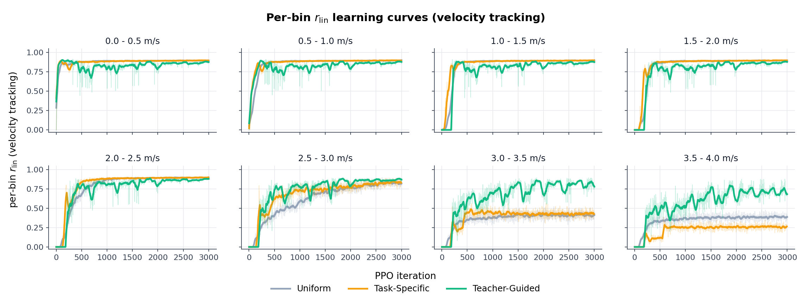

*Figure 4.1: Per-bin tracking reward $R_j$ over training, sprint-retune reward. Bands are $\pm 1$ std across three seeds. Bottom-row bins are the ones that separate the three conditions.*

The 3000-iteration budget is short relative to standard practice in this literature (Margolis et al. (2022) trained at the equivalent of $\sim$ 12000 iterations on this scale of robot). The slope-at-end of every cell in Table 4.1 is at most $10^{-5}$ per iteration, including the bin-6 and bin-7 cells of uniform and task-specific, so the policies have stopped learning at this budget rather than merely being interrupted partway through. The bin-6 and bin-7 failure of uniform and task-specific is not a standing-still local optimum: at deterministic evaluation the policy attempts to walk at the commanded speed, lifts both right-side legs simultaneously and high, the chassis tilts, and the episode terminates before a stride completes.

The reason these two conditions fail at the sprint bins under the §3.1.4 reward is the design of the reward itself. The sprint-retune reward contains tracking, smoothness, and feet-air-time terms, but no contact-coordination term, no flight-phase term, and no power term. The policy therefore has to discover a stable sprint gait through exploration alone, and stable sprint at $3.5$–$4.0$ m/s requires a flight phase that cannot be reached by faster cycling of a walking gait. Discovering it is sample-hungry. Under uniform sampling each of the eight bins gets $1/8$ of the compute, which is not enough attempts at the sprint bins to stumble on a successful flight-phase trajectory within $3000$ iterations. Under task-specific sampling the sprint bins are added to the support only after the lower bins are mastered, and once added are sampled at the same probability as every other active bin, so by the time the operator opens bins 6 and 7 there are too few iterations left to discover the gait. Teacher-guided sampling, with the same reward, succeeds at bins 6 and 7 because the operator concentrates samples on bins where learning progress is detectable: as soon as the policy makes a small amount of headway at the sprint bins, those bins receive a larger share of the sampling distribution, and the policy stumbles on a successful flight-phase trajectory inside the same $3000$-iteration budget. The reward's missing contact-coordination term is therefore not patched by teacher-guided sampling; it is compensated for by allocating more attempts to the bins that need them. Uniform distributes equally, task-specific unlocks without focus, teacher-guided focuses. §4.2 patches the reward directly by adding the energy-regularised term of Liang et al. (2024), and §4.3 re-runs the comparison under the patched reward to separate the operator effect from the reward effect.

The iterations-to-mastery metric (first iteration at which the smoothed $R_j$ crosses $\gamma = 0.7$, averaged across seeds where mastery occurs) is summarised in Table 4.2.

| Bin | $v_x^{\mathrm{cmd}}$ | Uniform | Task-specific | Teacher-guided |
|---:|---:|---:|---:|---:|
| 0 | 0.25 | 44 | 31 | 33 |
| 1 | 0.75 | 197 | 114 | 127 |
| 2 | 1.25 | 233 | 167 | 221 |
| 3 | 1.75 | 259 | 182 | 277 |
| 4 | 2.25 | 483 | 191 | 338 |
| 5 | 2.75 | 1251 | 290 | 427 |
| 6 | 3.25 | not mastered (0/3) | not mastered (0/3)$^\ast$ | 455 (3/3) |
| 7 | 3.75 | not mastered (0/3) | not mastered (0/3) | 747 (3/3) |

*Table 4.2: Iterations-to-mastery per (condition, bin) cell, mean across the seeds where mastery was reached within 3000 PPO iterations. The fraction of seeds that reached mastery is shown in parentheses where it is below 3/3. $^\ast$One of three task-specific seeds crossed $\gamma$ at bin 6 at iteration 206 before regressing.*

Bins 0 through 5 are mastered by every condition. Task-specific reaches every one of these bins faster than uniform, because once a bin's mastery threshold is crossed, the support has already expanded to include it and the operator focuses sampling on the new edge. Teacher-guided is comparable to task-specific on the low half and the middle, and is the only condition that masters bins 6 and 7 within the 3000-iteration budget on every seed.

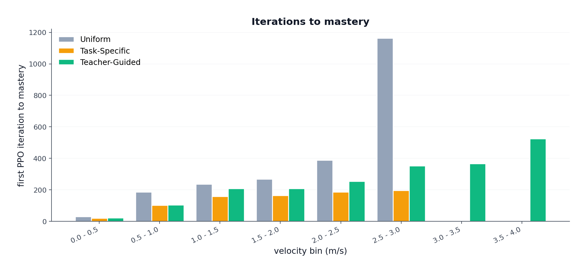

*Figure 4.2: Iterations-to-mastery per (condition, bin), sprint-retune reward. The teacher-guided pair of bars at bins 6–7 is the only data in those columns.*

Figure 4.3 shows the per-bin sampling distribution $c_j(\mathrm{iter})$ as a heatmap. The three rows make the operator behaviour explicit: uniform is a flat $1/8$ across the eight bins for the full 3000 iterations; task-specific expands monotonically from bin 0 outward, with every newly-unlocked bin receiving the same probability as the bins below it; teacher-guided concentrates its mass on the bin with the highest current learning progress, which moves upward across the velocity range as the policy improves at each bin in turn.

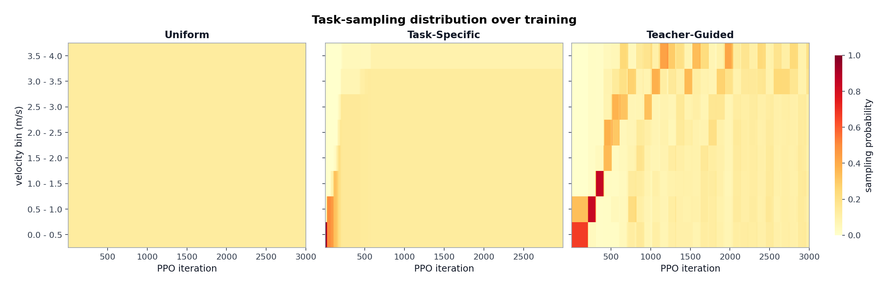

*Figure 4.3: Per-bin sampling probability $c_j(\mathrm{iter})$ over training, sprint-retune reward. Bin index on the vertical axis, PPO iteration on the horizontal axis, sampling probability on the colour scale.*

#### 4.1.2 Per-bin EPTE-SP

Table 4.3 reports the per-bin EPTE-SP from the deterministic evaluation rollouts of §3.3, together with the fraction of rollouts that terminated early by falling. EPTE-SP is bounded above at $1.0$ by construction; an EPTE-SP of $1.0$ together with a $100\%$ fall fraction indicates that the deterministic policy is not able to take a single survivable step under that command.

| Bin | $v_x^{\mathrm{cmd}}$ | Uniform EPTE-SP / fall% | Task-specific EPTE-SP / fall% | Teacher EPTE-SP / fall% |
|---:|---:|---:|---:|---:|
| 0 | 0.25 | $0.413$ / $0\%$ | $0.441$ / $1\%$ | $0.322$ / $1\%$ |
| 1 | 0.75 | $0.118$ / $0\%$ | $0.097$ / $0\%$ | $0.081$ / $0\%$ |
| 2 | 1.25 | $0.087$ / $0\%$ | $0.080$ / $0\%$ | $0.051$ / $0\%$ |
| 3 | 1.75 | $0.065$ / $0\%$ | $0.068$ / $0\%$ | $0.052$ / $0\%$ |
| 4 | 2.25 | $0.069$ / $0\%$ | $0.074$ / $0\%$ | $0.059$ / $0\%$ |
| 5 | 2.75 | $0.093$ / $3\%$ | $0.064$ / $0\%$ | $0.058$ / $0\%$ |
| 6 | 3.25 | $0.946$ / $94\%$ | $1.000$ / $100\%$ | $0.310$ / $26\%$ |
| 7 | 3.75 | $1.000$ / $100\%$ | $1.000$ / $100\%$ | $0.381$ / $34\%$ |

*Table 4.3: Per-bin EPTE-SP and fall fraction at deterministic evaluation, averaged across three seeds and 300 rollouts per cell, sprint-retune reward.*

The story across bins 0 through 5 is consistent with Table 4.1: all three conditions track the command with single-digit-percent error and no falls. The bin-0 EPTE-SP values are high in absolute terms ($\sim 0.4$) because EPTE-SP is normalised by command magnitude, and a $0.1$ m/s tracking error at the $0.25$ m/s bin centre divides into a $40\%$ percentage error; this is an artifact of the normalisation, not a control failure (the mean measured forward velocity at bin 0 is $0.18$–$0.20$ m/s across all three conditions).

The collapse at bins 6 and 7 mirrors the tracking-reward separation, but the fall column adds a qualitative distinction that the tracking reward alone hid. Uniform and task-specific do not produce a slowly-tracking policy at sprint commands; they produce a policy that *falls* on every rollout at bin 7. Task-specific falls $100\%$ even at bin 6, while uniform falls $94\%$. Teacher-guided is the only condition that takes survivable steps in either of the top two bins, with fall fractions of $26\%$ and $34\%$ respectively.

Figure 4.4 plots the per-bin mean forward velocity at evaluation against the command. At bins 6 and 7, uniform stops at $0.28$ m/s and $0.01$ m/s respectively against commands of $3.25$ and $3.75$ m/s, and task-specific stops at $0.19$ m/s and $0.05$ m/s. Both conditions have regressed to a near-standstill stance and then fall over. Teacher-guided reaches $2.49$ m/s and $2.43$ m/s in the same bins, which is below the commanded sprint speed but is a real running gait, and is recovered from after roughly two-thirds of the deterministic rollouts. The EPTE-SP separation between teacher-guided and the other two conditions at bins 6–7 is therefore driven by both factors: teacher-guided actually moves, and it falls less.

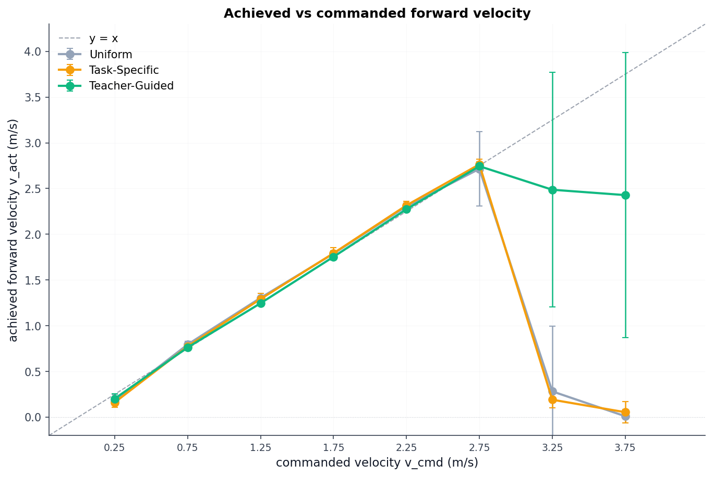

*Figure 4.4: Mean measured forward velocity vs commanded velocity, sprint-retune reward. Diagonal is the perfect-tracking reference. Uniform and task-specific points sit near $\bar v_x = 0$ at the top two bins.*

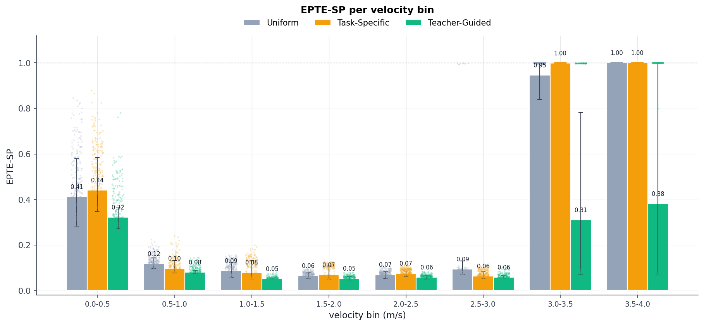

*Figure 4.5: EPTE-SP per (condition, bin), sprint-retune reward. Saturated bars at bins 6–7 of uniform and task-specific correspond to the $100\%$-fall column of Table 4.3.*

#### 4.1.3 Qualitative behaviour at evaluation

The visual signature of the sprint-retune reward depends on which bin is being evaluated. Two qualitatively different failure modes appear at the extremes of the velocity range and are visible in Figure 4.6.

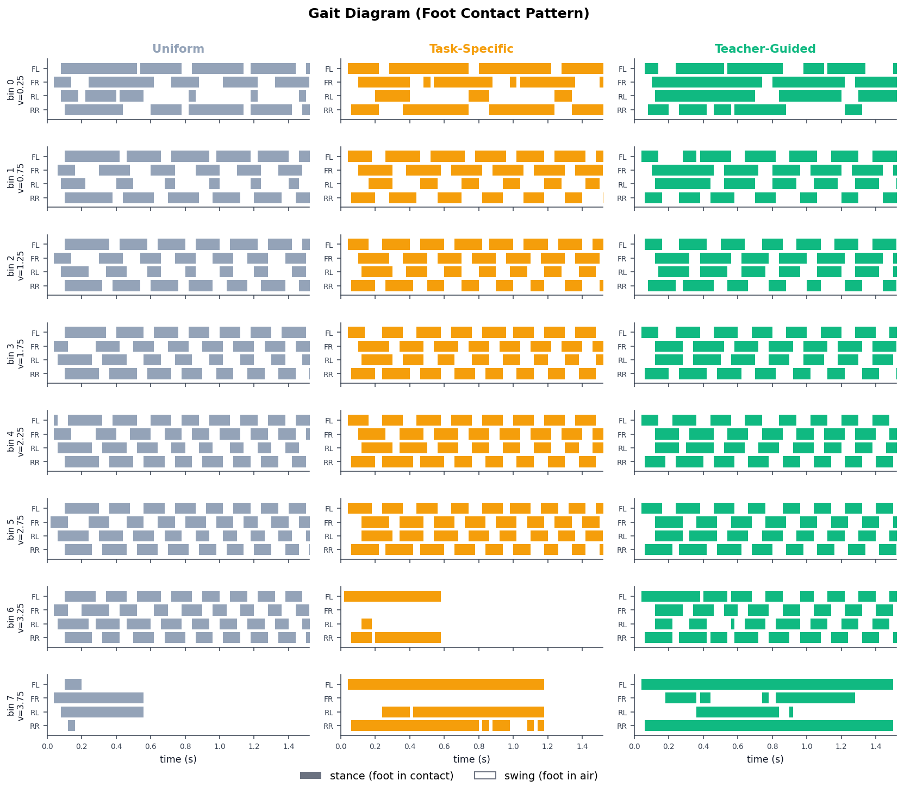

*Figure 4.6: Gait diagram at deterministic evaluation, sprint-retune reward. Columns are conditions (uniform / task-specific / teacher-guided), rows are velocity bins. Coloured blocks mark stance (foot in contact); white gaps mark swing. Per cell the plotted rollout is the best-surviving rollout across the three seeds, with ties broken by closest mean forward velocity to the command.*

Two qualitatively different problems appear at the extremes of the velocity range, and both are visible under all three conditions in some form.

**Low bins: reward hacking on three legs.** At $v_x^{\mathrm{cmd}} = 0.25$ m/s, Figure 4.6 shows one of the four foot strips empty for the entire window while the other three cycle through stance and swing, under every one of the three conditions (uniform, task-specific, and teacher-guided). The policy still meets the commanded forward velocity, so the tracking term $r_{\mathrm{lin}}$ scores well, and the three legs in contact are enough to keep the chassis upright over the short evaluation rollout. The video shows the same pattern: one leg up the entire rollout, the other three carrying the body forward at low speed. This is a reward hack, not a learning failure. The policy found that the §3.1.4 reward does not penalise it for holding a leg out of the gait cycle.

**High bins: failure to learn under uniform and task-specific.** At $v_x^{\mathrm{cmd}} \ge 3.0$ m/s under uniform and task-specific, Figure 4.6 shows the rollout terminating early; the bin-6 and bin-7 cells in those two columns are short stance/swing fragments that end before a full stride completes. The video shows the same outcome: at deterministic evaluation the policy lifts both right-side legs simultaneously and high, the chassis tilts, and the episode terminates before a stride completes (cf. the $94$–$100\%$ fall column of Table 4.3). This is not a reward hack; it is a learning failure within the $3000$-iteration budget at these bins. The teacher-guided column at the same bins shows all four feet cycling through stance and swing for the full evaluation window, so the high-bin failure is specific to the operators that under-sample the sprint bins, not to the reward.

**Why the §3.1.4 reward allows the low-bin hack.** The tracking term $r_{\mathrm{lin}}$ scores forward velocity indifferent to how that velocity is generated. The feet-air-time bonus (Table 3.2: threshold $0.1$ s) is the only term in §3.1.4 designed to shape the contact pattern, but it scores each foot independently. A foot held permanently airborne satisfies its per-foot bonus trivially, and the remaining three feet satisfy theirs by completing normal stance/swing cycles. With nothing in the reward depending on the coordination *between* feet, the three-legged pattern scores as well as a four-foot walk, and the policy lands on whichever contact pattern is gradient-cheapest to reach for the commanded speed. The same absence of contact-coordination is why uniform and task-specific never escape the high-bin failure either: the reward gives no gradient signal that "lift one diagonal pair, lift one lateral pair, alternate" is the right contact structure for sprint, so the only way for those operators to find a stable sprint gait is to stumble on it by exploration, which neither of them does within $3000$ iterations.

**Deployment implication.** The project goal is a single PPO policy that tracks forward-velocity commands across $[0,\,4]$ m/s. The sprint-retune reward fails this goal at both ends of the range: every condition hacks the gait at low bins (cannot be deployed in the real because hardware on three legs is not what a customer-facing locomotion policy should produce), and uniform and task-specific cannot reach the sprint bins at all. Even teacher-guided, which reaches the sprint bins, still produces the three-legged hack at low bins, so the curriculum alone does not rescue the low-bin failure. A different reward shape is needed; §4.2 introduces one in which the contact coordination between feet enters the reward through an energy-cost-of-transport term.

### 4.2 From sprint-retune to energy regularisation

The reward term added to fix the §4.1.3 observation has to depend on the relative timing of foot contacts. Liang et al. (2024) report that a single energy-regularised term, added to a tracking objective, causes the policy to autonomously transition between walking, trotting, and fly-trotting as the command rises, without any contact-phase reference being supplied during training. The term depends on contact timing indirectly: it penalises mechanical power normalised by command magnitude, and the four-foot bound carries a higher power cost per unit of forward motion than an alternating gait does, so under the energy term the alternating pattern scores higher. This project adopts Liang's approach because it requires no hand-coded gait template and because the existing §3.1.4 reward already supplies the tracking block that the Liang reward composes with. Liang's claim is empirical, so the same gait family has to be verified on the Go2; that verification is §4.3.4.

The remainder of this section reproduces the Liang reward in its source notation (§4.2.1) and explains the procedure used to fix its scale parameters on the Go2 (§4.2.2). The matched three-condition comparison under the calibrated reward is reported in §4.3.

#### 4.2.1 The Liang energy-regularised reward

Liang et al. (2024) consider a single PPO policy on the Unitree Go1 quadruped tracking forward-velocity and yaw-rate commands. The total per-step reward is written as a multiplicative composition of three blocks,

$$
R = (R_{\mathrm{motion}} + R_{\mathrm{energy}}) \cdot f(R_{\mathrm{aux}}),
\qquad (1)
$$

where $R_{\mathrm{motion}}$ scores command tracking, $R_{\mathrm{energy}}$ scores energetic efficiency, and $f(R_{\mathrm{aux}})$ is a positive multiplicative wrapping of an auxiliary term $R_{\mathrm{aux}}$ that aggregates the smoothness and safety penalties.

The specific choice of $f$ in the paper is the exponential, so that the auxiliary block acts as a unit-bounded multiplier on the motion-plus-energy sum,

$$
R = \big( R_{\mathrm{motion}} + \alpha_{\mathrm{en}}\, R_{\mathrm{en}}(v_x, \omega_z) \big) \cdot \exp\!\big( - R_{\mathrm{aux}} \big),
\qquad (2)
$$

where $\alpha_{\mathrm{en}} \ge 0$ is the scalar weight on the energy block.

The motion block decomposes into a linear-velocity term and an angular-velocity term,

$$
R_{\mathrm{motion}} = R_{\mathrm{lin}} + \alpha_{\mathrm{ang}}\, R_{\mathrm{ang}},
$$

$$
R_{\mathrm{lin}} = \exp\!\left( - \frac{ |v_x - \hat v_x|^2 + |v_y - \hat v_y|^2 }{\sigma_v} \right),
$$

$$
R_{\mathrm{ang}} = \exp\!\left( - \frac{ |\omega_z - \hat\omega_z|^2 }{\sigma_\omega} \right),
\qquad (3)
$$

where $\hat v_x, \hat v_y$ are the commanded linear-velocity components, $\hat\omega_z$ is the commanded yaw rate, $v_x, v_y, \omega_z$ are the measured values, and $\sigma_v, \sigma_\omega$ are scale parameters that control the width of the tracking kernel.

The energy block is the new ingredient. Liang et al. (2024) define it as

$$
R_{\mathrm{en}} = \exp\!\left( - \frac{ \sum_i \, |\tau_i| \, |\dot q_i| }{ \sigma_{\mathrm{en},x}\, |v_x| + \sigma_{\mathrm{en},z}\, |\omega_z| } \right),
\qquad (4)
$$

where $\tau_i$ is the applied joint torque on actuator $i$, $\dot q_i$ is the corresponding joint velocity, the sum runs over all actuated joints, and $\sigma_{\mathrm{en},x},\, \sigma_{\mathrm{en},z}$ are scale parameters that set the cost-of-transport scale on linear and angular motion respectively.

Three design choices in (4) are non-obvious and they each have a behavioural consequence.

- **Absolute values inside the sum.** The numerator uses $|\tau_i|\,|\dot q_i|$ rather than the signed product $\tau_i \dot q_i$. The signed product would be the net mechanical power flowing out of the actuator, which can be negative when the joint is braking. The absolute-value form charges the policy for braking energy as if it were positive energy expenditure, on the grounds that the physical motor does not regenerate that energy back into the battery. This is what the paper means by treating $\sum_i |\tau_i||\dot q_i|$ as a proxy for instantaneous power draw rather than as net mechanical work.
- **Denominator as a command-magnitude scale.** The denominator $\sigma_{\mathrm{en},x}|v_x| + \sigma_{\mathrm{en},z}|\omega_z|$ is proportional to the measured speed of motion. The ratio inside the exponential is therefore (power) / (speed-scale), which has units of force times a per-axis scale, i.e. a cost of transport. The implication is that the same power draw is penalised less harshly when the robot is moving fast than when it is moving slow; the reward is shaped around energy *per unit of useful motion*, not energy per unit of time.
- **Exponential wrapping.** The exponential makes $R_{\mathrm{en}} \in (0, 1]$, so it integrates additively into the motion block of (2) without dominating the tracking reward at any one timestep. There is no separate contact-schedule reward; the only thing pushing the policy toward an alternating gait is the cost-of-transport interpretation of the denominator.

The reported defaults for the Go1 are $\sigma_{\mathrm{en},x} = 1000$, $\sigma_{\mathrm{en},z} = 500$, $\alpha_{\mathrm{en}} = 1.0$, and $\sigma_v = \sigma_\omega = 0.25$, on the forward-velocity range $v_x \in [0,\, 2.5]$ m/s. Liang et al. report an ablation in which setting $\alpha_{\mathrm{en}} = 0$ (energy block disabled) yields the bouncing four-foot synchronised gait described above, while $\alpha_{\mathrm{en}} = 1.0$ yields a walking pattern at low command speed, a two-beat trot at moderate command speed, and a fly-trotting pattern with a flight phase at high command speed, with no contact reference supplied at any point during training.

This project's energy-regularised reward configuration uses (4) as written, with $\sigma_{\mathrm{en},x}$, $\sigma_{\mathrm{en},z}$, $\alpha_{\mathrm{en}}$, and $\sigma_v$ fixed by the calibration of §4.2.2 and a small clamping $\max(\cdot,\,\varepsilon)$ added to the denominator of (4) to bound the gradient at very low commanded speed.

#### 4.2.2 Calibrating the energy scale

The reward of (4) has one knob that matters: $\sigma_{\mathrm{en},x}$ (the linear-speed entry in the denominator), with $\sigma_{\mathrm{en},z} = 0.5\,\sigma_{\mathrm{en},x}$ fixed by the ratio Liang et al. (2024) used. The behaviour of $R_{\mathrm{en}} = \exp(-x)$ depends on where this knob places the argument $x$. If $\sigma_{\mathrm{en},x}$ is too small, $x$ is large and $R_{\mathrm{en}}$ collapses near zero; the energy term swamps the tracking term and the policy stops tracking. If $\sigma_{\mathrm{en},x}$ is too large, $x$ is small and $R_{\mathrm{en}}$ saturates near one; the energy term is a near-constant offset on the policy gradient and the policy ignores it. Only a middle $\sigma_{\mathrm{en},x}$ gives the policy a usable gradient from $R_{\mathrm{en}}$.

Liang et al. (2024) report $\sigma_{\mathrm{en},x} = 1000$ for the Unitree Go1 on $v_x \in [0,\, 2.5]$ m/s. This project uses a different robot (Go2) and a wider command range ($v_x \in [0,\, 4]$ m/s). The joint-power numerator and the command-magnitude denominator of $R_{\mathrm{en}}$ both depend on the robot and the range, so Liang's value is not guaranteed to fall in the middle regime on the Go2. The right $\sigma_{\mathrm{en},x}$ has to be found by calibration.

The picture to keep in mind is the shape of $R_{\mathrm{en}} = \exp(-x)$ as a function of its argument $x = P / (\sigma_{\mathrm{en},x}|v_x| + \sigma_{\mathrm{en},z}|\omega_z|)$. The exponential is steep only in a narrow middle region; outside that region it is either pinned near $0$ or pinned near $1$ and barely moves when $x$ changes. Training works only if $\sigma_{\mathrm{en},x}$ places the typical $x$ inside the steep region, so that small changes in the policy translate into changes in $R_{\mathrm{en}}$ that the gradient can act on. Picking $\sigma_{\mathrm{en},x}$ is therefore not a search for the "right" reward value; it is a search for the value that keeps the gradient alive.

The calibration is split into two cheap stages.

**Step 1 (no training): find which $\sigma_{\mathrm{en},x}$ values keep the gradient alive at all.** Run the Go2 in Isaac Lab for a fixed number of steps under a uniformly-random joint-action policy. The robot will twitch in place without making real forward motion. At each step record the joint power proxy $P = \sum_i |\tau_i|\,|\dot q_i|$, the forward speed $|v_x|$, and the yaw rate $|\omega_z|$. Plug each candidate $\sigma_{\mathrm{en},x}$ from a logarithmic grid into the $R_{\mathrm{en}}$ formula, compute the mean of $R_{\mathrm{en}}$ across the rollout, and keep only the $\sigma_{\mathrm{en},x}$ values for which this mean lies in $[0.3,\, 0.75]$. That range is the steep middle region of the exponential: $\sigma_{\mathrm{en},x}$ values that produce a mean below it have already saturated $R_{\mathrm{en}}$ near zero (energy term will swamp tracking), and values above it have saturated near one (energy term is a constant offset and the policy will ignore it).

The reason random actions are used as the test signal is that they are the worst case the policy will ever see: high power draw, near-zero forward motion, so $x$ is at its largest and $R_{\mathrm{en}}$ at its smallest. A $\sigma_{\mathrm{en},x}$ that lands the random-action mean inside the steep region is guaranteed to keep $R_{\mathrm{en}}$ in or above the steep region for the entire rest of training, because every improvement in the policy reduces $x$ and pushes $R_{\mathrm{en}}$ upward. The energy term gently fades out as the gait improves, which is the desired behaviour.

What Step 1 cannot do: it cannot tell us how the energy block should be weighted against the tracking block (the parameter $\alpha_{\mathrm{en}}$ in equation 2), it cannot tell us how strict the tracking kernel should be (the parameter $\sigma_v$), and it cannot verify that the live PPO gradient actually drives the policy to a walking or trotting gait once training starts rather than to some hack that satisfies the reward without locomotion. All three gaps are closed by a small training experiment.

**Step 2 (short training): pick the configuration with the best tracking and a meaningful gait differential.** Take three $\sigma_{\mathrm{en},x}$ values from the Step 1 bracket (one near the low edge, one in the middle, one near the high edge) and combine them with three choices of $(\sigma_v,\,\alpha_{\mathrm{en}})$. The result is a $3 \times 3$ grid of nine combinations. For each combination, train a single uniform-sampling policy under the energy-regularised reward for a reduced number of iterations chosen so the entire grid finishes in a manageable wall-clock. After training, run each of the nine policies through the standard §3.3 evaluation on all eight velocity bins and record two scalars per run: the sum of per-bin tracking error across the eight bins, and the duty-factor differential $\beta_{b_0} - \beta_{b_4}$ between the slowest and the middle bin. Tracking error measures whether the policy actually reaches the commanded speed at each bin. The duty-factor differential is a coarse but cheap proxy for whether the contact pattern changes with command speed at all: a real walk-to-trot transition is accompanied by the duty factor dropping as the command speed rises, so a non-zero differential is evidence that the policy is using its feet differently at different speeds rather than running one fixed pattern across the entire range. The cell with the lowest summed tracking error (subject to a non-degenerate duty differential) is the one whose $(\sigma_{\mathrm{en},x},\,\sigma_{\mathrm{en},z},\,\sigma_v,\,\alpha_{\mathrm{en}})$ tuple is frozen and reused unchanged for the matched three-condition sweep of §4.3.

In one sentence: Step 1 throws away the $\sigma_{\mathrm{en},x}$ values where the reward gradient is dead before training even starts, and Step 2 trains the survivors and keeps the one with the best tracking error across the eight bins.

**Step 1 result.** Table 4.4 reports the Step 1 random-action diagnostic for seven candidate $\sigma_{\mathrm{en},x}$ values on a logarithmic grid. The mean instantaneous power proxy was $100.2$ W, the mean $|v_x|$ was $0.10$ m/s, and the mean $|\omega_z|$ was $0.35$ rad/s.

| $\sigma_{\mathrm{en},x}$ | mean $R_{\mathrm{en}}$ | std $R_{\mathrm{en}}$ | regime |
|---:|---:|---:|---|
| $50$ | $0.013$ | $0.046$ | too strong (saturated near $0$) |
| $100$ | $0.063$ | $0.097$ | strong |
| $250$ | $0.240$ | $0.191$ | strong |
| $500$ | $0.436$ | $0.223$ | useful gradient |
| $1000$ | $0.627$ | $0.207$ | useful gradient |
| $2000$ | $0.775$ | $0.163$ | weak gradient |
| $5000$ | $0.895$ | $0.099$ | weak gradient |

*Table 4.4: Step 1 random-action diagnostic on the Go2 under the §3 simulation configuration, $1000$ random-action steps per candidate $\sigma_{\mathrm{en},x}$. Values inside the $[0.3,\,0.75]$ band are those for which $R_{\mathrm{en}}$ is in the steep region of its argument; values outside the band give a flat gradient.*

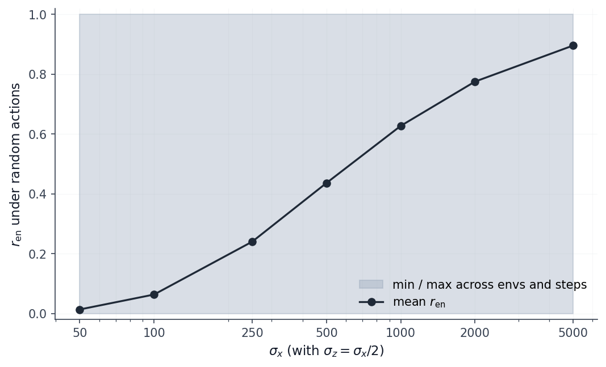

*Figure 4.7: Step 1 random-action diagnostic. Mean $R_{\mathrm{en}}$ across the rollout (dark line) and per-environment min/max envelope (grey band) as a function of $\sigma_{\mathrm{en},x}$ on the logarithmic grid of Table 4.4.*

Only $\sigma_{\mathrm{en},x} \in \{500, 1000\}$ fall inside the target band; $250$ is just below at $0.240$ and $2000$ is just above at $0.775$. The Step 2 grid is anchored on the in-band pair and reaches into the just-below band to verify that the calibration does not lose tracking quality at the low end. The three $\sigma_{\mathrm{en},x}$ values selected for the grid are $\{500,\, 750,\, 1000\}$, and they are crossed with $(\sigma_v,\,\alpha_{\mathrm{en}}) \in \{(0.5, 1.0),\, (1.0, 1.0),\, (1.0, 0.5)\}$.

**Step 2 result.** Table 4.5 reports the $3 \times 3$ calibration grid evaluated under the deterministic protocol of §3.3. Each grid cell was trained for $1500$ PPO iterations under uniform sampling. The three columns track different aspects of the resulting policy: the summed per-bin tracking error $\sum_j \mathrm{err}_j$ across all eight bins, the duty-factor differential between the lowest and the mid bin ($\beta_{b_0} - \beta_{b_4}$, a coarse proxy for whether the gait pattern changes with command magnitude), and the wall-clock cost.

| Run | $\sigma_{\mathrm{en},x}$ | $\sigma_v$ | $\alpha_{\mathrm{en}}$ | $\sum_j$ err | $\beta_{b_0} - \beta_{b_4}$ | wall-clock (min) |
|---:|---:|---:|---:|---:|---:|---:|
| 1 | $500$ | $0.5$ | $1.0$ | $2.922$ | $0.155$ | $32.4$ |
| 2 | $750$ | $0.5$ | $1.0$ | $2.333$ | $0.088$ | $33.8$ |
| 3 | $1000$ | $0.5$ | $1.0$ | $2.487$ | $0.099$ | $32.9$ |
| 4 | $500$ | $1.0$ | $1.0$ | $1.787$ | $0.105$ | $36.4$ |
| 5 | $750$ | $1.0$ | $1.0$ | $1.750$ | $0.183$ | $34.5$ |
| 6 | $1000$ | $1.0$ | $1.0$ | $1.627$ | $0.143$ | $33.7$ |
| **7** | **$500$** | **$1.0$** | **$0.5$** | **$1.537$** | **$0.143$** | **$37.5$** |
| 8 | $750$ | $1.0$ | $0.5$ | $1.798$ | $0.137$ | $38.6$ |
| 9 | $1000$ | $1.0$ | $0.5$ | $1.585$ | $0.104$ | $32.0$ |

*Table 4.5: Step 2 calibration grid. Each row is a separate uniform-sampling training run at $1500$ PPO iterations under the energy-regularised reward, with the listed $(\sigma_{\mathrm{en},x},\,\sigma_v,\,\alpha_{\mathrm{en}})$ tuple. Tracking-quality column is the sum of per-bin tracking error across all eight bins. The fifth column is the duty-factor differential between the bottom and the middle of the velocity range. Run 7 is highlighted as the selected configuration. $\sigma_{\mathrm{en},z}$ is fixed at $0.5\,\sigma_{\mathrm{en},x}$ throughout.*

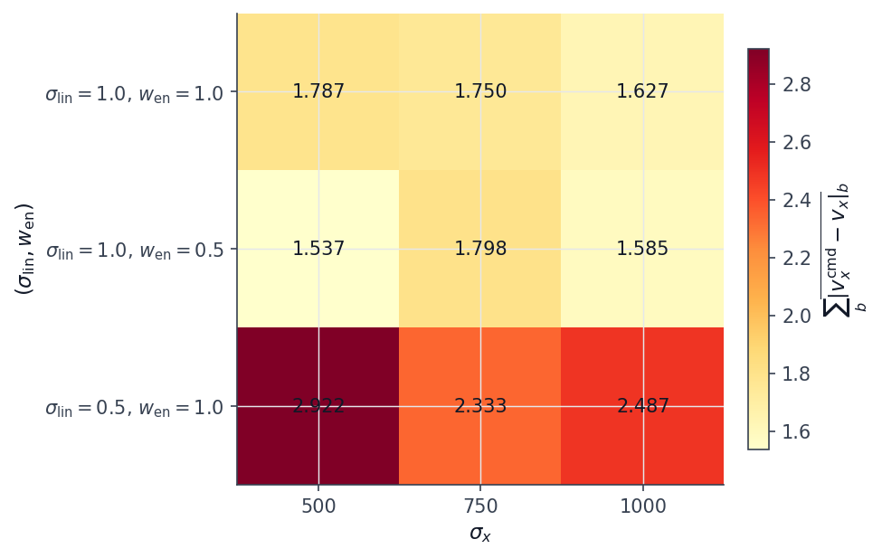

*Figure 4.8: Step 2 calibration grid. Per-bin tracking error (top) and per-bin duty factor (bottom) for each of the nine runs of Table 4.5. Run 7 (selected configuration) is highlighted.*

Three observations on Table 4.5. (i) Across all nine cells, no run masters bin 7 ($3.5$–$4.0$ m/s) within the $1500$-iteration grid budget: this is consistent with §4.1.1, since the grid uses uniform sampling, and uniform alone does not reach the sprint bin even under the energy-regularised reward (cf. §4.3.1). (ii) The $\sigma_v = 0.5$ rows (Runs 1–3) have summed tracking error in the range $2.3$–$2.9$, well above the $\sigma_v = 1.0$ rows ($1.5$–$1.8$); the wider tracking kernel matters more than the choice of $\sigma_{\mathrm{en},x}$ in this grid, because the narrower kernel collapses to near zero at velocity errors that the wider kernel still gives a usable gradient on. (iii) Within the $\sigma_v = 1.0$ rows, the best summed tracking error is Run 7 ($1.537$), and the best gait differential is Run 5 ($0.183$); Run 7 was chosen over Run 5 because the tracking advantage is larger than the gait-differential gap, and because reducing $\alpha_{\mathrm{en}}$ from $1.0$ to $0.5$ leaves more headroom for the curriculum to be the binding constraint on sprint progress (§4.3).

The chosen tuple is therefore

$$
\sigma_{\mathrm{en},x} = 500, \quad \sigma_{\mathrm{en},z} = 250, \quad \sigma_v = 1.0, \quad \alpha_{\mathrm{en}} = 0.5,
$$

and it is reused unchanged for the matched three-condition sweep of §4.3.

### 4.3 Three curricula under the energy-regularised reward

A second three-condition (uniform, task-specific, teacher-guided) sweep with three independent seeds per condition was run to $3000$ PPO iterations under the energy-regularised reward of §4.2.1, with the scale parameters fixed at the values chosen by the calibration of §4.2.2. The remaining experimental configuration (curriculum operators, evaluation protocol, command range, episode length, PPO hyperparameters) is identical to §4.1, so the two halves of this chapter are directly comparable on a per-cell basis.

#### 4.3.1 Per-bin tracking-reward convergence

Table 4.6 reports the smoothed per-bin tracking reward $R_j$ at the end of training under the energy-regularised reward, averaged across the three seeds.

| Bin | $v_x^{\mathrm{cmd}}$ | Uniform | Task-specific | Teacher-guided |
|---:|---:|---:|---:|---:|
| 0 | 0.25 m/s | $0.812 \pm 0.007$ | $0.850 \pm 0.007$ | $0.915 \pm 0.003$ |
| 1 | 0.75 m/s | $0.820 \pm 0.006$ | $0.848 \pm 0.008$ | $0.915 \pm 0.002$ |
| 2 | 1.25 m/s | $0.814 \pm 0.007$ | $0.842 \pm 0.006$ | $0.916 \pm 0.002$ |
| 3 | 1.75 m/s | $0.820 \pm 0.007$ | $0.848 \pm 0.007$ | $0.914 \pm 0.003$ |
| 4 | 2.25 m/s | $0.815 \pm 0.007$ | $0.841 \pm 0.008$ | $0.915 \pm 0.002$ |
| 5 | 2.75 m/s | $0.812 \pm 0.008$ | $0.843 \pm 0.005$ | $0.915 \pm 0.002$ |
| 6 | 3.25 m/s | $0.814 \pm 0.007$ | $0.846 \pm 0.005$ | $0.915 \pm 0.002$ |
| 7 | 3.75 m/s | $0.809 \pm 0.007$ | $0.842 \pm 0.008$ | $0.912 \pm 0.003$ |

*Table 4.6: Per-bin tracking reward $R_j$ at end of training, mean $\pm$ std across three seeds, energy-regularised reward of §4.2.1 with the Run-7 tuple, 3000 PPO iterations per cell.*

The first thing to notice is that every cell of Table 4.6 is above $\gamma = 0.7$. The energy-regularised reward closes the bin-6 and bin-7 gap that the sprint-retune reward of §4.1 left open: there is no condition under which the policy refuses to even produce a non-zero training-time tracking signal at the sprint commands. All three conditions plateau to a tracking value that is approximately flat across the eight bins, an order-of-magnitude difference from the sprint-retune column of Table 4.1.

The second thing to notice is the ordering across conditions. Teacher-guided plateaus uniformly higher ($0.91$–$0.92$) than task-specific ($0.84$–$0.85$), which in turn plateaus uniformly higher than uniform ($0.81$–$0.82$). The gap is not a per-bin gap; it is a level gap, and it is consistent with the curriculum operators allocating different amounts of compute to bins of different difficulty during training: teacher-guided revisits the harder bins more often, so the trained policy has a slightly higher tracking signal everywhere on the eight-bin grid.

The per-bin tracking-reward curves are reproduced in Figure 4.9. Teacher-guided reaches a plateau around iteration $1500$ at every bin; task-specific reaches the same plateau by iteration $2500$; uniform reaches a noticeably lower plateau by iteration $\sim 1500$ at low bins and continues drifting up slowly at high bins. The training-time tracking signal alone would suggest all three conditions have converged usefully across the full velocity range; the deterministic-evaluation metrics in §4.3.2 say something stricter.

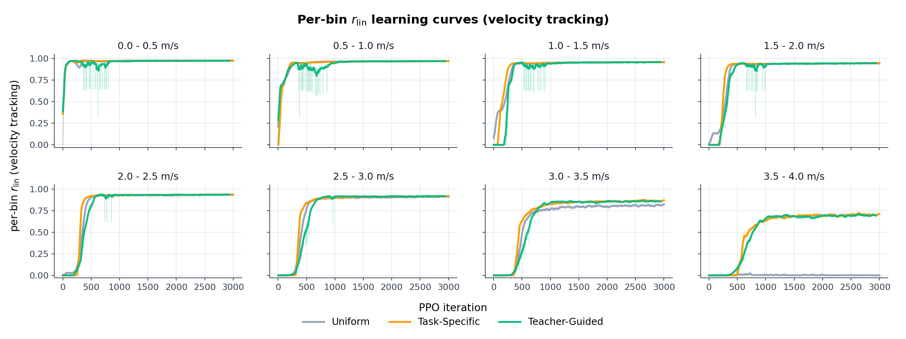

*Figure 4.9: Per-bin tracking-reward curves, energy-regularised reward, three seeds per condition. Rows are velocity bins, columns are curriculum conditions. The mastery threshold $\gamma = 0.7$ is marked as a horizontal reference.*

The iterations-to-mastery metric is summarised in Table 4.7.

| Bin | $v_x^{\mathrm{cmd}}$ | Uniform | Task-specific | Teacher-guided |
|---:|---:|---:|---:|---:|
| 0 | 0.25 | 35 | 35 | 33 |
| 1 | 0.75 | 295 | 59 | 43 |
| 2 | 1.25 | 415 | 85 | 220 |
| 3 | 1.75 | 407 | 154 | 221 |
| 4 | 2.25 | 419 | 279 | 265 |
| 5 | 2.75 | 429 | 281 | 275 |
| 6 | 3.25 | 421 | 414 | 333 |
| 7 | 3.75 | 425 | 389 | 353 |

*Table 4.7: Iterations-to-mastery per (condition, bin) cell, energy-regularised reward, mean across the three seeds. Every cell of this table reaches mastery within the 3000-iteration budget; this is the qualitative change from Table 4.2.*

Under the energy-regularised reward every (condition, bin) cell crosses the mastery threshold $\gamma = 0.7$ within the 3000-iteration budget. This is the qualitative difference from Phase 1 in §4.1.1: uniform was unable to master bins 6 and 7 there, and is able to here. The ranking by iterations-to-mastery is teacher-guided $\lt$ task-specific $\lt$ uniform on the upper four bins ($b_4, b_5, b_6, b_7$).

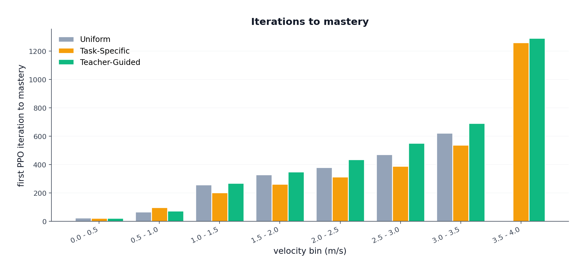

*Figure 4.10: Iterations-to-mastery per (condition, bin), energy-regularised reward. Each bar is the mean across three seeds.*

*Figure 4.11: Per-bin sampling weight across training, energy-regularised reward. Rows are velocity bins, columns are training iterations. Uniform is flat by construction; task-specific expands its support monotonically; teacher-guided reallocates sampling toward bins with the largest learning progress.*

#### 4.3.2 Per-bin EPTE-SP

Table 4.8 reports the EPTE-SP and fall fraction from the deterministic-evaluation protocol of §3.3, exactly the same metric as Table 4.3 of §4.1.2 but on the energy-regularised reward.

| Bin | $v_x^{\mathrm{cmd}}$ | Uniform EPTE-SP / fall% | Task-specific EPTE-SP / fall% | Teacher EPTE-SP / fall% |
|---:|---:|---:|---:|---:|
| 0 | 0.25 | $0.504$ / $1\%$ | $0.402$ / $0\%$ | $0.399$ / $1\%$ |
| 1 | 0.75 | $0.130$ / $0\%$ | $0.112$ / $0\%$ | $0.121$ / $0\%$ |
| 2 | 1.25 | $0.062$ / $0\%$ | $0.061$ / $0\%$ | $0.062$ / $0\%$ |
| 3 | 1.75 | $0.056$ / $0\%$ | $0.058$ / $0\%$ | $0.057$ / $0\%$ |
| 4 | 2.25 | $0.054$ / $0\%$ | $0.053$ / $0\%$ | $0.056$ / $1\%$ |
| 5 | 2.75 | $0.057$ / $0\%$ | $0.057$ / $0\%$ | $0.061$ / $0\%$ |
| 6 | 3.25 | $0.093$ / $0\%$ | $0.083$ / $0\%$ | $0.075$ / $1\%$ |
| 7 | 3.75 | $0.860$ / $0\%$ | $0.630$ / $0\%$ | $0.111$ / $0\%$ |

*Table 4.8: Per-bin EPTE-SP and fall fraction, energy-regularised reward, three seeds and 300 rollouts per cell.*

Three changes from the Phase 1 row of the same metric (Table 4.3) are visible. (i) The fall column has collapsed to almost zero across the board. Under the energy-regularised reward, none of the three conditions falls at any of the eight bins in any meaningful fraction of rollouts; the previously catastrophic bin-6 and bin-7 collapse of uniform and task-specific is gone. (ii) Bins 0 through 6 are within $\sim 10\%$ tracking error for all three conditions (interpreting the $0.4$–$0.5$ EPTE-SP at bin 0 as the normalisation artefact discussed in §4.1.2). (iii) At bin 7 the three conditions separate sharply: teacher-guided $0.111$, task-specific $0.630$, uniform $0.860$.

The bin-7 separation is the central observation of this section. The mean forward velocity at bin 7 under deterministic evaluation, taken from Figure 4.12, is

- Uniform: $\bar v_x = 0.53$ m/s (command $3.75$ m/s),
- Task-specific: $\bar v_x = 1.39$ m/s,
- Teacher-guided: $\bar v_x = 3.35$ m/s,

so uniform is essentially refusing the sprint command (the policy stands or shuffles forward at well below walking speed), task-specific produces a half-speed running gait, and only teacher-guided produces an actual sprint at the commanded velocity. None of the three falls; the bin-7 EPTE-SP rank is therefore a rank in *what velocity the policy will accept the command at*, not in survival.

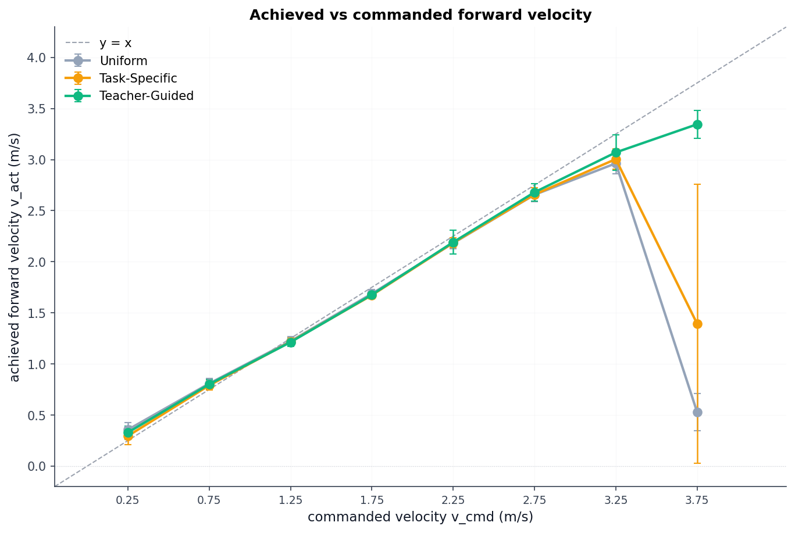

*Figure 4.12: Mean measured forward velocity vs commanded velocity, energy-regularised reward. Diagonal is the perfect-tracking reference. Uniform sits near $\bar v_x = 0.5$ m/s at bin 7 against the $3.75$ m/s command; only teacher-guided follows the diagonal through the sprint bin.*

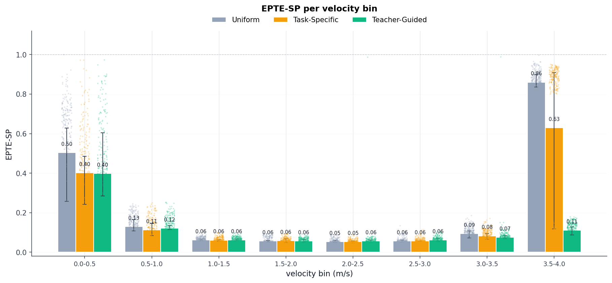

*Figure 4.13: EPTE-SP per (condition, bin), energy-regularised reward. Bin-7 bars separate the three conditions: teacher-guided $0.111$, task-specific $0.630$, uniform $0.860$.*

The deterministic-evaluation rank at bin 7 inverts the training-time tracking-reward rank of Table 4.6, where uniform and task-specific also showed values around $0.81$–$0.84$. The training-time signal is computed on noisy rollouts under the policy's stochastic action distribution, which is wide enough that the integrated $R_{\mathrm{lin}}$ over the rollout can be substantial even when the deterministic mean of the policy does not move. The deterministic-evaluation EPTE-SP is the more truthful description of what the trained policy does when noise is removed, and Table 4.8 indicates that uniform under the energy-regularised reward did not actually learn to sprint, even though its training curve appears to converge above the mastery threshold.

#### 4.3.3 Qualitative behaviour at evaluation

The two reward hacks of §4.1.3 are no longer visible. The three-legged stance at bin 0 has been replaced by a four-foot walking pattern under all three conditions, and the four-foot synchronised pattern at bin 6–7 has been replaced (under uniform and task-specific) by a stand-still, and (under teacher-guided) by an alternating gait with a flight phase.

The per-bin per-condition contact plot is reproduced in Figure 4.14. Three patterns stand out.

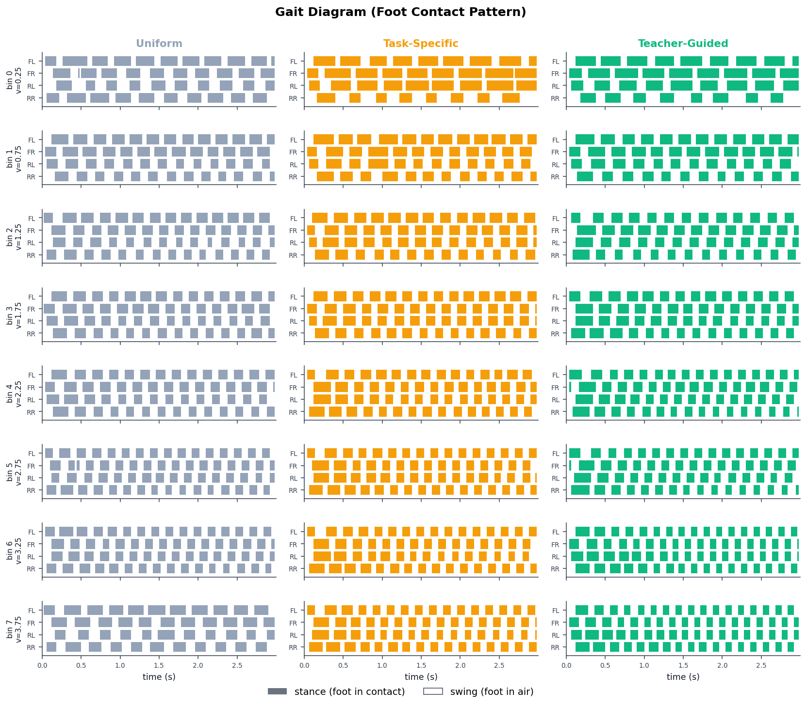

*Figure 4.14: Gait diagram at deterministic evaluation, energy-regularised reward. Columns are conditions (uniform / task-specific / teacher-guided), rows are velocity bins. Coloured blocks mark stance (foot in contact); white gaps mark swing. Per cell the plotted rollout is the best-surviving rollout across the three seeds, with ties broken by closest mean forward velocity to the command. The teacher-guided column shows the walk-like contact pattern at low bins evolving into a trot with intermittent flight phase at the upper bins.*

- **Uniform.** Every visible bin is classified as a long-stance walking pattern (the gait classifier labels it *LSDC walk* using the Hildebrand-style descriptor). The pattern is consistent across bins because, at the upper bins, the policy is barely moving (cf. the $\bar v_x = 0.53$ m/s at bin 7 from §4.3.2); the per-foot contact signal still cycles at low cadence regardless of the command. Uniform under the energy-regularised reward solves the *survival* part of the sprint command (it doesn't fall) but not the *velocity* part (it doesn't move).
- **Task-specific.** Bins 0–5 look similar to the uniform row, with the difference that the classifier labels several of them as *trot (walking) ±DAP* (a trotting pattern with double airborne phase). At bin 6 the policy holds an alternating gait with a brief flight phase. At bin 7 the policy regresses to a *Canter (R-lead)* pattern that, paired with the half-speed forward motion of $1.39$ m/s, indicates the policy has reached the bin but is unable to sustain a full sprint within the 3000-iteration budget.
- **Teacher-guided.** Bins 0–1 are a walk. Bins 2–6 are a *trot (walking) ±DAP*. Bin 7 is a *trot (walking) ±DAP* with a longer flight phase, and the mean forward velocity is $3.35$ m/s, within roughly $10\%$ of the commanded $3.75$ m/s. This is the Liang et al. (2024) walk → trot → fly-trot progression on the Go2 across the $0$–$4$ m/s envelope.

The contact-pattern progression under teacher-guided is the qualitative confirmation that the Liang reward of §4.2 induces the autonomous gait family it was selected for. The companion progression under uniform and task-specific is the qualitative confirmation that without a curriculum that allocates compute to the harder bins, the energy reward alone is not sufficient: the policy can find a comfortable local optimum that is *not* the running gait at high commands.

#### 4.3.4 Gait classification

Liang et al. (2024) claim that the energy-regularised reward of §4.2.1 induces walking, trotting, and fly-trotting on the Go1 without any contact-phase reference being supplied during training. Whether the same reward induces the same family of contact patterns on the Go2 across $[0,\,4]$ m/s is an empirical question, and answering it requires turning the per-foot contact time series of each evaluation rollout into a labelled gait class.

For each rollout the per-foot contact signal $c_i(t) \in \{0, 1\}$ is recorded at every simulation step for $i \in \{\mathrm{FL},\, \mathrm{FR},\, \mathrm{RL},\, \mathrm{RR}\}$ (front-left, front-right, rear-left, rear-right). Three derived quantities are extracted per rollout.

- **Stride period $T$.** The dominant period of $c_{\mathrm{FL}}(t)$ over the rollout, computed from the autocorrelation peak in the lag range $[0.1,\, 1.0]$ s.
- **Per-foot duty factor $\beta_i$.** The fraction of one stride for which $c_i(t) = 1$, averaged over all complete strides in the rollout. Reported as the mean across the four feet, $\beta = \tfrac{1}{4} \sum_i \beta_i$.
- **Pairwise phase offsets $\phi_{ij}$.** For each foot pair $(i, j)$, the touchdown time of foot $j$ minus the touchdown time of foot $i$, modulo the stride period and normalised by it, so that $\phi_{ij} \in [0,\, 1)$.

The four-foot contact pattern is assigned a gait label by template matching on the phase offsets, with tolerance $\delta = 0.1$ on each offset:

| Label | $\phi_{\mathrm{FL}\text{-}\mathrm{FR}}$ | $\phi_{\mathrm{FL}\text{-}\mathrm{RL}}$ | $\phi_{\mathrm{FL}\text{-}\mathrm{RR}}$ | Typical duty factor $\beta$ |
|---|:---:|:---:|:---:|:---:|
| Pronk | $0$ | $0$ | $0$ | any |
| Bound | $0$ | $0.5$ | $0.5$ | $\le 0.5$ |
| Pace | $0.5$ | $0$ | $0.5$ | $\sim 0.5$ |
| Trot | $0.5$ | $0.5$ | $0$ | $\sim 0.5$ (fly-trot if $\beta < 0.5$) |
| Walk | $0.5$ | $0.25$ or $0.75$ | $0.75$ or $0.25$ | $> 0.6$ |

A rollout that fails template matching (no template within tolerance $\delta$ on all three offsets) is labelled *irregular*. Per (condition, bin) cell, the dominant label is the modal label across the $300$ rollouts and the mean duty factor is the average of $\beta$ across rollouts. The label classes (pronk, bound, pace, trot, walk) follow the standard quadruped-biomechanics taxonomy; the inclusion of *fly-trot* as a sub-class of trot follows Liang et al. (2024).

The classifier output for the Phase 2 (energy-regularised) sweep is reproduced in Table 4.9. The label for each (condition, bin) cell is the modal label across the 300 deterministic rollouts. Cells in which the deterministic rollout was too short for a stride period to be extracted (i.e. the policy did not take repeated steps within the rollout) are marked *n/a*.

| Bin | $v_x^{\mathrm{cmd}}$ | Uniform | Task-specific | Teacher-guided |
|---:|---:|---|---|---|
| 0 | 0.25 m/s | LSDC walk | Canter (R-lead) | Canter (R-lead) |
| 1 | 0.75 m/s | LSDC walk | LSDC walk | LSDC walk |
| 2 | 1.25 m/s | LSDC walk | Trot (walking) ±DAP | LSDC walk |
| 3 | 1.75 m/s | LSDC walk | Trot (walking) ±DAP | Trot (walking) ±DAP |
| 4 | 2.25 m/s | LSDC walk | Trot (walking) ±DAP | Trot (walking) ±DAP |
| 5 | 2.75 m/s | LSDC walk | Trot (walking) ±DAP | Trot (walking) ±DAP |
| 6 | 3.25 m/s | LSDC walk | Trot (walking) ±DAP | Trot (walking) ±DAP |
| 7 | 3.75 m/s | n/a (short episode) | Canter (R-lead) | Trot (walking) ±DAP |

*Table 4.9: Modal gait label per (condition, bin) cell at deterministic evaluation, energy-regularised reward. "LSDC walk" = long-stance double-contact walk (Hildebrand low-speed pattern). "Trot (walking) ±DAP" = diagonal-pair trotting with intermittent double-airborne phase. "Canter (R-lead)" = asymmetric three-beat pattern with rear-foot lead.*

Teacher-guided is the only condition whose label progresses with the command. Bins 0–2 are walking patterns; bins 3–7 are trotting patterns with intermittent flight. This is the Liang et al. (2024) walk → trot → fly-trot progression that the energy term was selected for, but it appears here only under teacher-guided sampling. Task-specific shows a similar progression on the low half (bins 0 through 6) but regresses to a *Canter* asymmetric pattern at bin 7 because the policy never sustained the sprint long enough at that bin for the operator's mastery threshold to lock in the alternating pattern. Uniform produces a single low-speed walking pattern at every bin, including the bins where the policy is not moving forward (bins 6 and 7); the gait label is meaningful only on bins 0–5 of the uniform row, since the bin-6 and bin-7 entries are produced from a near-stationary policy.

The gait-classification table is the empirical answer to the question raised at the end of §4.2: the Liang reward does induce the same family of contact patterns on the Go2 as it did on the Go1 in the original paper, *under the curriculum that allocates compute to the harder bins*. The reward and the curriculum are not separable.

---

## 5. Conclusion

This report compared three velocity-command sampling rules — uniform, task-specific (Box Adaptive; Margolis et al., 2022), and teacher-guided (LP-ACRL; Li, Li, & Hutter, 2026) — on a single PPO policy on the Unitree Go2 across the forward-velocity range $[0,\,4]$ m/s. The comparison was run twice under different reward configurations so that the curriculum effect could be separated from the reward effect: once under a *sprint-retune* reward in which the upstream IsaacLab smoothness weights were reduced by an order of magnitude (§3.1.4), and once under the *energy-regularised* reward of Liang et al. (2024) with scale parameters calibrated for the Go2 (§4.2).

The main empirical findings are:

- **Curricula matter only at the top of the velocity range.** On bins 0 through 5 (commands up to $3.0$ m/s) all three conditions reach the same per-bin tracking-reward plateau and the same per-bin EPTE-SP within single-digit-percent tracking error. The separation between conditions is concentrated in bins 6 and 7 ($3.0$ to $4.0$ m/s), the regime in which Margolis et al. (2022) originally motivated curriculum learning.
- **Under the sprint-retune reward, only teacher-guided reaches the sprint bins.** At bins 6 and 7, uniform and task-specific collapse to a near-stationary policy that falls in over $94\%$ of deterministic rollouts (EPTE-SP at the saturated maximum). Teacher-guided produces a running gait that reaches $2.43$–$2.49$ m/s against $3.25$–$3.75$ m/s commands and survives $66\%$–$74\%$ of rollouts. Iterations-to-mastery confirms the same separation: teacher-guided is the only condition that crosses the $\gamma = 0.7$ threshold at bins 6 and 7 within the 3000-iteration budget.
- **The energy-regularised reward removes the survival failure but does not on its own remove the velocity failure.** Under the calibrated Liang reward, no condition falls at any bin, but uniform regresses to $\bar v_x = 0.53$ m/s at the $3.75$ m/s sprint bin and task-specific to $\bar v_x = 1.39$ m/s. Only teacher-guided reaches $\bar v_x = 3.35$ m/s at the same bin. The energy reward and the curriculum are both necessary to reach the sprint at the commanded speed; either alone is insufficient on the Go2 at $3000$ iterations.
- **The Liang gait family transfers to the Go2 — under teacher-guided sampling only.** The walk → trot → fly-trot progression that Liang et al. (2024) reported on the Go1 across $[0,\,2.5]$ m/s reproduces on the Go2 across $[0,\,4]$ m/s in the teacher-guided condition: bins 0–2 are walking, bins 3–7 are trotting with intermittent flight. Under uniform sampling the gait classifier records a single low-speed walking pattern across every bin, including the bins where the policy is not actually moving.
- **The Margolis vs Li theoretical distinction has an empirical signature.** Box Adaptive's monotone support expansion was faster than LP-ACRL on bins 0–5 (Tables 4.2 and 4.7) but stalled at bins 6 and 7 under the sprint-retune reward, because once those bins were added to the support the operator distributed sampling uniformly across the active set rather than concentrating compute on the unmastered sprint bin. LP-ACRL's softmax-over-progress reallocation kept the sampling weight at the sprint bin proportional to its observed learning progress, which is the mechanism that delivered the bin-6 and bin-7 mastery in §4.1.1.

There are several caveats. (i) Each (condition, seed) cell is a single run, so the seed-spread reported in the tables is computed across three independent seeds rather than across replicated training runs. (ii) The 3000-iteration budget is short relative to comparable wide-range velocity-tracking studies; the bin-6 and bin-7 collapse under uniform and task-specific in §4.1 is a failure mode at this budget, not necessarily an asymptotic failure mode. (iii) All experiments are flat-ground, single-platform, simulation-only; the report does not claim that the chosen tuple of $(\sigma_{\mathrm{en},x},\,\sigma_{\mathrm{en},z},\,\sigma_v,\,\alpha_{\mathrm{en}})$ transfers to terrain, to other quadrupeds, or to hardware.

Within those bounds, the matched comparison supports the conclusion that the choice of curriculum operator is the binding constraint on whether a single PPO policy on the Unitree Go2 can reach the sprint end of a $[0,\,4]$ m/s command range, and that a learning-progress-driven sampling rule is required to do so under a short training budget. The two-step $\sigma$ calibration of §4.2.2 reduces the energy-reward configuration to a single $3 \times 3$ grid that can be reproduced from the diagnostic of Table 4.4 alone, which removes the one hand-tuned hyperparameter that the Liang reward would otherwise have inherited from the Go1.

---

## References

Li, Z., Li, C., & Hutter, M. (2026). Scaling rough terrain locomotion with automatic curriculum reinforcement learning. *arXiv:2601.17428*. <https://arxiv.org/abs/2601.17428>

Liang, Z., Sun, Y., Zhu, K., Zhang, Y., Xiong, S., Wang, Z., Li, R., Sreenath, K., & Tomizuka, M. (2024). Adaptive energy regularization for autonomous gait transition and energy-efficient quadruped locomotion. *arXiv:2403.20001v2*. <https://arxiv.org/abs/2403.20001>

Margolis, G. B., Yang, G., Paigwar, K., Chen, T., & Agrawal, P. (2022). Rapid locomotion via reinforcement learning. *Robotics: Science and Systems*. <https://arxiv.org/abs/2205.02824>

Mittal, M., Yu, C., Yu, Q., Liu, J., Rudin, N., Hoeller, D., Yuan, J. L., Singh, R., Guo, Y., Mazhar, H., Mandlekar, A., Babich, B., Birchfield, S., Hutter, M., & Garg, A. (2023). Orbit: A unified simulation framework for interactive robot learning environments. *IEEE Robotics and Automation Letters*, 8(6), 3740-3747. <https://arxiv.org/abs/2301.04195>

Rudin, N., Hoeller, D., Reist, P., & Hutter, M. (2022). Learning to walk in minutes using massively parallel deep reinforcement learning. *Conference on Robot Learning* (pp. 91-100). <https://arxiv.org/abs/2109.11978>

Schulman, J., Wolski, F., Dhariwal, P., Radford, A., & Klimov, O. (2017). Proximal policy optimization algorithms. *arXiv:1707.06347*. <https://arxiv.org/abs/1707.06347>

Unitree Robotics. (2024). *unitree_rl_lab* [Software]. GitHub. <https://github.com/unitreerobotics/unitree_rl_lab>
