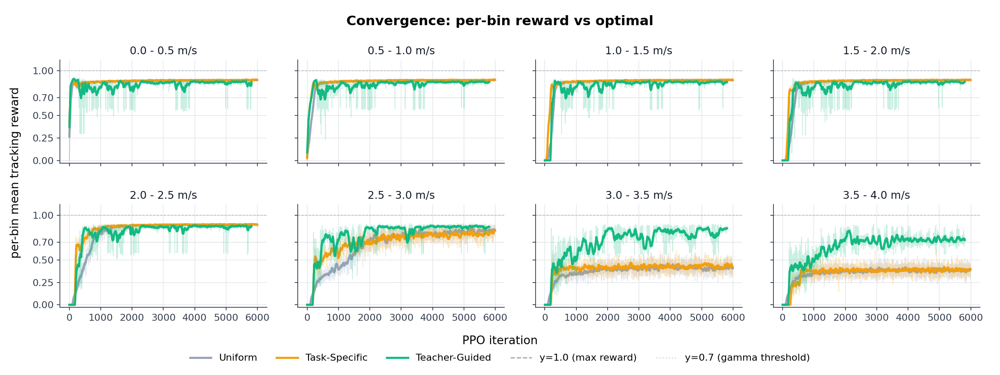
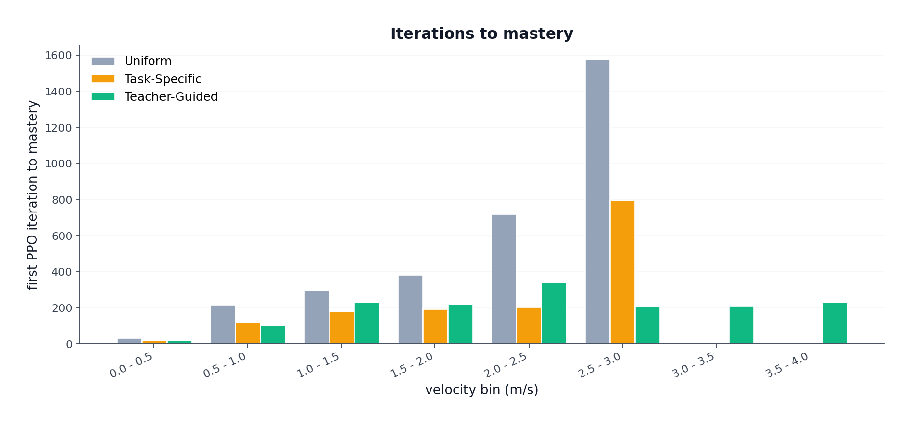
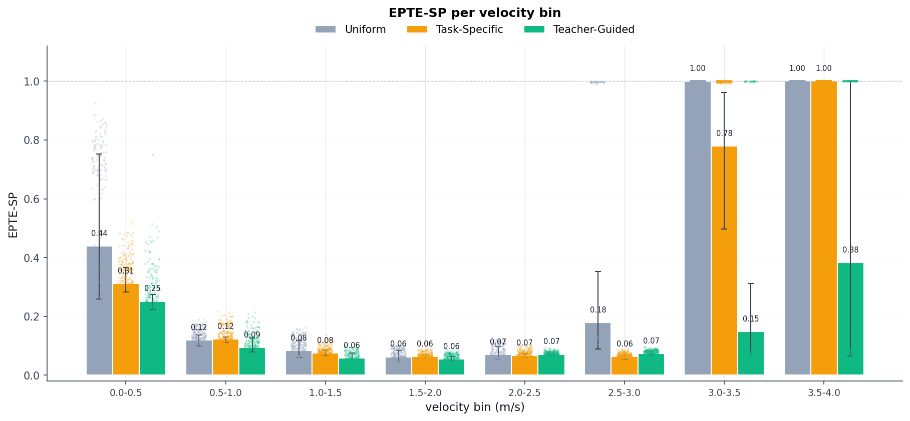
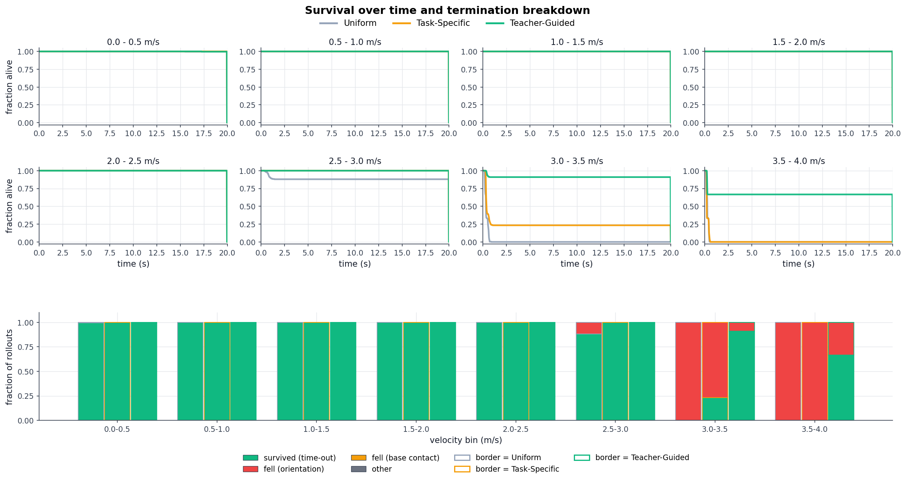
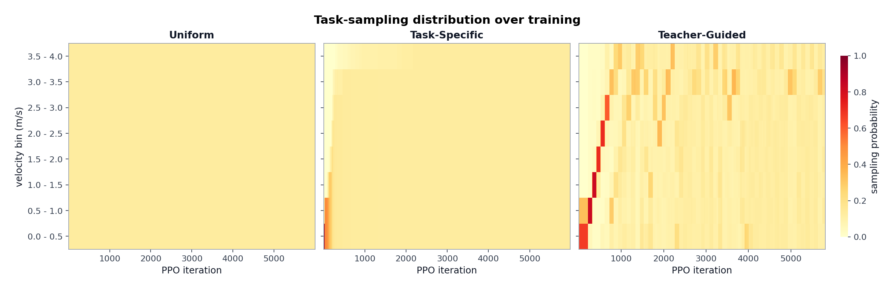

# Curriculum Learning for Velocity Tracking on the Unitree Go2 Quadruped

**Author:** Phakin Boonchanachai (66340500037)
**Course:** FRA503 Deep Reinforcement Learning

---

## Table of Contents

- [1. Introduction](#1-introduction)
  - [1.1 Motivation](#11-motivation)
  - [1.2 Problem statement](#12-problem-statement)
  - [1.3 Objectives](#13-objectives)
  - [1.4 Scope and limitations](#14-scope-and-limitations)
  - [1.5 Contributions](#15-contributions)
  - [1.6 Structure of the report](#16-structure-of-the-report)
- [2. Background](#2-background)
  - [2.1 PPO and Isaac Lab in brief](#21-ppo-and-isaac-lab-in-brief)
  - [2.2 Velocity-command curricula](#22-velocity-command-curricula)
    - [2.2.1 Box Adaptive curriculum (task-specific)](#221-box-adaptive-curriculum-task-specific)
    - [2.2.2 LP-ACRL (teacher-guided)](#222-lp-acrl-teacher-guided)
    - [2.2.3 Structural comparison](#223-structural-comparison)
  - [2.3 Reward design for wide-range velocity tracking](#23-reward-design-for-wide-range-velocity-tracking)
    - [2.3.1 Structure of a locomotion reward](#231-structure-of-a-locomotion-reward)
    - [2.3.2 The upstream IsaacLab Go2 16-term reward](#232-the-upstream-isaaclab-go2-16-term-reward)
  - [2.4 Synthesis](#24-synthesis)
- [3. Methodology](#3-methodology)
  - [3.1 Experimental setup and reward configuration](#31-experimental-setup-and-reward-configuration)
    - [3.1.1 Simulator, training budget, and parallelism](#311-simulator-training-budget-and-parallelism)
    - [3.1.2 Velocity command space](#312-velocity-command-space)
    - [3.1.3 Action interface and observation](#313-action-interface-and-observation)
    - [3.1.4 Reward configuration and the standing-still derivation](#314-reward-configuration-and-the-standing-still-derivation)
  - [3.2 The three curriculum conditions](#32-the-three-curriculum-conditions)
    - [3.2.1 Uniform (baseline)](#321-uniform-baseline)
    - [3.2.2 Box Adaptive (task-specific)](#322-box-adaptive-task-specific)
    - [3.2.3 LP-ACRL (teacher-guided)](#323-lp-acrl-teacher-guided)
  - [3.3 Evaluation protocol](#33-evaluation-protocol)
  - [3.4 Hyperparameter summary](#34-hyperparameter-summary)
- [4. Results](#4-results)
  - [4.1 Phase 1: Three curricula under the sprint-retune reward](#41-phase-1-three-curricula-under-the-sprint-retune-reward)
    - [4.1.1 Per-bin tracking-reward convergence](#411-per-bin-tracking-reward-convergence)
    - [4.1.2 Per-bin EPTE-SP](#412-per-bin-epte-sp)
    - [4.1.3 Qualitative behaviour at evaluation](#413-qualitative-behaviour-at-evaluation)
- [References](#references)

---

## 1. Introduction

### 1.1 Motivation

The Unitree Go2 is a small quadruped robot. To be useful in the field, it needs a single controller that works across a wide speed range, from a standstill up to a sprint at around 4 m/s. A controller that only runs at one fixed speed is not practical for real deployment.

Modern locomotion controllers are usually trained with deep reinforcement learning (DRL). A neural-network policy is trained in simulation against a reward that depends on how well it tracks a commanded velocity, and the trained policy is then transferred to hardware (Rudin et al., 2022). Recent simulators such as Isaac Lab (Mittal et al., 2023) make this practical on a single workstation by running thousands of robots in parallel.

Training one policy across a wide speed range is not the same as training a policy at a single target speed. The control problem is harder at high speed than at low speed:

- At low speed, the robot can balance easily. The reward signal is dense and the policy learns from the very first iteration.
- At high speed, the dynamics change. Ground reaction forces grow, the gait pattern has to shift from walk to trot to run, and the robot is more likely to fall over.

If velocity commands are sampled uniformly across the full range from the start of training, most high-speed commands return almost no reward, because the policy cannot yet run and fails immediately. The gradient is dominated by these useless failures, and the policy ends up specialising on the easy low-speed end of the range while never learning the sprint end (Margolis et al., 2022).

This is the *sparse-signal problem* at high speed, and it motivates **curriculum learning**: actively choosing which velocity commands the policy sees during training, so that compute is spent where the policy can still make progress.

Two different curriculum philosophies have appeared in the recent quadrupedal-locomotion literature:

- **Box Adaptive** (Margolis et al., 2022). Start at low velocity. Expand the sampling window outward only after each bin's tracking reward crosses a mastery threshold. The rule only adds weight to bins; it never removes weight.
- **LP-ACRL** (Li, Li, & Hutter, 2026). Reallocate sampling mass continuously using a softmax over per-task learning progress. When a bin stops improving, its weight is automatically reduced and reallocated to bins that are still improving.

Although both rules have been published individually (Box Adaptive on the MIT Mini Cheetah, LP-ACRL on the ANYmal D), no matched comparison of the two has been reported on the Unitree Go2, to the author's knowledge.

> **Terminology used throughout this report.** Following the naming used in the project's implementation, the Box Adaptive rule of Margolis et al. (2022) is referred to as the *task-specific* curriculum, and the LP-ACRL rule of Li, Li, & Hutter (2026) as the *teacher-guided* curriculum. The baseline that gives every bin the same sampling probability is referred to as the *uniform* condition. All later chapters use these three names (*uniform*, *task-specific*, *teacher-guided*) when referring to the conditions of the matched comparison.

There is also a hardware-safety reason to care about which curriculum strategy is used. The Go2's joint motors have finite torque and velocity limits. A policy that solves the simulated tracking reward by spinning its legs at unphysical speeds, or by snapping its feet down at uncontrolled action rates, will damage the robot once deployed. The curriculum does not just decide *which* speeds are learned. It also shapes *how* they are learned.

### 1.2 Problem statement

This report trains and evaluates a single PPO policy (Schulman et al., 2017) on the Unitree Go2 to track forward velocity commands across the range $v_x^{\mathrm{cmd}} \in [0, 4]$ m/s in simulation.

- Lateral velocity command $v_y^{\mathrm{cmd}}$ is fixed at $0$.
- Yaw-rate command $\omega_z^{\mathrm{cmd}}$ is fixed at $0$.
- The forward range is split into $N = 8$ bins of width $\Delta v = 0.5$ m/s.

The central question: **which command-sampling strategy lets the single policy reach the high-velocity bins under a fixed training budget on a flat-ground simulation of the Go2?**

### 1.3 Objectives

- **O1.** Implement three velocity-command sampling strategies for a single PPO policy on the Go2 in Isaac Lab:
  - *Uniform*: a baseline that gives every bin the same sampling probability throughout training.
  - *Task-specific*: Box Adaptive (Margolis et al., 2022).
  - *Teacher-guided*: LP-ACRL (Li, Li, & Hutter, 2026).
- **O2.** Run a matched comparison of the three strategies across three independent random seeds on $[0, 4]$ m/s partitioned into $8$ bins. All non-curriculum components (reward, observations, terminations, PPO hyperparameters, domain randomisation) are held fixed across conditions.
- **O3.** Evaluate the three strategies using four per-bin metrics:
  - Mean tracking reward.
  - EPTE-SP: expected per-step tracking error, normalised by commanded speed.
  - Task-sampling distribution over training.
  - Iterations-to-mastery.

### 1.4 Scope and limitations

The work is bounded as follows.

- **Velocity axis.** Only the forward velocity command is studied. Lateral velocity and yaw rate are fixed at zero throughout training and evaluation.
- **Terrain.** Training and evaluation are on a flat ground plane. No terrain generator, no height scanner, no terrain-difficulty curriculum.
- **Simulation only.** All experiments run in Isaac Lab. No sim-to-real transfer or hardware deployment is attempted in this report.
- **Single platform.** Only the Unitree Go2 is used. No cross-platform validation against other quadrupeds.
- **Single algorithm.** PPO is the only RL algorithm used. No comparison against alternative policy-optimisation methods.
- **Single-run cells.** Each (curriculum, seed) cell is run once. The matched comparison uses three seeds per condition; broader hyperparameter sweeps are out of scope.

### 1.5 Contributions

This report contributes:

- A matched three-way comparison of the uniform baseline, task-specific (Box Adaptive; Margolis et al., 2022), and teacher-guided (LP-ACRL; Li, Li, & Hutter, 2026) sampling strategies on the Unitree Go2 across $[0, 4]$ m/s, with every non-curriculum component held fixed across conditions.
- A per-bin analysis of tracking accuracy and learning progress for each condition, including evidence on which strategies reach the high-velocity bins under the fixed iteration budget and which fail.
- A discussion of where the observed task-sampling distributions and iterations-to-mastery patterns agree or diverge from the hypotheses underlying the two published curriculum rules.

### 1.6 Structure of the report

The remainder of the report is organised as follows.

- **Chapter 2: Background.** Deep RL for legged locomotion. The two curriculum strategies under comparison. The gait-taxonomy framework used later in the report to interpret locomotion behaviour.
- **Chapter 3: Methodology.** Experimental design, robot and simulator setup, reward function, command space, curriculum operator parameters, PPO hyperparameters, and evaluation metrics.
- **Chapter 4: Results and discussion.** Quantitative results for the three curricula, followed by discussion.

---

## 2. Background

### 2.1 PPO and Isaac Lab in brief

**Proximal Policy Optimisation (PPO)** is the policy-gradient algorithm used to train every policy in this report (Schulman et al., 2017). PPO is an on-policy actor-critic method. The actor outputs an action distribution conditioned on the current observation; the critic estimates the value function used to compute the advantage of each action. At every update, PPO collects a fresh batch of trajectories from the current policy and maximises a clipped surrogate objective:

$$
L^{\mathrm{CLIP}}(\theta) = \hat{\mathbb{E}}_t \left[ \min\!\left( r_t(\theta)\, \hat{A}_t,\; \mathrm{clip}\!\left( r_t(\theta),\, 1 - \epsilon,\, 1 + \epsilon \right) \hat{A}_t \right) \right],
$$

where $r_t(\theta) = \pi_\theta(a_t \mid s_t) / \pi_{\theta_{\mathrm{old}}}(a_t \mid s_t)$ is the importance-sampling ratio between the new and old policies, $\hat{A}_t$ is the estimated advantage, and $\epsilon$ is the clip range. The clip prevents updates from moving the policy too far in a single iteration, which trades a small amount of optimisation speed for substantially improved stability. In practice this makes PPO robust to hyperparameter choices and reliable enough to train large simulated systems without manual tuning of the trust region.

**Isaac Lab** is the simulator used for every experiment in this report (Mittal et al., 2023). It is a modular robot-learning framework layered over NVIDIA Isaac Sim that exposes thousands of parallel simulation environments on a single GPU. Each parallel environment runs an independent copy of the robot, the terrain, and the reward computation, and PPO collects gradient information from the union of all environments at every step. This parallelism is the reason a wide-range velocity-tracking policy can be trained on a single workstation in roughly an hour rather than over days (Rudin et al., 2022). Isaac Lab also provides standard interfaces for observation composition, command sampling, termination conditions, and domain randomisation, all of which are used in this work.

### 2.2 Velocity-command curricula

Both curriculum rules studied in this report operate on the same input: a per-task tracking-reward signal computed over recently observed trajectories. They differ in how that signal is consumed to produce the next sampling distribution over commands. This section presents each rule in the notation of its source paper.

#### 2.2.1 Box Adaptive curriculum (task-specific)

Margolis et al. (2022) consider a velocity command sampled at the start of each episode from a probability distribution over a two-dimensional command space spanned by the forward linear-velocity command $\mathbf{v}_x^{\mathrm{cmd}}$ and the yaw-rate command $\boldsymbol{\omega}_z^{\mathrm{cmd}}$. The command space is represented as a discrete grid with resolution $[0.5\ \mathrm{m/s},\ 0.5\ \mathrm{rad/s}]$ centered at $[0\ \mathrm{m/s},\ 0\ \mathrm{rad/s}]$. The sampling distribution at episode $k$ is denoted $p_{\mathbf{v}_x,\boldsymbol{\omega}_z}^{k}(\cdot, \cdot)$.

The **Box Adaptive** variant maintains the joint distribution as a product of independent marginals,

$$
p_{\mathbf{v}_x,\boldsymbol{\omega}_z}^{k}(\cdot, \cdot) = p_{\mathbf{v}_x}^{k}(\cdot)\, p_{\boldsymbol{\omega}_z}^{k}(\cdot),
$$

with the per-component update rules

$$
p_{\mathbf{v}_x}^{k+1}(\cdot) \leftarrow f_v\!\left( p_{\mathbf{v}_x}^{k}(\cdot),\, r_{v_x^{\mathrm{cmd}}} \right),
\qquad (8\text{a})
$$

$$
p_{\boldsymbol{\omega}_z}^{k+1}(\cdot) \leftarrow f_\omega\!\left( p_{\boldsymbol{\omega}_z}^{k}(\cdot),\, r_{\omega_z^{\mathrm{cmd}}} \right),
\qquad (8\text{b})
$$

where $r_{v_x^{\mathrm{cmd}}}$ and $r_{\omega_z^{\mathrm{cmd}}}$ are the velocity-tracking rewards on the most recent episode whose command was $\mathbf{v}_x^{\mathrm{cmd}},\, \boldsymbol{\omega}_z^{\mathrm{cmd}}$. The specific Box Adaptive update is

$$
p_{\mathbf{v}_x}^{k+1}(\mathbf{v}_x^n) \leftarrow
\begin{cases}
p_{\mathbf{v}_x}^{k}(\mathbf{v}_x^n) & r_{v_x^{\mathrm{cmd}}} < \gamma, \\
1 & \text{otherwise},
\end{cases}
\qquad (10\text{a})
$$

$$
p_{\boldsymbol{\omega}_z}^{k+1}(\boldsymbol{\omega}_z^n) \leftarrow
\begin{cases}
p_{\boldsymbol{\omega}_z}^{k}(\boldsymbol{\omega}_z^n) & r_{\omega_z^{\mathrm{cmd}}} < \gamma, \\
1 & \text{otherwise},
\end{cases}
\qquad (10\text{b})
$$

where $\gamma \in (0, 1)$ is a success threshold, and the neighbouring commands $\mathbf{v}_x^n,\, \boldsymbol{\omega}_z^n$ are the adjacent discretised cells on each axis:

$$
\mathbf{v}_x^n \in \{\mathbf{v}_x^{\mathrm{cmd}} - 0.5,\ \mathbf{v}_x^{\mathrm{cmd}} + 0.5\}, \qquad
\boldsymbol{\omega}_z^n \in \{\boldsymbol{\omega}_z^{\mathrm{cmd}} - 0.5,\ \boldsymbol{\omega}_z^{\mathrm{cmd}} + 0.5\}.
$$

The structural property of this rule is that probability mass is only added; it is never removed. Once a cell is unlocked, it remains in the sampling distribution for the rest of training. The curriculum therefore expands outward from the initialisation in a monotone fashion.

In this report, the Box Adaptive rule is implemented over a one-dimensional command axis (forward linear velocity only, with lateral velocity and yaw rate fixed at zero per §1.2) and is referred to as the **task-specific** curriculum.

#### 2.2.2 LP-ACRL (teacher-guided)

Li, Li, and Hutter (2026) formulate curriculum learning as an explicit task-sampling problem. The task space is denoted $\mathcal{T}$, and the curriculum is a sequence of task-sampling distributions

$$
\mathcal{C} = (c_0, c_1, \ldots, c_j, \ldots), \qquad c_j \in \Delta(\mathcal{T}),
\qquad (1)
$$

where $c_j$ is the task-sampling distribution at curriculum stage $j$. A task instance is denoted $\zeta \in \mathcal{T}$.

The agent's performance on task instance $\zeta$ is measured by the expected episodic reward when training under distribution $c_j$:

$$
R_{c_j}(\zeta) = \mathbb{E}_{\tau \sim c_j}\!\left[ R_\tau \right],
\qquad (5)
$$

where $R_\tau$ is the cumulative reward of a trajectory $\tau$ of length $H$.

**Learning progress** on a task instance is defined as the change in expected episodic reward between two consecutive curriculum stages:

$$
LP_{c_j}(\zeta) = R_{c_j}(\zeta) - R_{c_{j-1}}(\zeta).
\qquad (6)
$$

A task instance with positive $LP$ is improving; a task instance with $LP$ near zero has plateaued, either because it has been mastered or because it is currently unlearnable.

The task-sampling distribution at the next curriculum stage is then a softmax over learning progress:

$$
c_{j+1}(\zeta) = \frac{\exp\!\left( LP_{c_j}(\zeta) / \beta \right)}{\sum_{\zeta' \in \mathcal{T}} \exp\!\left( LP_{c_j}(\zeta') / \beta \right)},
\qquad (7)
$$

where $\beta$ is a temperature parameter that controls the sharpness of the distribution. Small $\beta$ produces a near winner-take-all distribution; large $\beta$ produces a near-uniform distribution.

The structural property of this rule is that probability mass is *reallocated* at every curriculum stage. When a task instance plateaus, its softmax weight collapses, and the freed mass is redistributed across whichever instances are currently improving fastest.

In this report, LP-ACRL is implemented on the same one-dimensional command axis as the Box Adaptive variant (forward linear velocity, 8 discrete task instances of width $0.5$ m/s) and is referred to as the **teacher-guided** curriculum.

#### 2.2.3 Structural comparison

The two rules differ in three properties that have direct consequences for the analysis in later chapters.

- **Reversibility.** Box Adaptive adds probability mass to cells and never removes it. LP-ACRL reweights the entire distribution at every stage based on current learning progress.
- **Trigger.** Box Adaptive uses a fixed-threshold trigger ($\gamma$): a cell unlocks the moment its tracking reward crosses $\gamma$. LP-ACRL has no fixed threshold; sampling weight is allocated proportionally to recent improvement.
- **Dilution.** Once $k$ cells are unlocked under Box Adaptive, each unlocked cell receives roughly $1/k$ of the sampling budget regardless of which cells are still improving. Under LP-ACRL, sampling weight follows learning progress, so a plateaued cell shares minimal budget regardless of how many other cells are being sampled.

These three differences appear repeatedly in the analysis of Chapter 4.

### 2.3 Reward design for wide-range velocity tracking

#### 2.3.1 Structure of a locomotion reward

A locomotion reward for velocity tracking is typically a weighted sum of three families of terms (Rudin et al., 2022).

- **Tracking terms** that produce a positive scalar when the actual body velocity matches the commanded velocity. The standard form is an exponential kernel on velocity error.
- **Smoothness and effort penalties** that produce a negative scalar when the policy commands jerky or high-torque actions. Typical members of this family penalise joint velocity, joint acceleration, joint torque, and the change in the policy's output action between consecutive control steps.
- **Bonus terms** that reward specific gait-pattern features, most commonly a feet-air-time bonus that pays out when a foot is in swing phase for at least a threshold duration.

The total reward at step $t$ is

$$
r_t = \sum_{i} w_i\, r_i(\zeta_t),
$$

where $r_i$ is the $i$-th term and $w_i$ is its weight. Tracking terms have $w_i > 0$, penalty terms have $w_i < 0$, and bonus terms have $w_i > 0$. The relative magnitudes of these weights determine which solution the policy converges to.

#### 2.3.2 The upstream IsaacLab Go2 16-term reward

The starting point of this work is the upstream IsaacLab Go2 reward function published by Unitree Robotics (2024), composed of 16 weighted terms. The two tracking terms are exponential kernels on linear and angular velocity error:

$$
r_{\mathrm{lin}} = \exp\!\left( -\, \frac{\| v_{xy}^{\mathrm{cmd}} - v_{xy} \|^2}{\sigma_{\mathrm{lin}}^{2}} \right), \qquad w_{\mathrm{lin}} = 1.5, \quad \sigma_{\mathrm{lin}} = 0.5\ \mathrm{m/s},
$$

$$
r_{\mathrm{ang}} = \exp\!\left( -\, \frac{(\omega_z^{\mathrm{cmd}} - \omega_z)^2}{\sigma_{\mathrm{ang}}^{2}} \right), \qquad w_{\mathrm{ang}} = 0.75, \quad \sigma_{\mathrm{ang}} = 0.25\ \mathrm{rad/s}.
$$

Both kernels saturate at $1$ when the actual velocity matches the command, so the maximum reward contribution from the two tracking terms combined is $w_{\mathrm{lin}} + w_{\mathrm{ang}} = 2.25$.

The smoothness and effort group is

$$
r_{\mathrm{smooth}} = -\,|w_{\dot{q}}|\, \|\dot{q}\|^2 \;-\; |w_{\ddot{q}}|\, \|\ddot{q}\|^2 \;-\; |w_\tau|\, \|\tau\|^2 \;-\; |w_{\Delta a}|\, \|a_t - a_{t-1}\|^2 \;\le\; 0,
$$

with all four weights $w_{\dot{q}},\, w_{\ddot{q}},\, w_\tau,\, w_{\Delta a}$ negative in the configuration, so that the leading sign of each term in $r_{\mathrm{smooth}}$ is negative.

The remaining ten terms cover orientation, height stability, contact bonuses (including feet-air-time), and termination penalties. The upstream values for all 16 weights, and the specific modifications adopted in this work, are reported in Chapter 3.

### 2.4 Synthesis

The three streams above set up the experimental setting of Chapter 3 and the comparisons of Chapter 4. PPO and Isaac Lab (§2.1) supply the optimisation algorithm and the parallel simulator under which a curriculum comparison is feasible. The two curriculum rules (§2.2) provide qualitatively different hypotheses about how training compute should be allocated across a wide command range: Box Adaptive grows the sampling support monotonically with measured per-bin success, while LP-ACRL reallocates probability mass continuously based on observed learning progress. The reward function (§2.3) defines what succeeding on a per-bin task actually means in scalar terms, and its 16 weighted components are the surface on which both tracking quality and locomotion style are eventually scored.

---

## 3. Methodology

This chapter specifies the concrete experimental setting under which the three curricula of Chapter 2 are compared. The setting has four parts: the simulator and command space, the reward configuration actually used in this work (which deviates from the upstream Go2 defaults of §2.3.2 for a reason that is derived below), the three curriculum conditions, and the evaluation protocol. A consolidated hyperparameter summary is given at the end of the chapter.

### 3.1 Experimental setup and reward configuration

#### 3.1.1 Simulator, training budget, and parallelism

All experiments are run in Isaac Lab on a single workstation with 2048 parallel environments collecting rollouts in lockstep. Each PPO update consumes a batch of 24 environment steps per env, and training runs for 6000 PPO iterations per (condition, seed). Three independent random seeds are drawn for every condition, so each curriculum is compared on three runs and reported statistics are taken across seeds.

The choice of 2048 parallel envs is empirical rather than theoretical: pilot timing on the same hardware showed that 4096 envs ran slower per iteration than 2048, opposite to what raw GPU throughput would predict. The cause was not isolated, so 2048 was kept for the sweep as the conservative choice. The choice of 6000 PPO iterations replaces an earlier 3000-iteration plan: at 3000 iterations the highest-speed bins had not converged for any condition, so the budget was doubled to give every (condition, bin) cell room to plateau within a single run.

#### 3.1.2 Velocity command space

The robot is given a command vector $(v_x^{\mathrm{cmd}}, v_y^{\mathrm{cmd}}, \omega_z^{\mathrm{cmd}})$. The lateral and yaw components are held at zero in both training and evaluation:

$$
v_y^{\mathrm{cmd}} = 0, \qquad \omega_z^{\mathrm{cmd}} = 0.
$$

The forward command is discretised into eight contiguous bins of width $0.5$ m/s spanning the full velocity envelope:

$$
B_0 = [0.0,\, 0.5),\ B_1 = [0.5,\, 1.0),\ \ldots,\ B_6 = [3.0,\, 3.5),\ B_7 = [3.5,\, 4.0].
$$

Bin 7 is closed on the right so that the upper bound $4.0$ m/s is sampleable. Each bin index $j \in \{0, 1, \ldots, 7\}$ defines a per-bin task in the sense of §2.2: the per-bin tracking reward, per-bin success threshold, and per-bin learning-progress signal used by the two curricula are all computed over the eight bins defined here. The command is resampled every 20 simulated seconds, and the fraction of environments holding a standing-still command is set to zero (the upstream default of 10 percent stand-still environments was removed to keep all training samples on the discrete bin grid).

#### 3.1.3 Action interface and observation

The policy emits a 12-dimensional joint position action $a_t$. Joint targets are computed as $q^{\mathrm{target}} = q^{\mathrm{default}} + s \cdot a_t$, with action scale $s$. The upstream scale of $0.25$ is retained for every joint except that the scalar $s$ itself is raised from the upstream value:

$$
s : \quad 0.25 \;\longrightarrow\; 0.35.
$$

The upstream scale of $0.25$ is too small for the leg-swing amplitude that a $4$ m/s sprint requires; raising it to $0.35$ gives the policy enough joint-angle range per step to produce a sprint-speed stride. PD gains, torque envelope, friction defaults, and action clip are all inherited from the upstream Unitree Go2 configuration without change.

The policy observation is six terms (base angular velocity, projected gravity, velocity command, joint position relative to default, joint velocity relative to default, last action), each scaled and noised exactly as in the upstream configuration. The critic observation adds two privileged terms (base linear velocity, joint effort). All observations are clipped to $\pm 100$. The domain-randomisation block (friction, restitution, base mass perturbation, reset pose, push events) is inherited from the upstream Go2 configuration unchanged.

#### 3.1.4 Reward configuration and the standing-still derivation

The 16-term reward of §2.3.2 is the starting point. Five of the 16 weights are modified for this work; the remaining eleven are inherited from upstream without change. The motivation for the five modifications is a structural failure of the upstream weighting under the stretched command range $[0, 4]$ m/s, derived below.

**The standing-still local optimum.** Recall from §2.3.2 that the per-step reward decomposes as

$$
r_t = w_{\mathrm{lin}}\, r_{\mathrm{lin}} + w_{\mathrm{ang}}\, r_{\mathrm{ang}} + r_{\mathrm{smooth}} + r_{\mathrm{rest}},
$$

with $w_{\mathrm{lin}} = 1.5$, $w_{\mathrm{ang}} = 0.75$, and $r_{\mathrm{smooth}} \le 0$ summing the four smoothness and effort penalties. The two tracking kernels each saturate at $1$, so the maximum tracking contribution is $w_{\mathrm{lin}} + w_{\mathrm{ang}} = 2.25$.

The smoothness magnitude $|r_{\mathrm{smooth}}|$ grows roughly with the square of the commanded velocity: faster commands force faster joint motion, larger torques, and larger step-to-step action changes. Under the upstream weights, $|r_{\mathrm{smooth}}|$ at sprint commands near $4$ m/s exceeds the tracking ceiling of $2.25$. The consequence is a binary comparison at sprint commands:

- *If the policy actually runs at the commanded speed.* The two tracking terms saturate at $r_{\mathrm{lin}} + r_{\mathrm{ang}} \approx 2.25$. The smoothness term satisfies $|r_{\mathrm{smooth}}| > 2.25$. Therefore $r_t < 0$.
- *If the policy stands still.* Joint velocities, accelerations, torques, and action rates are near zero, so $r_{\mathrm{smooth}} \approx 0$. The yaw command is zero (above), so $r_{\mathrm{ang}}$ saturates at $1$ even when the body is stationary. Therefore $r_t \approx w_{\mathrm{ang}} \cdot 1 = 0.75 > 0$.

The standing-still solution is preferred by the policy gradient over the sprint solution, and a uniform initial sampling over $[0, 4]$ m/s converges to a policy that stands still under every command. The fix is to reduce the magnitudes of the four smoothness weights so that the smoothness penalty at the commanded sprint speed no longer exceeds the tracking ceiling.

**Sprint-retune weights.** The four smoothness weights are reduced one order of magnitude, and the feet-air-time threshold is reduced from $0.5$ s to $0.1$ s. The fifth modification (feet-air-time threshold) is included here because the upstream threshold of $0.5$ s rewards only foot swings longer than half a second, which is incompatible with the higher stride frequency that running near $4$ m/s requires.

| Reward term | Upstream weight or threshold | Sprint-retune value | What this term penalises |
|---|---:|---:|---|
| Joint velocity squared | $-1 \times 10^{-3}$ | $-1 \times 10^{-4}$ | $\|\dot{q}\|^2$ |
| Joint acceleration squared | $-2.5 \times 10^{-7}$ | $-1 \times 10^{-7}$ | $\|\ddot{q}\|^2$ |
| Joint torque squared | $-2 \times 10^{-4}$ | $-2 \times 10^{-5}$ | $\|\tau\|^2$ |
| Action rate squared | $-0.1$ | $-0.005$ | $\|a_t - a_{t-1}\|^2$ |
| Feet-air-time threshold | $0.5$ s | $0.1$ s | minimum swing duration for the air-time bonus |

*Table 3.1: The five reward modifications relative to the upstream Go2 configuration. The remaining eleven of the 16 terms (linear and angular velocity tracking, orientation, height stability, contact bonuses other than feet-air-time, and termination penalties) are kept at upstream weights.*

The combined effect of the four weight reductions is that $|r_{\mathrm{smooth}}|$ at sprint commands is brought back below the tracking ceiling of $2.25$, so that an actually-running policy receives a positive total reward and the standing-still solution is no longer the gradient-preferred local optimum. Every experiment reported in Chapter 4 is run on this modified reward configuration.

### 3.2 The three curriculum conditions

All three conditions share §3.1 exactly. They differ only in how the sampling distribution $c_j(\zeta)$ over the eight bins evolves during training. A shared heartbeat is used: every 48 environment steps (one *tick*, equal to two PPO iterations at rollout length 24), the per-bin tracking reward buffers are flushed to the active curriculum operator and the sampling distribution for the next tick is recomputed.

#### 3.2.1 Uniform (baseline)

The sampling distribution is fixed at the uniform distribution over all eight bins for the full 6000 iterations:

$$
c_j(\zeta) = \frac{1}{N} = \frac{1}{8}, \quad j = 0, 1, \ldots, 7.
$$

No mastery signal is computed and no support expansion or reallocation occurs. This is the no-curriculum baseline.

#### 3.2.2 Box Adaptive (task-specific)

The Box Adaptive operator of §2.2.1 is initialised with active support $\mathcal{A}_0 = \{0\}$, the first bin only. On every tick, the smoothed mean tracking reward of every active bin is compared against the success threshold

$$
\gamma = 0.7.
$$

When the active bin $b$ at the top of the support crosses $\gamma$, the support is grown to $\mathcal{A} \cup \{b-1, b, b+1\}$ following eqs. (10a) and (10b) of Margolis et al. (2022). Sampling within $\mathcal{A}$ is uniform. To prevent the threshold-crossing rule from triggering on a single lucky episode, the mastery check is gated by a minimum of 50 episodes collected in the candidate bin before the per-bin mean is consulted. This min-episode gate is an implementation detail of the operator and does not appear in the Margolis paper.

#### 3.2.3 LP-ACRL (teacher-guided)

The LP-ACRL operator of §2.2.2 buffers per-bin reward signals on every tick but recomputes the sampling distribution only every $M = 50$ ticks. With $M = 50$ ticks of 48 env steps each at rollout length 24, one re-weight cycle equals exactly 100 PPO iterations, matching the stage length used by Li et al. (2026). At each re-weight, the per-bin learning progress $\mathrm{LP}_j$ is computed from the difference between the current and the previous stage's per-bin reward, the softmax weights are formed from $\mathrm{LP}_j$ at temperature

$$
\beta = 0.05,
$$

and a uniform-mixture floor is applied at

$$
\varepsilon = 0.15
$$

so that the final sampling distribution is $c_j = (1 - \varepsilon)\, \mathrm{softmax}_j(\mathrm{LP}/\beta) + \varepsilon / N$. With $N = 8$, the floor sets the minimum per-bin probability at $\varepsilon / N \approx 1.9\%$.

### 3.3 Evaluation protocol

After training, every policy is evaluated under deterministic action selection (mean of the policy Gaussian, no noise) on each of the eight bins independently. For each bin the policy is rolled out for a fixed number of episodes, and the following quantities are recorded:

- **Per-bin tracking reward.** The episode-averaged value of $r_{\mathrm{lin}}$ in bin $j$, denoted $R_j$. Reported as the mean and standard deviation across the three seeds.
- **EPTE-SP (Episodic Percentage Tracking Error with Stability Penalty).** Defined by Li et al. (2026, eq. 8). For a single rollout of length $T$ with commanded velocity $v^{\mathrm{cmd}}$ and measured forward velocity $v_x(t)$, the episodic tracking error percentage is the time-averaged absolute relative error, and the stability penalty adds a fixed penalty for any episode that terminates by falling. EPTE-SP is reported per bin (mean across seeds and across episodes).
- **Sampling heatmap.** For each curriculum condition, the matrix $c_j(\mathrm{iter})$ giving the per-bin sampling probability at every PPO iteration is logged during training. The heatmap is the visual signature of how each operator allocates compute.
- **Iterations-to-mastery.** For each (condition, bin) cell, the first PPO iteration at which the smoothed per-bin $R_j$ crosses $\gamma = 0.7$. Bins that never cross the threshold within the 6000-iteration budget are recorded as "not mastered." This is the metric on which Box Adaptive and LP-ACRL are scored against the uniform baseline at sprint commands.

The unit of comparison is the per-bin pair (condition, bin). With 8 bins, 3 conditions, and 3 seeds, the sweep produces 72 per-bin evaluation cells in total.

### 3.4 Hyperparameter summary

Table 3.2 collects every hyperparameter whose value matters for reproducibility. Values inherited from the upstream Go2 configuration without change are marked "upstream." Values that differ from upstream are listed explicitly.

| Group | Hyperparameter | Value |
|---|---|---:|
| Simulator | Parallel environments | $2048$ |
| Simulator | Rollout length $T$ (env steps per PPO update) | $24$ |
| Simulator | Total PPO iterations | $6000$ |
| Simulator | Seeds per condition | $3$ |
| Command | Bins $N$, bin width $\Delta v$, $V_{\max}$ | $8$, $0.5$ m/s, $4.0$ m/s |
| Command | Lateral and yaw command | $v_y^{\mathrm{cmd}} = 0$, $\omega_z^{\mathrm{cmd}} = 0$ |
| Command | Resampling interval | $20$ s |
| Command | Stand-still environment fraction | $0$ |
| Action | Joint position action scale $s$ | $0.35$ (upstream $0.25$) |
| Action | PD gains, torque envelope, action clip | upstream |
| Reward | $w_{\mathrm{lin}}$, $\sigma_{\mathrm{lin}}$ | $1.5$, $0.5$ m/s |
| Reward | $w_{\mathrm{ang}}$, $\sigma_{\mathrm{ang}}$ | $0.75$, $0.25$ rad/s |
| Reward | $w_{\dot{q}}$ (joint velocity squared) | $-1 \times 10^{-4}$ (upstream $-1 \times 10^{-3}$) |
| Reward | $w_{\ddot{q}}$ (joint acceleration squared) | $-1 \times 10^{-7}$ (upstream $-2.5 \times 10^{-7}$) |
| Reward | $w_{\tau}$ (joint torque squared) | $-2 \times 10^{-5}$ (upstream $-2 \times 10^{-4}$) |
| Reward | $w_{\Delta a}$ (action rate squared) | $-0.005$ (upstream $-0.1$) |
| Reward | Feet-air-time threshold | $0.1$ s (upstream $0.5$ s) |
| Reward | Other 11 of 16 weights | upstream |
| PPO | Clip $\varepsilon_{\mathrm{PPO}}$, learning rate, GAE $\lambda$, discount $\gamma_{\mathrm{disc}}$, epochs, mini-batches | upstream |
| Curriculum (shared) | Tick (env steps between operator updates) | $48$ |
| Curriculum (task-specific) | Success threshold $\gamma$ | $0.7$ |
| Curriculum (task-specific) | Seed bin | bin $0$ |
| Curriculum (task-specific) | Minimum episodes before mastery check | $50$ |
| Curriculum (teacher-guided) | Temperature $\beta$ | $0.05$ |
| Curriculum (teacher-guided) | Stage length $M$ (ticks per re-weight) | $50$ |
| Curriculum (teacher-guided) | Uniform mixture floor $\varepsilon$ | $0.15$ |

*Table 3.2: Consolidated hyperparameter summary. The five reward modifications, the action scale, and all curriculum operator knobs are listed explicitly; everything else not listed inherits the upstream Unitree Go2 configuration.*

---

## 4. Results

This chapter follows the experimental journey of the project in two phases. Section 4.1 reports the initial three-condition comparison under the sprint-retune reward configured in §3.1.4. Section 4.2 turns to the points in those results that did not match expectation, including the gait that the policy actually produced; that observation drives the reward redesign of §4.3. Section 4.4 reports the second comparison under the redesigned reward, and §4.5 discusses what the two phases together say about the relative contributions of curriculum and reward design. Section 4.6 concludes.

### 4.1 Phase 1: Three curricula under the sprint-retune reward

A three-condition (uniform, task-specific, teacher-guided) sweep with three independent seeds per condition was run to 6000 PPO iterations using exactly the configuration of §3.1. Nine training runs were completed, all returning exit code 0. Per-run wall-clock was between 57 and 87 minutes; total wall-clock was 13 h 1 m. Every policy was then evaluated under the deterministic protocol of §3.3, with 100 rollouts of 1000 steps per (condition, seed, bin) cell (300 rollouts per (condition, bin) cell after aggregating over seeds).

The headline of this section is set up by one empirical pattern that turns out to do most of the work in explaining what follows: bins 0 through 5 transfer to each other, but bins 6 and 7 do not transfer from bins 0 through 5. Training on bin $b$ inside the lower group raises performance on bin $b+1$ in the same group, while no amount of training on bins 0 through 5 alone carries the policy onto bins 6 and 7. The boundary between the two groups sits between bin 5 ($[2.5, 3.0)$) and bin 6 ($[3.0, 3.5)$). The boundary itself is observed; its mechanism is not established in this section and is taken up in §4.2.

#### 4.1.1 Per-bin tracking-reward convergence

Table 4.1 reports the per-bin mean tracking reward $\bar R$ and its across-seed standard deviation $\sigma$ at the end of training. A (condition, bin) cell is treated as converged when the linear-fit slope of the per-bin mean tracking reward over the final segment is below $1 \times 10^{-4}$ per iteration in absolute value, with $\sigma$ below $0.05$. The one cell that did not meet this criterion is marked with $\dagger$.

| Bin | Uniform $\bar R$ | Uniform $\sigma$ | Task-specific $\bar R$ | Task-specific $\sigma$ | Teacher-guided $\bar R$ | Teacher-guided $\sigma$ |
|:---:|:---:|:---:|:---:|:---:|:---:|:---:|
| 0 | $0.897$ | $0.002$ | $0.898$ | $0.002$ | $0.867$ | $0.016$ |
| 1 | $0.897$ | $0.001$ | $0.898$ | $0.002$ | $0.875$ | $0.005$ |
| 2 | $0.897$ | $0.001$ | $0.899$ | $0.001$ | $0.873$ | $0.008$ |
| 3 | $0.897$ | $0.001$ | $0.898$ | $0.001$ | $0.874$ | $0.007$ |
| 4 | $0.897$ | $0.002$ | $0.897$ | $0.002$ | $0.873$ | $0.012$ |
| 5 | $0.827$ | $0.007$ | $0.796$ | $0.015$ | $0.869$ | $0.010$ |
| 6 | $0.415$ | $0.010$ | $0.429$ | $0.018$ | $0.812^{\dagger}$ | $0.036$ |
| 7 | $0.386$ | $0.008$ | $0.389$ | $0.008$ | $0.729$ | $0.015$ |

*Table 4.1: Phase 1 per-bin mean tracking reward $\bar R$ and across-seed standard deviation $\sigma$, three seeds per condition. $\dagger$ indicates the cell did not satisfy the convergence criterion (still improving at end of budget).*

*Figure 4.1: Per-bin mean tracking reward versus PPO iteration under the Phase 1 reward, three seeds aggregated per condition.*

Reading the table and Figure 4.1 together raises four questions, each of which has a behavioural answer.

**Why uniform tracks all the way to bin 5 even though it has no curriculum.** The proposal expected uniform to be the obvious laggard: with the sampling budget split equally across all eight bins, only $1/N = 12.5\%$ of compute reaches each bin, so each bin is trained on roughly $750$ effective iterations out of $6000$. The data does not show uniform lagging on bins 0 through 5. The reason is the transfer pattern observed above. Bins 0 through 5 form a contiguous group inside which adjacent-bin policy transfer is strong: a policy that tracks $1$ m/s already has most of what it needs to track $1.5$ m/s, so training on bin $b$ moves the policy on bin $b+1$ for free. Twelve-and-a-half percent of compute is plenty to polish a group of bins that transfer between adjacent members. The proposal's pessimism about uniform assumed each bin was an independent skill; on bins 0 through 5 they are not.

**Why uniform and task-specific plateau at a floor near $0.4$ on bins 6 and 7 instead of zero.** The collapsed evaluation rollouts show the policy falling within one second of the start of the episode (Figure 4.4 below) and producing achieved velocity $\le 0.2$ m/s against a $3$ m/s command (Figure 4.5). Substituting these numbers into $r_{\mathrm{lin}} = \exp(-\|v^{\mathrm{cmd}} - v\|^2 / \sigma_{\mathrm{lin}}^2)$ with $\sigma_{\mathrm{lin}} = 0.5$ m/s gives a per-step reward near zero, so a fallen policy should yield $\bar R \approx 0$ over the episode. Instead the table reports a stable $\bar R \approx 0.4$ across thousands of iterations. The discrepancy comes from how the training-time per-bin signal is collected versus how evaluation rollouts are scored. During training, the rolling per-bin buffer averages over stochastic-action episodes that resample their command every 20 simulated seconds, so the buffer integrates the brief seconds of forward motion before the fall and the occasional luckier sample where the action noise yielded an early plant; deterministic eval rollouts collapse immediately and average over a clean zero. The floor at $\sim 0.4$ is therefore a *training-buffer artefact*, not a sign that the policy is tracking; the eval data shows it is not. The implication is that an online per-bin reward signal at high speeds is unreliable as a learning indicator, which becomes relevant again when the same signal feeds the curriculum operators.

**Why teacher-guided's curves are visibly less smooth than the others.** Uniform's curve on a given bin is the cleanest because exposure is constant at $12.5\%$ for the full 6000 iterations: the policy is being polished on that bin every iteration, so the rolling per-bin mean is a low-variance estimator. Task-specific's curves are flat-zero before a bin is unlocked, then climb smoothly once exposure jumps to between $14\%$ and $100\%$ depending on how many bins are active. Teacher-guided's exposure is non-stationary by design: when learning progress on bin $b$ is high, sampling mass concentrates there and the curve climbs steeply; when LP fades, mass collapses to the $\varepsilon/N \approx 1.9\%$ uniform floor and the curve barely moves until LP becomes nonzero again. This is most visible on bins 5, 6, and 7 of the teacher-guided panel of Figure 4.1, where each bin's curve has a distinct "fast climb followed by long plateau" shape. The roughness is not noise; it is the LP-driven softmax taking turns on the active bin.

**Why teacher's bin 6 still reads $\dagger$ at end of training.** Bin 6 is the only cell in Table 4.1 not meeting the convergence criterion: the smoothed mean was still rising at iteration 6000. Bin 6 is also the first bin across the lower-group boundary, so teacher-guided's LP signal there stays nonzero longer than on any easier bin. The softmax keeps reallocating mass to bin 6 right up to the budget cut-off, and the cell ends as "still improving" rather than "plateaued." This is a budget question, not a curriculum failure; if the run had been extended, teacher's bin 6 would have continued climbing rather than dropping.

A related observation in Figure 4.1: on bin 5, uniform and task-specific plateau slightly *below* teacher-guided ($0.827$ and $0.796$ versus $0.869$). This inverts the "uniform is highest on easy bins" pattern from bins 0 through 4 and is the first place where focused training visibly buys something. Bin 5 sits right next to the lower-group boundary, and the polish needed to push $\bar R$ from $0.8$ to $0.87$ requires more concentrated time on the bin than the unfocused $12.5\%$ uniform exposure can provide.

*Figure 4.2: First PPO iteration at which the smoothed per-bin mean tracking reward $r_{\mathrm{lin}}$ crosses the mastery threshold $\gamma = 0.7$, per (condition, bin). Bars are missing where the threshold was not crossed within 6000 iterations.*

The iterations-to-mastery panel of Figure 4.2 shows the time at which each (condition, bin) cell first hit the threshold $\gamma = 0.7$. Uniform and task-specific are visually monotone: time-to-mastery grows with bin index, and bins 6 and 7 have no bar at all. Teacher-guided is not monotone. The bars for bins 5, 6, and 7 sit *to the left* of bin 4, meaning the curriculum crossed the threshold on the harder bins before crossing it on bin 4.

This looks counterintuitive but follows directly from how teacher allocates compute. Bin 4 sits one step away from the well-trained bins 0 through 3 inside the same lower group, so adjacent-bin generalisation alone raises its $\bar R$ to near-plateau without bin 4 ever being the high-LP bin. Once bin 3 plateaus, teacher's softmax has to pick the next focus; bin 4 at that moment has a very small LP signal (already near plateau), while bins 5, 6, and 7 have large LP because they are climbing from zero. With $\beta = 0.05$, the softmax is winner-take-most, so it picks the highest-LP bin (bin 5) and bin 4 gets only the floor exposure of $\sim 1.9\%$ for the rest of training. The eventual moment when bin 4's smoothed mean crosses $0.7$ is therefore *not* the result of focused training on bin 4: it is the side effect of continued polish on the easier and harder neighbours leaking into bin 4 through the shared policy. The "late" mastery of bin 4 is what passive generalisation looks like under the teacher operator, not a failure of teacher to learn bin 4.

#### 4.1.2 Per-bin EPTE-SP

EPTE-SP (Episodic Percentage Tracking Error with Stability Penalty, Li et al. 2026 eq. 8) is the metric that the curriculum literature uses to score a learned controller across a velocity range. Two design features matter for how its numbers should be read:

1. The tracking-error part is the time-averaged *relative* tracking error, dividing the absolute velocity error by the commanded velocity. This penalises errors of fixed absolute size more harshly at low commands than at high commands.
2. The stability part adds a fixed penalty when an episode terminates by falling rather than by time-out. The combined metric caps at $1.0$.

So a cell value of $0.05$ means the policy is tracking the commanded velocity within roughly five percent of the command on average and surviving to time-out. A value at the cap $1.0$ means *either* the policy fell on most rollouts *or* the relative tracking error was massive *or* both; EPTE-SP cannot distinguish those failure modes by itself, which is why it is read alongside the survival and achieved-velocity figures.

Table 4.2 reports EPTE-SP per (condition, bin), each cell being the mean over 300 rollouts.

| Bin (m/s) | Uniform | Task-specific | Teacher-guided |
|---|:---:|:---:|:---:|
| 0 $\;[0.0, 0.5)$ | $0.439$ | $0.312$ | $0.251$ |
| 1 $\;[0.5, 1.0)$ | $0.120$ | $0.123$ | $0.095$ |
| 2 $\;[1.0, 1.5)$ | $0.083$ | $0.076$ | $0.058$ |
| 3 $\;[1.5, 2.0)$ | $0.063$ | $0.063$ | $0.056$ |
| 4 $\;[2.0, 2.5)$ | $0.070$ | $0.066$ | $0.071$ |
| 5 $\;[2.5, 3.0)$ | $0.178$ | $0.063$ | $0.073$ |
| 6 $\;[3.0, 3.5)$ | $1.000$ | $0.779$ | $0.149$ |
| 7 $\;[3.5, 4.0]$ | $1.000$ | $1.000$ | $0.383$ |

*Table 4.2: Phase 1 mean EPTE-SP per (condition, bin); $n = 300$ rollouts per cell.*

*Figure 4.3: EPTE-SP per velocity bin under the Phase 1 reward; bar height is the mean over three seeds, error bars span the min–max range across rollouts.*

Five behavioural readings of this table.

**Why bin 0 is high for every condition.** On bins 1 through 4 all three conditions sit within $0.04$ of each other near $0.06$, the noise floor of the metric. Bin 0 jumps to $0.25$ through $0.44$ for the *same policies* that are tracking bins 1 through 4 cleanly. Two compounding mechanisms explain this. First, the centre of bin 0 is $v^{\mathrm{cmd}} = 0.25$ m/s; the normalisation in EPTE-SP divides absolute error by this small denominator, so an absolute error of $0.07$ m/s, which would read as a relative error of $0.05$ at bin 1 ($v^{\mathrm{cmd}} = 0.75$), reads as $0.28$ at bin 0. Second, a real quadruped cannot sustain a steady trot below some minimum stride rate; below that minimum the policy oscillates around the command instead of holding it cleanly, inflating the absolute error too. Both effects compound, so the easiest bin by command magnitude becomes the worst-tracking one by this metric. This is a property of the metric and of physics, not a learning failure.

**Why bins 1 through 4 are basically tied across conditions.** All three conditions have reached the metric's noise floor on these bins. EPTE-SP at this level is reading "the policy survives and tracks within a few percent"; once every condition has reached that level, the metric cannot distinguish a faster-learning condition from a slower one. The sample-efficiency gap visible on iterations-to-mastery (Figure 4.2) has been erased by the end-of-training plateau. Reading curriculum benefit off the bin-1-to-4 rows of Table 4.2 is reading the wrong axis: the question this metric answers is "what is the terminal tracking quality?", and at the noise floor everyone is the same.

**Why uniform separates from the two curricula at bin 5.** Uniform jumps from $0.063$ on bin 4 to $0.178$ on bin 5, while task-specific and teacher-guided stay near $0.07$. Uniform's survival rate on bin 5 dropped to $\sim 75\%$ (Figure 4.4), so the $\sim 25\%$ of rollouts that fall contribute a fall penalty to the metric, dragging the mean upward. Task-specific (95\% survival on bin 5) and teacher-guided (100\% on bin 5) avoid this contamination. Bin 5 is where the *unfocused* training time of uniform stops being sufficient to keep the policy upright on its own: bin 5 is the top bin of the lower group, and right at the boundary the policy needs the polish that focused curriculum training provides.

**Why bins 6 and 7 saturate at $1.0$ for uniform and task-specific.** Both conditions are falling within the first second of the episode (Figure 4.4), so almost every rollout contributes the fall penalty; the absolute tracking error on the brief portion before the fall is also large (Figure 4.5 shows achieved $v_x \le 0.2$ against $v^{\mathrm{cmd}} \approx 3$ m/s, a relative error of $\sim 0.9$). Both ingredients of EPTE-SP are at their worst, so the metric pegs at its cap. Once the metric saturates, it cannot tell us *how* badly the two conditions failed; the eval-rollout figures are needed to see that the failure mode is "immediate fall," not "tracking but slowly."

**Why teacher-guided keeps EPTE-SP below the cap on bins 6 and 7.** Teacher-guided's bin 6 reads $0.149$, very close to the lower-group noise floor; the contact-pattern panel for teacher-guided on bin 6 (Figure 4.7, §4.1.3) shows a continuous alternating contact pattern through the full episode. On bin 7 teacher-guided reads $0.383$, which is high relative to the noise floor but well below the cap. The bin-7 value comes from two compounding factors: roughly $33\%$ of teacher-guided's bin-7 rollouts still terminate by falling, contributing some fall penalty, and the achieved velocity is $\sim 2.3$ m/s against a $3.75$ m/s command, contributing a sustained relative error of $\sim 0.4$. Bin 7 for teacher is therefore "the policy is *attempting* the sprint without immediately falling, but not closing the gap to the command." Whether that gap can be closed by more training, by a different control behaviour, or whether it reflects a hardware ceiling for the Go2 is a question that Phase 1 cannot answer.

#### 4.1.3 Qualitative behaviour at evaluation

The deterministic-action rollouts make the per-bin separation tangible in survival rate and achieved velocity. The patterns below are read from the survival, achieved-velocity, and sampling-heatmap figures and from the per-rollout records in the evaluation outputs.

*Figure 4.4: Survival curves (top) and termination-cause breakdown (bottom) per (condition, bin) under the Phase 1 reward.*

*Figure 4.5: Achieved forward velocity versus commanded forward velocity at bin centres under the Phase 1 reward.*

**Bins 0 through 4: a single group, comparable across conditions.** All three conditions complete the 20-second episode at $\ge 95\%$ survival rate; achieved velocity matches commanded velocity along the $y = x$ diagonal of Figure 4.5. The underlying behaviour is the same across conditions on these bins because the underlying contact pattern is the same: a continuous alternating-foot pattern at varying stepping frequency. Adjacent-bin policy transfer is enough to bring every condition to a comparable end state.

**Bin 5: the lower-group boundary starts to bite.** Uniform survival drops to $\sim 75\%$; the dominant termination cause on the failing rollouts is the orientation limit (the robot rolls over and falls). Task-specific holds $\sim 95\%$ survival, teacher-guided holds $100\%$. Bin 5 ($[2.5, 3.0)$) sits right at the high end of the lower group: at $2.75$ m/s the policy is near the limit of how fast the contact pattern it is using can support before qualitatively different behaviour would be required. Uniform's $12.5\%$ unfocused exposure leaves the policy *near* the limit but not robustly inside it, so a quarter of rollouts cross into the unstable margin and fall. The two curricula give bin 5 more polish (task-specific via the post-mastery uniform exposure on unlocked bins, teacher-guided via the LP-driven concentration before bin 5 plateaus), and that extra polish is the difference between staying upright and not.

**Bins 6 and 7: across the boundary.** Uniform and task-specific terminate within one second of the start of the episode on bin 6 and within half a second on bin 7. The contact diagram is empty for the remainder of the rollout window because the rollout is over; the rollout records confirm the policy fell. Teacher-guided keeps a continuous alternating contact pattern through the full 20 seconds on bin 6, and on bin 7 survives $\sim 67\%$ of rollouts to time-out. The behavioural difference is not "teacher's behaviour is faster than uniform's"; it is "teacher's policy is *attempting the commanded velocity* while uniform's policy on the same command is *not moving forward at all*." Figure 4.5 makes this explicit: uniform and task-specific drop off the diagonal at $v_x^{\mathrm{cmd}} \approx 2.25$ m/s and end near zero achieved velocity at $v_x^{\mathrm{cmd}} = 3.75$ m/s. Teacher-guided continues along the diagonal up through bin 6 and reaches $\sim 2.3$ m/s at the bin-7 centre.

The mechanism behind this asymmetry is concentrated training time near the boundary. Bins 6 and 7 require qualitatively different behaviour from bins 0 through 5; the policy cannot reach this behaviour by polishing what already works because the new behaviour is not in the neighbourhood of the lower-group policy in joint-target space. To learn it the policy needs many gradient steps where the command is itself in the upper group, and only teacher-guided's LP-driven sampling provides that concentration: as bins 0 through 5 plateau, teacher's softmax mass redistributes onto bins 5 and 6 first, then onto 7 as 6 plateaus. Uniform never gives bin 7 more than $12.5\%$ of compute, and task-specific dilutes its bin-7 exposure across all unlocked bins (which by end of training is all eight, since bin 7 only just unlocks). Neither accumulates enough concentrated upper-group-command time to escape the absorbing minimum of "fall when the command is too fast."

*Figure 4.6: Task-sampling distribution $c_j(\zeta)$ as a function of PPO iteration, per condition, under the Phase 1 reward.*

Figure 4.6 is the visual signature of the previous paragraph. Uniform is a flat heatmap at $12.5\%$ per bin across all iterations. Task-specific shows bins 0 through 5 unlocking in quick succession early in training, after which the sampling mass is divided roughly uniformly across all unlocked bins; bin 6 unlocks late and bin 7 only at the very end of the run. Teacher-guided shows a moving column of mass: each bin takes a turn at the high-weight focus while it is improving, then fades to the $\varepsilon/N \approx 1.9\%$ floor when its LP drops. Note that the heatmap pattern teacher-guided produces (a stepwise diagonal focus from easy to hard) is what the proposal expected task-specific to produce; task-specific's actual heatmap is "everything unlocked, then uniform exposure on the unlocked set." Two operators with very different sampling shapes, and the one that produced the focused-attention shape is the one that reached bin 7.

Across the three views (per-bin reward in Table 4.1, EPTE-SP in Table 4.2, and the survival, achieved-velocity, and sampling patterns in Figures 4.4 through 4.6), the headline reading of Phase 1 is consistent. Uniform and task-specific track bins 0 through 5 and collapse on bins 6 and 7 because the boundary at $\sim 3$ m/s rewards focused training that neither operator provides on the top bins. Teacher-guided tracks bins 0 through 6 cleanly and partially reaches bin 7 because its LP-driven softmax delivers exactly that focused training. The next section turns to a question the per-bin tracking-reward and EPTE-SP numbers cannot answer on their own: even when the policy is tracking the commanded velocity, *how is the policy actually moving?*

---

## References

Li, Z., Li, C., & Hutter, M. (2026). Scaling rough terrain locomotion with automatic curriculum reinforcement learning. *arXiv:2601.17428*. <https://arxiv.org/abs/2601.17428>

Margolis, G. B., Yang, G., Paigwar, K., Chen, T., & Agrawal, P. (2022). Rapid locomotion via reinforcement learning. *Robotics: Science and Systems*. <https://arxiv.org/abs/2205.02824>

Mittal, M., Yu, C., Yu, Q., Liu, J., Rudin, N., Hoeller, D., Yuan, J. L., Singh, R., Guo, Y., Mazhar, H., Mandlekar, A., Babich, B., Birchfield, S., Hutter, M., & Garg, A. (2023). Orbit: A unified simulation framework for interactive robot learning environments. *IEEE Robotics and Automation Letters*, 8(6), 3740-3747. <https://arxiv.org/abs/2301.04195>

Rudin, N., Hoeller, D., Reist, P., & Hutter, M. (2022). Learning to walk in minutes using massively parallel deep reinforcement learning. *Conference on Robot Learning* (pp. 91-100). <https://arxiv.org/abs/2109.11978>

Schulman, J., Wolski, F., Dhariwal, P., Radford, A., & Klimov, O. (2017). Proximal policy optimization algorithms. *arXiv:1707.06347*. <https://arxiv.org/abs/1707.06347>

Unitree Robotics. (2024). *unitree_rl_lab* [Software]. GitHub. <https://github.com/unitreerobotics/unitree_rl_lab>
