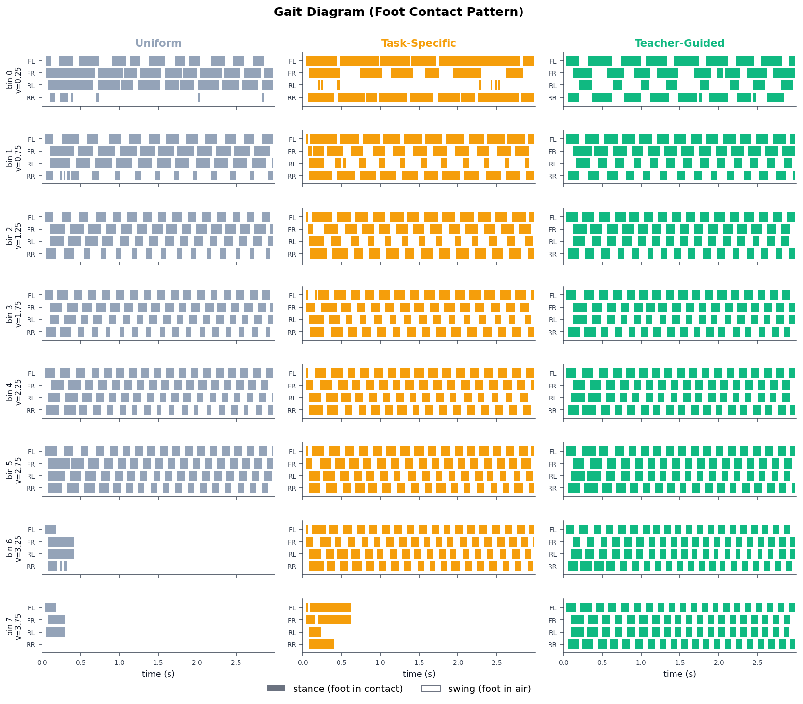
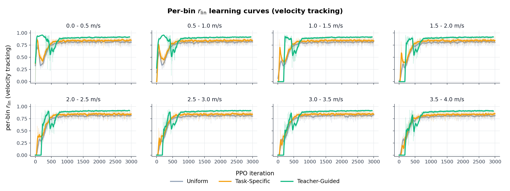
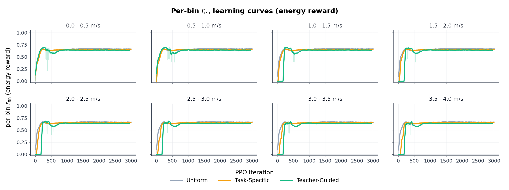
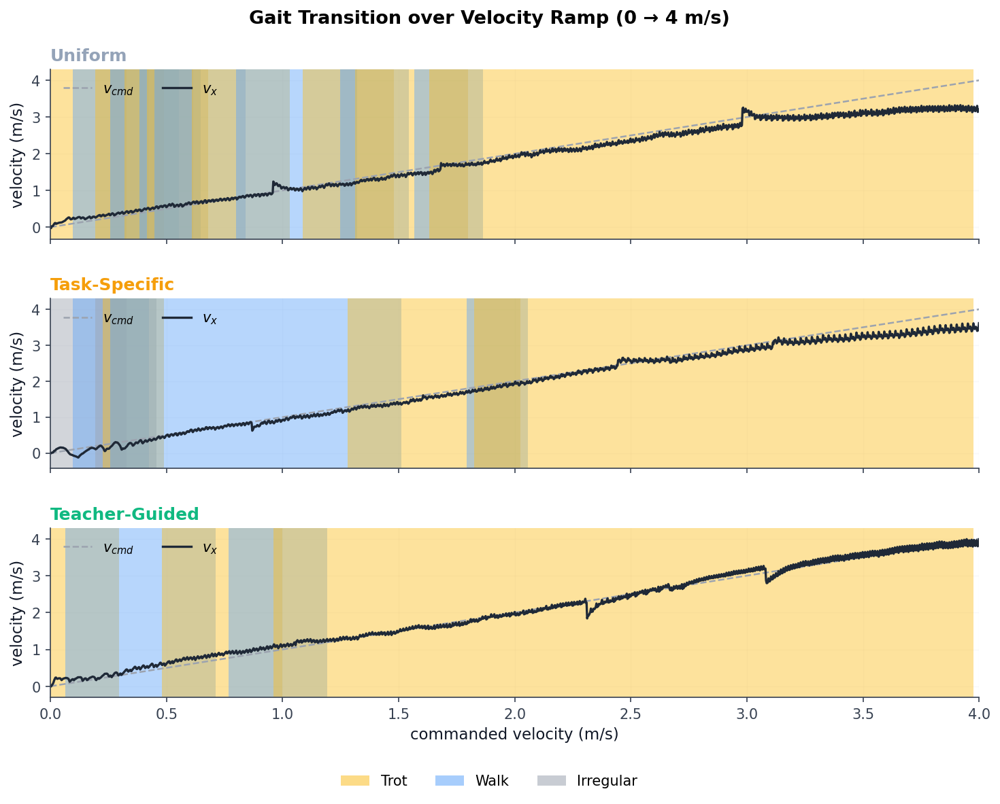

# Curriculum Learning and Gait Emergence for Go2 Velocity Tracking

**Author:** Phakin Boonchanachai (66340500037)
**Date:** 2026-05-11

---

## 1. Introduction

This project trains a single PPO policy on the Unitree Go2 to track forward velocity commands from 0 to 4 m/s, using Isaac Lab as the simulator. Three velocity-bin sampling strategies are compared: uniform (baseline), task-specific (Margolis et al. 2022 Box Adaptive), and teacher-guided (Li, Li, and Hutter 2026 LP-ACRL). The velocity range [0, 4] m/s is split into $N = 8$ bins of width 0.5 m/s. Lateral velocity and yaw rate are fixed at zero.

The first phase of the project compares the three curricula under the sprint-retune reward (described in Section 5.1). Teacher-guided LP-ACRL is the only condition that reaches the top velocity bins. Under the sprint-retune, however, the resulting gait is incorrect: feet flick up and down every few control steps to harvest the air-time bonus, producing a staccato pattern rather than a sustained gait cycle.

The second phase replaces the air-time bonus with the Liang 2024 cost-of-transport energy bonus. This produces a clean trotting gait without prescribing contact patterns. Under the energy reward, most of the curriculum advantage from the first phase disappears for bins 0 through 6. Teacher-guided curriculum retains its advantage only on bin 7.

The report makes three contributions: a three-way curriculum comparison on the Go2 across 0 to 4 m/s; the two-phase sigma calibration that made the energy reward usable on this platform; and an analysis of why the per-bin reward signal and both standard evaluation metrics become unreliable once the energy term is added.

## 2. Background and related work

### 2.1 Curriculum learning for legged locomotion

High-velocity commands produce near-zero tracking reward and frequent early terminations until the policy has already acquired a competent fast gait. Under uniform command sampling across a wide range, the gradient is dominated by uninformative trajectories from high-velocity failures, and the policy specializes on the easy end. This failure mode has been documented on the MIT Mini Cheetah (Margolis et al. 2022) and on the ANYmal D (Li, Li, and Hutter 2026).

Two families of curriculum operators address this. Task-specific curricula, where the operator designs the advancement rule, are represented here by Margolis et al. 2022 Box Adaptive. Teacher-guided curricula, where an adaptive mechanism adjusts sampling from the agent's own training signal, are represented here by Li, Li, and Hutter 2026 LP-ACRL. Both families use reward-derived information to decide which commands the policy sees next, which makes their mechanisms directly comparable on a matched setup.

### 2.2 Reward shaping for quadruped gait

The training stack is built on Isaac Lab (Mittal et al. 2023) and the upstream `unitree_rl_lab` repository (Unitree Robotics). The upstream reward is a weighted sum of 16 terms: two velocity-tracking exponential-kernel terms, smoothness penalties on joint velocity, acceleration, torques, and action-rate, a feet-air-time bonus, and auxiliary terms. The stack is trained under massively parallel PPO (Rudin et al. 2022, building on Schulman et al. 2017).

The Liang et al. 2024 energy bonus pays for motion-per-power: the robot earns the bonus by moving efficiently, not by taking swings of any particular duration or contact pattern. This distinction is important because it means the reward does not prescribe which gait the policy must adopt.

### 2.3 Quadrupedal gait taxonomy

The gait classifier uses the Hildebrand 1989 two-dimensional $(\beta, \phi_{LH})$ plane. $\beta$ is hindlimb duty factor; $\beta > 0.5$ is walking, $\beta \le 0.5$ is running. $\phi_{LH}$ is the lateral limb phase (0 = pace, 0.25 = walk-LS, 0.5 = trot, 0.75 = walk-DS). The quadrants between canonical points are named after Cartmill, Lemelin, and Schmitt 2002: LSLC, LSDC, DSDC, DSLC. Janis et al. 2021 frame these as an evolutionary map of mammalian gait diversification. This plane is the classifier's reference frame throughout the report.

## 3. Experimental setup

The design is a matched comparison. Nine runs (3 conditions x 3 seeds) share the robot, simulator, reward, observations, termination, and PPO configuration. Only the curriculum update rule and the random seed differ. Seeds are reused across conditions so condition-to-condition differences are not driven by seed assignment.

The task space is [0, 4.0] m/s split into $N = 8$ bins of width 0.5 m/s. Lateral velocity and yaw rate are fixed at zero.

Phase 1 (sprint-retune): 6000 PPO iterations, 2048 parallel environments, sprint-retune reward (Section 5.1). The proposal's 3000-iteration budget was too short for the high-speed bins to converge; the budget was doubled after pilot runs showed bins 5 through 7 had not plateaued.

Phase 2 (energy reward): 3000 PPO iterations, 4096 parallel environments, energy reward (Section 5.2). The energy reward causes earlier plateau; the proposal budget was sufficient.

## 4. The three curricula

Let $\mathcal{T} = \{\zeta_0, \ldots, \zeta_{N-1}\}$ be the set of $N = 8$ velocity bins and $c_j \in \Delta(\mathcal{T})$ the sampling distribution at curriculum stage $j$.

**Uniform.** The per-bin sampling weight is constant throughout training:

$$
w_b = \frac{1}{N}, \qquad b \in \{0, \ldots, N-1\}.
$$

Each bin receives exactly 12.5 percent of all training samples, regardless of how the policy performs on any bin.

**Task-specific (Box Adaptive, Margolis et al. 2022).** Per-bin weight $w_b$ is updated each curriculum tick by

$$
w_b \leftarrow \min\!\left(1.0,\; w_b + 0.2 \cdot \mathbb{1}[b' \in \{b{-}1,\, b,\, b{+}1\}]\right),
$$

where $b'$ is the currently active bin, conditional on $b'$ having both crossed the smoothed mastery threshold $\gamma$ on its per-bin mean tracking reward and accumulated at least 50 completed episodes. The paper specifies the rule schema and states that $\gamma \in (0, 1)$ is a success threshold, but leaves the numerical value, the episode-count stability gate, and the per-tick weight increment unspecified. The values used here, $\gamma = 0.7$, 50-episode count, and a weight increment of 0.2, are implementation hyperparameters chosen for this work. The rule only adds weight, never removes it. One consequence matters for the results: once bins 0 through 5 have all unlocked, each of the six unlocked bins receives roughly 16 percent of the budget. Once bin 6 also unlocks, each of the seven unlocked bins receives roughly 14 percent. This dilution leaves the hardest bin with insufficient focused exposure to cross the mastery threshold.

**Teacher-guided (LP-ACRL, Li, Li, and Hutter 2026).** Every stage of $M = 50$ ticks, per-bin learning progress is computed as

$$
\mathrm{LP}_b = \bar{r}_{\mathrm{lin,stage}}(b) - \bar{r}_{\mathrm{lin,prev}}(b),
$$

and sampling weights are produced as a softmax over learning progress, mixed with a uniform exploration floor:

$$
w_b = (1 - \varepsilon) \cdot \frac{\exp(\mathrm{LP}_b / \beta)}{\sum_{b'} \exp(\mathrm{LP}_{b'} / \beta)} + \frac{\varepsilon}{N}.
$$

The paper specifies the rule schema; the softmax temperature $\beta$, exploration floor $\varepsilon$, and stage length $M$ are tuned per setup. The values used here are $\beta = 0.05$, $\varepsilon = 0.15$, $M = 50$ ticks per stage. This rule actively redistributes weight. When a bin plateaus, its LP falls toward zero, its softmax mass collapses, and the next-highest-LP bin takes over. The uniform floor $\varepsilon = 0.15$ guarantees every bin at least $\varepsilon / N \approx 0.019$ probability of being sampled even when its learning progress is zero. With $\beta = 0.05$, the softmax is sharp, close to winner-take-most, so compute concentrates heavily on whichever bin is currently improving fastest.

The key structural difference between the two curricula is that task-specific can only add weight to bins, while teacher-guided can reallocate weight away from plateaued bins. Once many bins have unlocked under task-specific, budget dilution is permanent. Under teacher-guided, bins that plateau release their share back to whichever bin is still improving.

## 5. Reward function

### 5.1 Sprint-retune baseline

The upstream reward is a weighted sum of 16 terms:

$$
r_t = \sum_{i=1}^{16} w_i \cdot r_i(\zeta_t).
$$

The two velocity-tracking terms are exponential kernels on velocity error:

$$
r_{\mathrm{lin}} = \exp\!\left(-\,\frac{\|v_{xy}^{\mathrm{cmd}} - v_{xy}\|^2}{\sigma_{\mathrm{lin}}^2}\right), \qquad w_{\mathrm{lin}} = 1.5, \quad \sigma_{\mathrm{lin}} = 0.5\ \mathrm{m/s},
$$

$$
r_{\mathrm{ang}} = \exp\!\left(-\,\frac{(\omega_z^{\mathrm{cmd}} - \omega_z)^2}{\sigma_{\mathrm{ang}}^2}\right), \qquad w_{\mathrm{ang}} = 0.75, \quad \sigma_{\mathrm{ang}} = 0.25\ \mathrm{rad/s}.
$$

The upstream weights are tuned for $v_x \in [-1, 1]$ m/s. Stretching the command to [0, 4] m/s creates a standstill local optimum: the smoothness penalty at sprint commands exceeds the tracking ceiling, so any trajectory that actually runs at 4 m/s yields negative reward, while standing still pays the angular-tracking bonus unconditionally. To recover a non-degenerate optimum, five upstream values were modified.

| Term / parameter | Upstream | Current | Reason |
|---|---:|---:|---|
| `joint_vel.weight` | $-1{\times}10^{-3}$ | $-1{\times}10^{-4}$ | Sustained running requires high $\|\dot{q}\|$; weaken so high-$\dot{q}$ trajectories are net-positive. |
| `joint_acc.weight` | $-2.5{\times}10^{-7}$ | $-1{\times}10^{-7}$ | Fast strides require large joint accelerations during swing-stance transitions. |
| `joint_torques.weight` | $-2{\times}10^{-4}$ | $-2{\times}10^{-5}$ | Higher speeds demand larger peak torques; upstream weight discourages these torque levels. |
| `action_rate.weight` | $-0.1$ | $-0.005$ | Sprint stride requires rapid step-to-step changes in joint targets. |
| `feet_air_time.threshold` | $0.5$ s | $0.1$ s | Short threshold compatible with higher stride frequency at speed. |

*Table 1: Five sprint-retune reward modifications relative to upstream.*

In addition, the joint-position action scale was raised from 0.25 to 0.35 to allow the leg-swing amplitude that a sprint stride requires. This is complementary to the air-time threshold change: the action scale controls stride length, the air-time threshold controls minimum swing duration.

### 5.2 Energy-based reward

The energy reward from Liang et al. 2024 is:

$$
r_{\mathrm{en}} = \exp\!\left(-\,\frac{P}{\max(\sigma_x |v_x| + \sigma_z |\omega_z|,\;\varepsilon)}\right), \qquad P = \sum_{j=1}^{12} |\dot{q}_j|\, |\tau_j|,
$$

with $\sigma_x = 500$, $\sigma_z = 250$, $\varepsilon = 0.1$. The published equation in Liang et al. 2024 has no $\varepsilon$ clamp; the clamp is an implementation safeguard added here to prevent division-by-zero when the body is momentarily stationary, and the paper's published Go1 defaults are $\sigma_x = 1000$, $\sigma_z = 500$. The selection of the smaller $\sigma$ values used here is the subject of Section 9.

$P$ is mechanical power summed across the twelve leg joints. The denominator only grows when the body is moving. At standstill, the denominator sits at $\varepsilon = 0.1$, so any joint loading drives $r_{\mathrm{en}}$ toward zero. At $|v_x| = 3$ m/s, the denominator reaches 1500 and the bonus sits stably in the range $[0.4, 0.8]$ for typical power levels. The shaping is power-versus-displacement: the reward pays for moving efficiently, not for contact patterns of any specific shape.

The total reward under the energy configuration is:

$$
r_t = \sum_{i=1}^{16} w_i \cdot r_i(\zeta_t) + w_{\mathrm{en}} \cdot r_{\mathrm{en}}(\zeta_t),
$$

with `feet_air_time.weight = 0.0`, `air_time_variance.weight = 0.0`, $w_{\mathrm{en}} = 0.5$, and the five sprint-retune smoothness weakenings retained. The air-time threshold modification is no longer relevant since the air-time term is removed entirely.

The implementation is in `src/source/curriculum_rl/curriculum_rl/envs/liang_composite_reward.py`, function `energy_cot`.

## 6. Evaluation protocol

Convergence is read from per-bin mean tracking reward over PPO iterations, averaged across three seeds per condition.

For deterministic evaluation, each (condition, seed, bin) cell is rolled out 100 times for $K = 1000$ simulation steps at the bin centre, with the policy in deterministic-action mode and domain randomisation disabled.

The primary evaluation metric is EPTE-SP (Early-Penalised Tracking Error with Survival Premium):

$$
\mathrm{EPTE\text{-}SP} = \frac{\varepsilon \cdot k_f + (K - k_f)}{K},
$$

where $k_f$ is the fall step ($K$ if no fall), and $\varepsilon = \mathrm{clip}(|v_x^{\mathrm{cmd}} - v_x|,\, 0,\, 1)$ is the normalised tracking error. A perfect rollout scores 0; an immediate fall at maximum error scores 1.

The decision rule for pairwise comparison is: condition A beats condition B on bin $\zeta$ if and only if A's seed-mean EPTE-SP is less than B's and A's min-max range is disjoint from B's. Three seeds per condition is a compute-driven choice; this is a conservative dominance criterion, not a statistical test.

## 7. Results: curriculum comparison under the sprint-retune reward

### 7.1 Convergence and per-bin tracking performance

Per-bin mean tracking reward over PPO iterations shows the three conditions tracking closely on bins 0 through 4 and diverging on bins 5 through 7.

*Figure 1: Per-bin mean tracking reward versus PPO iteration, three seeds aggregated per condition.*

The deterministic-evaluation EPTE-SP per bin is shown in Figure 2 and listed in Table 2.

*Figure 2: EPTE-SP per velocity bin, mean over three seeds. Error bars show min-max across rollouts.*

| Bin (m/s) | Uniform | Task-Specific | Teacher-Guided |
|---|:---:|:---:|:---:|
| 0  [0.0, 0.5] | 0.439 | 0.312 | 0.251 |
| 1  [0.5, 1.0] | 0.120 | 0.123 | 0.095 |
| 2  [1.0, 1.5] | 0.083 | 0.076 | 0.058 |
| 3  [1.5, 2.0] | 0.063 | 0.063 | 0.056 |
| 4  [2.0, 2.5] | 0.070 | 0.066 | 0.071 |
| 5  [2.5, 3.0] | 0.178 | 0.063 | 0.073 |
| 6  [3.0, 3.5] | 1.000 | 0.779 | 0.149 |
| 7  [3.5, 4.0] | 1.000 | 1.000 | 0.383 |

*Table 2: Mean EPTE-SP per (condition, bin) under the sprint-retune reward, $n = 300$ samples per cell (3 seeds x 100 rollouts).*

Under the sprint-retune reward, teacher-guided LP-ACRL is the only condition that reaches bins 6 and 7. Uniform and task-specific both saturate at EPTE-SP = 1.000 on bin 6; teacher-guided holds at 0.149. The EPTE-SP gap at bin 7 is equally decisive: uniform and task-specific at 1.000, teacher-guided at 0.383. Task-specific performs better than uniform on bin 6 (0.779 vs 1.000) but does not reach mastery.

### 7.2 Velocity tracking and task sampling

*Figure 3: Task-sampling distribution as a function of PPO iteration, per condition.*

*Figure 4: Achieved forward velocity versus commanded forward velocity at bin centres.*

The sampling heatmap makes the mechanism behind the EPTE-SP results visible. Task-specific's chain-unlock rule fires on bins 0 through 5 in sequence, and after bin 5 unlocks the per-bin sampling share over six unlocked bins flattens to roughly 16 percent each. Once bin 6 also unlocks, each of the seven unlocked bins receives approximately 14 percent. That share is insufficient for the policy to cross the mastery threshold on bin 6, so bin 7 never receives the focused attention it needs. Teacher-guided shows the opposite pattern: each bin from 0 through 5 takes a turn as the high-weight focus and then recedes as it plateaus, freeing budget for the next bin to climb.

Achieved velocity tracks the command diagonal to approximately 2.25 m/s for uniform and task-specific, then drops sharply. At $v_x^{\mathrm{cmd}} = 3.75$ m/s, achieved velocity for both collapses below 0.2 m/s. Teacher-guided maintains achieved velocity around 2.3 m/s at the same command. These results, however, were obtained inside a reward landscape that had introduced its own local optima. Whether curriculum learning's advantage would hold under a better reward is what the energy-reward experiments address.

### 7.3 The gait is wrong

*Figure 5: Foot-contact patterns over a three-second window per (condition, bin). Filled = stance, empty = swing.*

The foot-contact diagram reveals a staccato pattern: each foot is in the air for only a brief flash before touching down again, with many short swings rather than sustained stride swings. This pattern appears across all conditions and bins where the policy is tracking the command.

The mechanism follows directly from the sprint-retune. With `feet_air_time.threshold` set to 0.1 s and a control step of 0.02 s, the air-time bonus is earned on any swing longer than five control steps. The policy therefore minimises swing duration just above this floor and earns the bonus repeatedly, rather than taking longer strides. The weakened action-rate penalty, reduced by a factor of 20 relative to upstream, makes the rapid lift-plant-lift toggling cheap. Together, these two changes incentivise short, frequent foot flicks rather than sustained gait cycles.

## 8. Why the gait is wrong

The staccato pattern is a predictable consequence of two interacting sprint-retune changes. With the air-time threshold at 0.1 s, the policy only needs five control steps of swing to earn the bonus. Once the per-step air-time bonus is earnable at this frequency, rapid foot-flicking becomes the optimal strategy under the weakened action-rate penalty. The policy is not failing to learn a gait; it learned exactly what the reward asked for.

Fixing the gait without prescribing contact patterns is the constraint for the next phase. Explicit duty-factor targets, stride-frequency targets, and periodic contact-schedule rewards are all excluded. The energy reward of Liang et al. 2024 addresses this: it pays for motion-per-power, so any policy that moves efficiently at the commanded speed earns the bonus, regardless of what the contact pattern looks like. A standing policy has near-zero body velocity, so the denominator stays at $\varepsilon$ and any joint loading drives the bonus toward zero. A running policy inflates the denominator with body velocity and earns a stable bonus without any contact-pattern constraint.

## 9. Sigma calibration

The Liang 2024 paper publishes $\sigma_x = 1000$, $\sigma_z = 500$ on the Unitree Go1. The Go2 is heavier, has a different torque envelope, and is trained in a different reward stack. The paper notes that the energy weight "should be comparable to motion rewards" and shows that overly large energy weight collapses tracking. The defaults are not robot-agnostic.

Calibration ran in two phases. Phase 0 was a random-action diagnostic (`src/scripts/sweep_sigma_diagnostic.py`): 512 environments, 1000 steps, random actions. The script swept $\sigma_x \in \{50, 100, 250, 500, 1000, 2000, 5000\}$ at fixed $\sigma_z = \sigma_x / 2$ and reported mean $r_{\mathrm{en}}$ across all environments and steps. The useful gradient band, defined as $\bar{r}_{\mathrm{en}} \in [0.30, 0.75]$ (neither saturated near zero nor near one), bracketed the candidate range to $\sigma_x \in \{500, 1000\}$, with $\sigma_x = 250$ retained as a low-side tiebreaker.

Phase v4 was a full training grid (`src/scripts/run_sweep_v4.sh`): a $3 \times 3$ grid over $\sigma_x \in \{250, 500, 1000\}$, $\sigma_{\mathrm{lin}} \in \{0.5, 1.0\}$, and $w_{\mathrm{en}} \in \{0.5, 1.0\}$, with each cell a full 3000-iteration training run. The winning configuration was run 8: $\sigma_x = 500$, $\sigma_z = 250$, $\sigma_{\mathrm{lin}} = 1.0$, $w_{\mathrm{en}} = 0.5$.

Two cross-cutting observations from the grid. First, softening the tracking sharpness $\sigma_{\mathrm{lin}}$ from 0.5 to 1.0 improved every row. The upstream tracking sharpness is too tight once the energy term is added. Second, halving $w_{\mathrm{en}}$ from 1.0 to 0.5 improved both surviving $\sigma_x$ rows. The paper's default overweights energy relative to tracking on this platform.

## 10. Gait classification methodology

The classifier operates in Hildebrand 1989's $(\beta, \phi_{LH})$ plane. From a contact trace of shape $(T, 4)$ with simulation timestep $dt$, the classifier proceeds as follows.

The reference foot is front-left (FL). Per-foot phase $\phi_i$ is computed as the lag of foot $i$'s first stance onset after each FL onset, divided by the stride period, taken modulo 1, and circular-meaned across strides. The lateral limb phase is then $\phi_{LH} = \mathrm{circular\_mean}(\phi_L, \phi_R)$, where $\phi_L = (\phi_{FL} - \phi_{RL}) \bmod 1$ and $\phi_R = (\phi_{FR} - \phi_{RR}) \bmod 1$. The left-right asymmetry is the cyclic distance $\delta\phi = \min(|\phi_L - \phi_R|,\, 1 - |\phi_L - \phi_R|)$.

If $\delta\phi \ge \mathrm{LR\_ASYMMETRY\_THRESHOLD}$, the gait is asymmetric and is matched against templates for canter, gallop, bound, and pronk via cyclic distance. Otherwise the gait is symmetric, and is labelled by the nearest canonical $\phi_{LH}$ within PHI_TOLERANCE. A walking-versus-running qualifier is appended based on whether $\beta$ exceeds BETA_RUN_THRESHOLD. The canonical trot label carries a DAP sub-tag when the per-side lag deviates from 0.5 by more than DAP_DISSOCIATION_THRESHOLD.

| Symbol | Value | Source |
|---|---|---|
| `BETA_RUN_THRESHOLD` | 0.50 | Hildebrand 1989 |
| `PHI_TOLERANCE` | 0.10 | half-quadrant width on Cartmill 2002 boundary |
| `LR_ASYMMETRY_THRESHOLD` | 0.20 | engineering: $2 \times \mathrm{PHI\_TOLERANCE}$ |
| `DAP_DISSOCIATION_THRESHOLD` | 0.05 | engineering: approximately 10 ms at 200 ms trot period |
| `STAND_DUTY` | 0.95 | engineering threshold for Stand admin label |

*Table 3: Gait classifier thresholds.*

Note on DAP: dissociation up to approximately 0.10 cycle (roughly 50 ms at horse trot period) is a normal feature of trot in sound horses (Starke and Clayton 2015), not a separate gait. Magnitudes well above that flag a quality concern but do not change the gait label.

The implementation is in `src/scripts/plot_gait_classification.py`.

## 11. Results under the energy reward

### 11.1 Per-bin learning curves

*Figure 6: Per-bin learning curves for the tracking reward $r_{\mathrm{lin}}$, three seeds aggregated per condition.*

*Figure 7: Per-bin learning curves for the energy reward $r_{\mathrm{en}}$, three seeds aggregated per condition.*

All three conditions plateau on bins 0 through 6 within 3000 iterations. Bin 7 plateaus too, but at low $r_{\mathrm{lin}}$ for uniform and task-specific: these conditions revert to slow walking dynamics when given a sprint command rather than acquiring sprint-speed locomotion. Teacher-guided reaches bin 7 reliably across all three seeds.

### 11.2 Foot-contact patterns and gait metrics

*Figure 8: Foot-contact patterns over a three-second window per (condition, bin). Filled = stance, empty = swing.*

The staccato pattern from phase 1 is gone. The contact diagram shows clean alternating contact with longer continuous stance and swing durations and no rapid lift-plant-lift toggling across all bins where the policy is tracking the command.

*Figure 9: Duty factor and stride frequency versus commanded velocity, per (condition, bin).*

Duty factor falls from approximately 0.66 at bin 0 to approximately 0.54 at bin 6. Stride frequency rises with commanded velocity over the same range. No flight phase emerges anywhere in the trackable range. Since $\beta$ stays above 0.5 everywhere it is reported, this is a walking trot, not a flying trot.

The classifier output for representative seeds is summarised in Table 4.

| Bin (m/s) | Condition (rep. seed) | $\beta$ | $\phi_{LH}$ | Classifier label |
|---|---|:---:|:---:|---|
| [0.0, 0.5] | uniform | 0.67 | 0.25 | Walk-LS |
| [0.5, 1.0] | uniform | 0.62 | 0.40 | LSDC walk |
| [1.0, 1.5] | uniform | 0.59 | 0.48 | Trot (walking) |
| [1.5, 2.0] | uniform | 0.56 | 0.50 | Trot (walking) +DAP |
| [2.0, 2.5] | uniform | 0.55 | 0.51 | Trot (walking) +DAP |
| [2.5, 3.0] | uniform | 0.54 | 0.52 | Trot (walking) +DAP |
| [3.0, 3.5] | uniform | 0.54 | 0.51 | Trot (walking) $\pm$DAP |
| [3.5, 4.0] | uniform | n/a | n/a | Stand (collapsed) |
| [3.5, 4.0] | teacher | 0.53 | 0.51 | Trot (walking) +DAP |

*Table 4: Representative gait labels per (condition, bin) under the energy reward.*

The pattern is Walk-LS at bin 0, LSDC walk at bin 1, settled Trot from bin 2 upward. The Trot picks up a positive diagonal advanced placement as speed increases, where the hind foot lands fractionally before the diagonal fore. This sign of dissociation is the same direction observed in trotting horses (Starke and Clayton 2015).

### 11.3 Velocity ramp and gait transition

*Figure 10: Gait transition during a continuous forward-velocity ramp from 0 to 4 m/s. Coloured bands show classifier output; commanded and achieved velocities are overlaid.*

The policy moves through the gait sequence continuously rather than switching at a sharp boundary. Walk-LS appears at the lowest commanded velocities, the trace passes through LSDC walk, and the policy settles into Trot from approximately 1.5 m/s upward. Under uniform and task-specific, achieved velocity flattens around 2.5 m/s. Under teacher-guided, it tracks the command line to approximately 3.5 m/s before the residual gap opens. The discrete bin labels in Table 4 are labels on a continuous flow, consistent with how Hildebrand 1989 describes mammalian gait transitions.

### 11.4 Tracking, sampling, and EPTE-SP per bin

*Figure 11: EPTE-SP per velocity bin, mean over three seeds, under the energy reward.*

| Bin (m/s) | Uniform | Task-Specific | Teacher-Guided |
|---|:---:|:---:|:---:|
| 0  [0.0, 0.5] | 0.500 | 0.393 | 0.416 |
| 1  [0.5, 1.0] | 0.127 | 0.104 | 0.128 |
| 2  [1.0, 1.5] | 0.061 | 0.062 | 0.064 |
| 3  [1.5, 2.0] | 0.055 | 0.058 | 0.055 |
| 4  [2.0, 2.5] | 0.053 | 0.053 | 0.052 |
| 5  [2.5, 3.0] | 0.056 | 0.056 | 0.060 |
| 6  [3.0, 3.5] | 0.093 | 0.084 | 0.069 |
| 7  [3.5, 4.0] | 0.861 | 0.633 | 0.107 |

*Table 5: Mean per-bin tracking error $\overline{|v_x^{\mathrm{cmd}} - v_x|}$ in m/s under the energy reward, $n = 300$ per cell.*

Bins 0 through 6 show all three conditions within approximately 0.01 m/s of each other in mean tracking error. Bin 7 diverges sharply: uniform 0.861, task-specific 0.633, teacher-guided 0.107.

*Figure 12: Achieved versus commanded forward velocity at bin centres, under the energy reward.*

*Figure 13: Task-sampling distribution as a function of PPO iteration, per condition, under the energy reward.*

Bin 0 (centre at 0.25 m/s) shows elevated EPTE-SP in the range 0.39 to 0.50 across all conditions. This is not a learning failure: the per-bin training reward on bin 0 is comparable to bins 1 through 4 in both phases. The elevated EPTE-SP arises partly because the platform cannot maintain a steady trot below some minimum speed, and partly because EPTE-SP normalises by the small commanded velocity, inflating the reported value.

### 11.5 Where curriculum still matters

Under the energy reward, uniform tracks bins 0 through 6 about as well as the curriculum conditions. The reward change removed the local optima that the sprint-retune had introduced near the gait-regime boundary around 3 m/s. With a sensible reward landscape, each bin's trotting gait generalises naturally, and uniform sampling's 12.5 percent per-bin share is sufficient for bins 0 through 6.

Bin 7 is the exception. Reaching the [3.5, 4.0] m/s sprint bin requires concentrated training time; it sits beyond a gait-regime transition near 3 m/s that requires the policy to acquire qualitatively different locomotion dynamics. The per-seed breakdown for bin 7 is shown in Table 6.

| Condition | Seed | Achieved $v_x$ (m/s) | Tracking error (m/s) |
|---|:---:|:---:|:---:|
| uniform | 0 | 0.39 | (collapsed) |
| uniform | 1 | 0.63 | (collapsed) |
| uniform | 2 | 0.56 | (collapsed) |
| task_specific | 0 | 0.33 | (collapsed) |
| task_specific | 1 | 0.50 | (collapsed) |
| task_specific | 2 | 3.32 | 0.117 |
| teacher | 0 | 3.29 | 0.08 to 0.12 |
| teacher | 1 | 3.33 | 0.08 to 0.12 |
| teacher | 2 | 3.47 | 0.08 to 0.12 |

*Table 6: Per-seed bin-7 outcomes under the energy reward.*

Uniform achieves 0/3 successes. Task-specific achieves 1/3 (only when chain-unlock reached bin 7 before budget exhaustion). Teacher-guided achieves 3/3. Kinematic confirmation: mean action rate at bin 7 is 1.31 for teacher-guided, 0.26 for uniform, and 0.59 for task-specific (the latter pulled down by two collapsed seeds). At bin 6, all three conditions sit between 1.07 and 1.16, nearly tied, because all three conditions track bin 6.

Teacher-guided's softmax over learning progress actively reallocates compute to bin 7 as soon as easier bins plateau, and this mechanism delivers the focused exposure needed regardless of the random seed. The plain uniform sampler's 12.5 percent per-bin share is not enough to push the policy past the gait-regime transition near 3 m/s.

### 11.6 Metric and curriculum-signal corruption

Three issues arise under the energy reward, listed in order of severity.

The first issue is that per-bin total reward $\bar{R}$ flattens to approximately [0.81, 0.92] across every (condition, bin) cell, including collapsed bin-7 cells. The convergence plot and iterations-to-mastery chart cannot distinguish mastered bins from collapsed ones. EPTE-SP is also less informative than in phase 1: only 14 of 7200 rollouts terminate for bad orientation, giving a survival rate near 100 percent. With no survival variation, EPTE-SP reduces algebraically to the normalised tracking-error term and carries no extra information beyond Table 5.

The second issue is that the curriculum's own input signal is unreliable on collapsed bins. The per-bin signal that both curriculum operators consume is the column `r_lin` written to `curriculum.csv`, populated from `episode_sums["track_lin_vel_xy"] / ep_len / weight` (mdp.py:122-128), clamped to [0, 1]. This is the tracking term only, not total reward and not $r_{\mathrm{en}}$. Yet it reads approximately 0.81 on collapsed bin-7 cells where eval shows $v_x$ near zero.

The mechanism is a training-time noise artefact, not energy masking. The clamp to [0, 1] discards negative outliers; the per-episode denominator is the actual (often short) episode length. When the policy crashes early on a bin, the brief pre-crash interval can contain transient $r_{\mathrm{lin}}$ spikes as the policy momentarily achieves something closer to the commanded velocity before the crash. Averaging those spikes over a short episode produces an inflated per-bin tracking signal. An earlier draft (update_progress_2.md Section 3.3) attributed the inflation to $r_{\mathrm{en}}$ masking $r_{\mathrm{lin}}$ in the per-bin total reward. That explanation is inconsistent with the CSV schema, which records the tracking term alone. The correct framing is that the per-bin tracking signal under training noise is unreliable on collapsed bins regardless of $r_{\mathrm{en}}$.

The third issue is the consequence of the second: both curriculum operators are choosing what to do next based on a signal that does not cleanly separate mastered bins from collapsed ones. Task-specific's threshold-crossing event may fire because the per-bin tracking signal averaged high over short crash-cut episodes, not because the policy learned the bin. Teacher-guided's learning-progress signal may register a plateau on a bin the policy never solved. That teacher-guided still produced the cleaner outcome on bin 7 is evidence of its mechanism's robustness under a noisy signal, not a vindication of the signal quality itself.

## 12. Conclusion

Under the sprint-retune reward, teacher-guided LP-ACRL was the only condition to reach bins 6 and 7. Uniform sampling failed completely on both top bins; task-specific failed on bin 7 and reached bin 6 only partially. Under the energy reward, that advantage shrinks to a single bin. Uniform sampling tracks bins 0 through 6 about as well as the curriculum conditions once the energy reward removes the local optima that the sprint-retune introduced. Curriculum learning's measured benefit in phase 1 was largely a consequence of operating inside a broken reward landscape: the conditions differed in their ability to push the policy past a regime boundary that the staccato attractor created, not in any fundamental ability to generalise across the velocity range.

Teacher-guided curriculum retains a genuine advantage on bin 7. Its softmax over learning progress actively reallocates compute to the bin still showing improvement, and it reaches bin 7 reliably across all three seeds. This is the setting where a curriculum is most useful: a single hard bin, beyond a gait-regime transition, that requires concentrated exposure to reach mastery.

The energy reward's contribution is equally clear. Replacing the air-time bonus with the Liang 2024 cost-of-transport bonus produces a clean trotting gait across all trackable bins without prescribing contact patterns. Duty factor decreases smoothly with speed. The staccato gait is gone. The trot picks up a positive diagonal advanced placement at high speed, consistent with biomechanical observations in horses.

Both findings suggest a practical design principle: before comparing curriculum strategies, verify that the reward landscape does not contain artefactual local optima. A curriculum that appears essential inside a broken reward may be doing most of its work against the reward's own incentive structure rather than against the difficulty of the task.

### 12.1 Limitations

Three limitations apply to the results above.

First, no flight phase. The gait is a walking trot across the entire trackable range, with $\beta$ staying above 0.5 everywhere. The energy reward alone is insufficient to produce flight. If flight-phase locomotion is a project goal, a periodic contact-schedule reward would need to be added.

Second, the training-time per-bin reward signal is unreliable on collapsed bins. Until this is fixed (Section 12.2), neither curriculum operator can reliably detect when a bin is truly mastered versus when the policy is simply failing fast on it.

Third, only three seeds per condition. Task-specific's 1/3 success on bin 7 is not statistically distinguishable from noise at this sample size. Whether the chain-unlock mechanism reaches bin 7 reproducibly is not determinable from current data.

### 12.2 Future work

Four lines of work would extend or correct the results above.

The most important is to replace the per-bin reward signal feeding both curriculum operators with a tracking-only, clipping-aware signal that cannot be inflated by training-time noise. A reasonable implementation logs achieved velocity per bin with a fixed-length window rather than normalising by episode length, and feeds both curriculum operators from that signal.

The second is to run additional seeds (target 5 to 10) on task-specific and uniform, to establish whether the chain-unlock mechanism reaches bin 7 reproducibly or whether seed 2 under task-specific was an isolated event in this sweep.

The third, if flight-phase locomotion is required, is to add a periodic contact-schedule reward and re-run the full comparison under the resulting reward stack.

The fourth is to verify whether the per-bin tracking-signal corruption observed in Section 11.6 is also present in eval rollouts or is confined to the training loop. If the eval traces are clean, then the corruption is a property of the training loop's episode-normalisation choice and can be fixed there without affecting the eval pipeline.

## References

[1] Margolis, G. B., Yang, G., Paigwar, K., Chen, T., and Agrawal, P. (2022). *Rapid Locomotion via Reinforcement Learning.* Robotics: Science and Systems.

[2] Li, Z., Li, C., and Hutter, M. (2026). *Scaling Rough Terrain Locomotion with Automatic Curriculum Reinforcement Learning.* arXiv:2601.17428.

[3] Liang, Q. et al. (2024). *Adaptive Energy Regularization for Autonomous Gait Transition and Energy-Efficient Quadruped Locomotion.* arXiv:2403.20001.

[4] Unitree Robotics. *unitree_rl_lab.* GitHub repository, accessed 2026-04-28.

[5] Mittal, M. et al. (2023). *Orbit: A Unified Simulation Framework for Interactive Robot Learning Environments.* IEEE Robotics and Automation Letters.

[6] Rudin, N. et al. (2022). *Learning to Walk in Minutes Using Massively Parallel Deep Reinforcement Learning.* Conference on Robot Learning (CoRL).

[7] Schulman, J. et al. (2017). *Proximal Policy Optimization Algorithms.* arXiv:1707.06347.

[8] Hildebrand, M. (1989). *The quadrupedal gaits of vertebrates.* BioScience 39(11): 766-775.

[9] Hildebrand, M. (1977). *Analysis of asymmetrical gaits.* Journal of Mammalogy 58(2): 131-156.

[10] Cartmill, M., Lemelin, P., and Schmitt, D. (2002). *Support polygons and symmetrical gaits in mammals.* Zoological Journal of the Linnean Society 136: 401-420.

[11] Janis, C. M., Shoshitaishvili, B., Kambic, R., and Figueirido, B. (2021). *Evolutionary history of quadrupedal walking gaits shows mammalian release from locomotor constraint.* Proceedings of the Royal Society B 288: 20210937.

[12] Robilliard, J. J., Pfau, T., and Wilson, A. M. (2007). *Gait characterisation and classification in horses.* Journal of Experimental Biology 210: 187-197.

[13] Starke, S. D. and Clayton, H. M. (2015). *An exploration of the influence of diagonal dissociation and moderate changes in speed on locomotor parameters in trotting horses.* PeerJ.

[14] Audoin-Maddison et al. (2009). *Walk-run classification of symmetrical gaits in the horse: a multidimensional approach.* Journal of the Royal Society Interface 6: 35-47.

## Appendix

Under teacher-guided in phase 1, bins 5, 6, and 7 crossed the smoothed mastery threshold before bin 4 did. The proposed partial explanation is that bin 4, sitting in the same speed range as bin 3, picked up much of its reward through generalisation from bin 3 early in training. By the time the softmax came around to allocate mass, bin 4's learning progress was already low, while bins 5 through 7 still had nonzero learning progress climbing out of near-zero. The softmax therefore allocated training mass to bins 5 through 7 before bin 4 had finished plateauing, producing the non-monotone ordering. With three seeds and the per-bin tracking signal known to be noisy on bins that are still climbing, this is recorded as a noisy three-seed observation rather than a finding.
