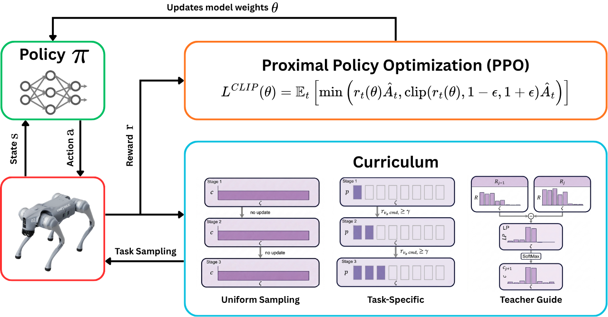

# A Comparative Study of Curriculum Learning Strategies for Velocity-Tracking Policies on the Unitree Go2 Quadruped

**Author:** Phakin Boonchanachai (66340500037)

---

## 1. Introduction

Legged robots operate across a wide range of commanded velocities in practice: from slow, careful maneuvering through cluttered indoor spaces to fast running across open outdoor terrain. A useful locomotion controller should support this full range with a single trained policy, without requiring separate controllers for slow walking and fast running. This capability is the target of a growing body of reinforcement-learning work on legged platforms [rudin2022walk, margolis2022rapid, liacrl2026].

Training such a policy, however, is a multi-task learning problem with a severely unbalanced reward signal. Low-velocity commands yield informative reward from random initialization, but high-velocity commands produce near-zero reward and frequent early terminations until the policy has already acquired a competent fast gait [margolis2022rapid, ji2022concurrent]. On-policy trajectories from the high-velocity end therefore contribute mostly noise to the gradient, and policies trained by uniform command sampling across a wide range tend to specialize on the easy end. This failure mode has been documented on the MIT Mini Cheetah [margolis2022rapid] and on the ANYmal D [liacrl2026], and is the specific training obstacle that curriculum learning addresses.

The standard remedy is a *curriculum*: a schedule that changes the probability of each command value during training, biasing sampling toward easy commands at the start so the policy can acquire a basic gait, then shifting toward harder commands as competence improves. A good curriculum shortens training, broadens the range of commands the policy can execute, and reduces the operator effort needed to train a new policy.

Two families of curricula dominate velocity-range scheduling in legged locomotion [weng2020curriculumblog]: *task-specific curricula*, in which the operator designs the advancement rule by hand, and *teacher-guided curricula*, in which a separate adaptive mechanism adjusts the sampling distribution from the agent's training signal. This work focuses on these two families because their mechanisms are directly comparable: both use reward-derived information to decide which commands the policy sees next. A direct comparison on a matched setup, with all training factors other than the sampling rule held fixed, has not been reported in the literature reviewed here; this work provides one. The two families are reviewed in Section 2.

## 2. Related Work and Background

### 2.1 Formal Curriculum Definition

Let $\mathcal{T}$ denote the task space and $c_j \in \Delta(\mathcal{T})$ the sampling distribution over tasks at curriculum stage $j$. A curriculum is a sequence [liacrl2026]:

$$
\mathcal{C} = (c_0, c_1, c_2, \ldots), \tag{1}
$$

where $c_0$ is the initial distribution and each subsequent $c_j$ is updated based on agent performance. For velocity-tracking, $\mathcal{T}$ is a discretized set of forward-velocity bins.

**Objective.** The curriculum does not terminate at a predefined $c_{\text{final}}$; its goal is defined on the final trained policy. Given a fixed training budget, the task space partitions into a mastered subspace $\mathcal{T}_{\text{mastered}}$ on which the policy meets a performance criterion, and an unmastered subspace $\mathcal{T}_{\text{unmastered}}$ on which it does not [liacrl2026]. A good curriculum (i) minimizes $|\mathcal{T}_{\text{unmastered}}|$ and (ii) maximizes performance across $\mathcal{T}_{\text{mastered}}$.

### 2.2 Task-Specific Curriculum

A task-specific curriculum is one in which the operator designs the sampling schedule by hand [weng2020curriculumblog]. The operator chooses a difficulty ordering over the task space, a success criterion, and an update rule that expands the active task set once the criterion is met. This work adopts the Box Adaptive rule of Margolis et al. [margolis2022rapid]; its advancement is driven by a reward threshold, making it directly comparable to the reward-driven teacher-guided rule of Section 2.3.

**Mechanism.** The velocity command space is partitioned into a discrete grid with resolution $\Delta v$. At episode $k$, a command $v_x^{\mathrm{cmd}}$ is drawn from the current sampling distribution $p_{v_x}^k(\cdot)$. The agent executes an episode under that command and receives a velocity-tracking reward $r_{v_x^{\mathrm{cmd}}}$. If the reward clears a success threshold $\gamma \in (0, 1)$, the sampling weights on the neighbouring commands $v_x^n \in \{v_x^{\mathrm{cmd}} - \Delta v,\; v_x^{\mathrm{cmd}} + \Delta v\}$ are promoted to $1$; otherwise the distribution is left unchanged:

$$
p^{k+1}_{v_x}(v_x^n) \leftarrow \begin{cases} p^k_{v_x}(v_x^n) & \text{if } r_{v_x^{\mathrm{cmd}}} < \gamma, \\ 1 & \text{otherwise}. \end{cases} \tag{2}
$$

Unnormalised weights are renormalised at sampling time. The initial distribution $p_{v_x}^0(\cdot)$ is uniform over a single seed bin around zero; neighbours outside the task space are clipped.

**Expected training behaviour.** The initial distribution puts weight only on the seed bin around zero. All samples come from there, so the policy learns the slowest commands first. Once its tracking reward on the seed bin clears $\gamma$, the rule fires: the adjacent bin's weight jumps from $0$ to $1$. Renormalisation now splits samples between the two bins. The policy continues to improve on the seed bin while also seeing commands from the neighbour. When the neighbour's reward clears $\gamma$, its neighbour is promoted in turn. The active region therefore expands outward one bin at a time, in the order easy $\to$ hard.

Two consequences follow from this mechanism. First, no bin is sampled before the frontier reaches it, so hard bins begin training late and receive fewer total samples than easy bins. Second, once a bin is unlocked, its weight stays at $1$ even after the policy has mastered it, so already-easy bins continue to consume samples that could otherwise go to the frontier. Expansion can also halt if a bin fails to clear $\gamma$ within the remaining training budget; subsequent bins then stay unsampled. Operator choices are the threshold $\gamma$, the grid resolution $\Delta v$, and the seed bin.

### 2.3 Teacher-Guided Curriculum

A teacher-guided curriculum replaces the hand-designed advancement rule with an adaptive process that estimates per-task learning progress from the agent's own reward signal and biases sampling toward the tasks on which the policy is currently improving the fastest [weng2020curriculumblog]. The operator specifies neither a difficulty ordering nor a success threshold. This work adopts LP-ACRL [liacrl2026], which specialises the framework to a discrete task space with a softmax rule over per-bin learning progress.

**Mechanism.** Training is organised into *curriculum stages*. Within a stage, the sampling distribution $c_j$ is held fixed; between stages, it is updated. Three quantities are computed per stage.

First, the agent's performance on a trajectory $\tau = (s_0, a_0, r_0, \ldots, s_{H-1}, a_{H-1}, r_{H-1})$ of length $H$ is measured by its episodic reward $R_\tau$. For a bin $\zeta$, the expected episodic reward under the current sampling distribution $c_j$ is estimated from the trajectories observed during the stage:

$$
R_{c_j}(\zeta) = \mathbb{E}_{\tau \sim c_j}[R_\tau]. \tag{3}
$$

Second, the learning progress on $\zeta$ is the change in average episodic reward between two consecutive evaluations:

$$
LP_{c_j}(\zeta) = R_{c_j}(\zeta) - R_{c_{j-1}}(\zeta). \tag{4}
$$

Third, the sampling distribution for the next stage is a softmax over the most recent learning-progress estimates, with temperature $\beta$ controlling the sharpness of the distribution:

$$
c_{j+1}(\zeta) = \frac{\exp(LP_{c_j}(\zeta) / \beta)}{\sum_{\zeta' \in \mathcal{T}} \exp(LP_{c_j}(\zeta') / \beta)}. \tag{5}
$$

**Expected training behaviour.** The softmax in Equation (5) constrains the bin weights to sum to $1$. A bin's share of that total is proportional to $\exp(LP / \beta)$: bins with the highest learning progress get the largest share, bins with zero learning progress get only their share of whatever mass is left over.

With $c_0$ uniform, the first stage samples every bin. Easy bins show large reward gains between stage $0$ and stage $1$; hard bins show near-zero reward in both stages and therefore near-zero $LP$. The softmax then concentrates $c_1$ on the easy bins. Because samples are now mostly on easy bins, those bins improve quickly, reach their reward ceiling, and their $LP$ falls toward zero. As it does, their $\exp(LP)$ shrinks and the bins in the middle, which are only now starting to improve, automatically absorb the freed mass. The sampling frontier therefore walks from easy to hard across stages without any explicit "advance" signal; it is the softmax normalisation that drives the shift.

The same mechanism explains what happens once the hardest bin plateaus. Its $LP$ drops to zero, its $\exp(LP)$ shrinks, and the medium bins, which may still exhibit small positive $LP$ from gradient updates, receive a larger share of the samples. Sampling mass therefore walks back toward the middle rather than staying stuck on the hardest bin. If every bin plateaus simultaneously, all $\exp(LP)$ equal $1$ and the distribution reverts to uniform. Operator choices reduce to the temperature $\beta$ and the stage length $M$.

## 3. Problem Statement

The specific DRL problem that curriculum learning addresses in this context is the following multi-task training failure:

- The command space $[0, V_{\max}]$ is wide: a single policy must track velocities from slow walking to fast running.
- A randomly initialized policy produces near-zero tracking reward and frequent early terminations on high-velocity commands; only low-velocity commands yield informative reward from initialization.
- Under uniform command sampling, most early-training rollouts originate from infeasible high-velocity commands, and the on-policy gradient is dominated by these uninformative trajectories.
- The resulting policy specializes on the easy end of the command range and fails to acquire competent high-velocity behavior.

A curriculum addresses this failure by shaping the command distribution $c_j$ during training: easier commands dominate early so the policy can acquire a basic gait, and harder commands are introduced progressively as competence improves. The mechanism by which $c_j$ is updated is the subject of the comparison in this work.

## 4. Objectives and Scope

**Objectives.**

- To characterize, for each of the three sampling strategies, the evolution of the sampling distribution $c_j$ and the per-bin mean return over the course of training.
- To measure the quality of the final policy on each velocity bin using EPTE-SP, and to identify the velocity regions where each strategy succeeds or fails.
- To relate observed policy quality back to the sampling-distribution behavior, in order to analyze which curriculum mechanism is most effective on this setup.

**In scope.**

- Comparison of three sampling strategies on a single command axis: uniform sampling, task-specific curriculum [margolis2022rapid], and teacher-guided curriculum [liacrl2026].
- One-dimensional forward-velocity tracking: $v_{b,x}^*$ is the only commanded variable; lateral velocity and yaw rate are fixed at zero throughout.
- The Unitree Go2 quadruped (12 actuated joints) on flat ground in the Isaac Lab simulator [mittal2023orbit].
- Proximal Policy Optimization (PPO) [schulman2017ppo] as the fixed RL algorithm.
- Analysis based on the evaluation metrics defined in Section 7.

## 5. Methodology

*Figure 1: Training pipeline. Only the curriculum module differs across conditions.*

The design is a matched comparison. Nine runs (three conditions $\times$ three seeds) share the robot, simulator, reward, observations, termination, and PPO configuration. They differ only in the curriculum update rule and the random seed; seeds vary within each condition and are reused across conditions so that condition-to-condition differences are not driven by seed assignment.

### 5.1 Task Space

The task space $\mathcal{T}$ is the forward-velocity range $[0, 4.0]$ m/s, split into $N=8$ bins of width $\Delta v = 0.5$ m/s:

$$
\mathcal{T} = \{\zeta_0, \ldots, \zeta_{N-1}\}, \quad \zeta_i = [i \cdot \Delta v,\, (i+1) \cdot \Delta v]\ \text{m/s}.
$$

The upper bound matches the flat-terrain velocity range used by Li et al. [liacrl2026] for LP-ACRL on ANYmal D, which is the comparison point for the teacher-guided condition. Lateral velocity and yaw rate are fixed at zero, so the curriculum operates on a single axis. If pilot runs show $4.0$ m/s is unreachable on the Go2 hardware envelope, $V_{\max}$ is reduced uniformly across all three conditions.

### 5.2 Conditions

| | **Uniform (baseline)** | **Task-Specific** [margolis2022rapid] | **Teacher-Guided** [liacrl2026] |
|---|---|---|---|
| Initial $c_0$ | Uniform on $\mathcal{T}$ | Uniform on a single seed bin of $\mathcal{T}$ | Uniform on $\mathcal{T}$ |
| Update rule | None (fixed) | Eq. (2) per episode | Eq. (5) per curriculum stage |
| Operator parameters | None | Threshold $\gamma$, seed bin | Temperature $\beta$, stage length $M$ |

*Table 1: The three conditions under comparison.*

## 6. Experimental Setup

The experiment is structured in five phases. Phase 1 is executed once; phases 2--5 define the per-run workflow that is repeated for each of the nine training runs (3 conditions $\times$ 3 seeds). All factors are fixed except the curriculum module $c_j$.

### 6.1 Phase 1 --- Setup (once)

- Simulator: Isaac Lab [mittal2023orbit].
- Robot: Unitree Go2 (12 actuated joints), default PD joint-position interface.
- Optimiser: `rsl_rl` PPO. Fixed budget $I_{\max}$, identical across all nine runs.
- Reward, observation, termination, and PPO/network hyperparameters: adopted from the Unitree Go2 velocity-tracking task configuration in `unitree_rl_lab` [unitree_rllab] without modification. Using an off-the-shelf configuration removes reward shaping and observation design as confounds in the comparison.
- Full hyperparameter values in Appendix A.

### 6.2 Phase 2 --- Pilot

Operator-chosen curriculum parameters are locked before the main sweep via short single-seed pilot runs, one per curriculum. Criteria are behavioural, not performance-based:

- $\gamma$: largest value for which the task-specific frontier expands monotonically through all eight bins within the pilot budget.
- $(\beta, M)$: pair for which the teacher-guided hardest-bin sampling mass grows only after its $LP$ becomes positive and drifts back toward uniform once all bins plateau---read off the pilot $c_j$ heatmap.

Initial pilot-seed values are in Table 6 (Curriculum hyperparameters).

### 6.3 Phase 3 --- Training

For each of the nine runs: instantiate environment and networks with the run's seed, attach the run's curriculum module, run PPO for $I_{\max}$ iterations, save the final weights. The uniform condition uses a pass-through curriculum module (returns $c_0$ on every query) as the no-curriculum control. Per iteration, log: per-bin return $R_{c_j}(\zeta)$ and active sampling distribution $c_j(\zeta)$.

### 6.4 Phase 4 --- Evaluation

For each saved policy:

- Domain randomisation: disabled.
- Policy: deterministic (mean action).
- Command: bin center $v_i = (i + 0.5)\Delta v$.
- 100 rollouts of length $K$ per bin.

Output: $9 \times 8 \times 100 = 7200$ per-episode EPTE-SP scalars via Eq. (6).

### 6.5 Phase 5 --- Analysis

- Rollouts $\to$ seed: 100 rollouts per (condition, seed, bin) averaged into one EPTE-SP per seed.
- Seeds $\to$ condition: mean and min-max range over 3 seeds per (condition, bin).
- Training logs: per-condition learning curves and $c_j$ heatmaps (averaged over seeds); iterations to mastery per bin per condition, computed from the per-bin return curves.
- **Decision rule.** A beats B on bin $\zeta$ iff A's seed-mean EPTE-SP $<$ B's *and* A's min-max range is disjoint from B's. Bins with no pairwise dominance are reported without ranking. Three seeds per condition is a compute-driven choice; the decision rule is therefore a conservative dominance criterion, not a statistical hypothesis test.

## 7. Evaluation Metrics

Four metrics, each answering one question:

- **Per-bin mean return** $R_{c_j}(\zeta)$ during training. One learning curve per bin per condition, plotted against PPO iteration. Shows *when* each bin is learned.
- **EPTE-SP** on the final policy. One scalar per bin per condition (aggregated over seeds). The primary score for final-policy quality. Defined below.
- **Task-sampling heatmap** $c_j(\zeta)$ during training. A 2D image (velocity bin $\times$ PPO iteration). Shows *what* the curriculum did.
- **Iterations to mastery** per bin per condition. The first PPO iteration at which the seed-averaged per-bin mean return $R_{c_j}(\zeta)$ crosses a mastery threshold $R_{\text{master}} = 0.7$. Bins that never cross the threshold within $I_{\max}$ iterations are reported as *did not reach* (DNR). Quantifies *sample efficiency*: how many PPO iterations a curriculum needs to bring each velocity region to a usable skill level. This is the primary metric for curriculum benefit; final EPTE-SP is the primary metric for final-policy quality.

EPTE-SP is defined per evaluation episode as:

$$
\tilde{\varepsilon} = \frac{\varepsilon \cdot k_f \;+\; (K - k_f)}{K}, \quad \tilde{\varepsilon} \in [0, 1], \quad \text{lower is better.} \tag{6}
$$

$K$ is the episode length in steps. $k_f$ is the step at which the robot falls; $k_f = K$ if it never falls. $\varepsilon \in [0,1]$ is the velocity tracking error over the upright portion of the episode. A perfect run (no fall, zero tracking error) scores $0$. A run that falls immediately scores $1$.

Per-bin EPTE-SP is computed from $100$ deterministic rollouts per bin on the final policy, with the velocity command set to the bin center and domain randomization disabled, as specified in Section 6.4. The aggregation and the decision rule are given in Section 6.5.

## 8. Expected Results

Predicted behavior of each condition on the four metrics:

- **Uniform.** Return curves plateau early and low on hard bins. Final EPTE-SP rises toward 1 on the fastest bins. Heatmap is flat throughout.
- **Task-specific.** Return curves stay near zero on each bin until the frontier unlocks it, then climb. Final EPTE-SP is low across the range with a mild rise on the top bin (unlocked late). Heatmap shows stepwise expansion outward from the seed bin.
- **Teacher-guided.** Return curves climb on bins where $LP$ is currently highest, walking from easy to hard. Final EPTE-SP is low across the range, slightly lower than task-specific on the top bin. Heatmap shows sampling mass walking diagonally from easy to hard bins, then redistributing back to medium bins once hard bins plateau.

Expected ordering of final EPTE-SP on the hardest bins:

$$
\tilde{\varepsilon}_{\text{teacher-guided}} \;\lesssim\; \tilde{\varepsilon}_{\text{task-specific}} \;<\; \tilde{\varepsilon}_{\text{uniform}}.
$$

The first gap is expected to be small, the second large. Teacher-guided's advantage over task-specific is primarily in *time to mastery* and *hyperparameter sensitivity*, not in final quality.

Expected iterations to mastery follow the opposite ordering: teacher-guided is fastest on every bin, task-specific is slower but still reaches mastery on all bins, and uniform only reaches mastery on the easiest bins and fails (DNR) elsewhere. The gap between task-specific and teacher-guided widens with bin index, because the softmax assigns non-zero probability to every bin from stage 0, giving hard bins a head start that sequential unlocking cannot match.

A departure from this ordering would itself be informative. Task-specific matching teacher-guided exactly would indicate that the one-dimensional setting does not reward adaptive mass allocation. Uniform matching the two curricula would indicate the task space is easy enough to require no curriculum.

## References

- **[weng2020curriculumblog]** L. Weng, "Curriculum for Reinforcement Learning," *Lil'Log*, January 2020. Available: <https://lilianweng.github.io/posts/2020-01-29-curriculum-rl/>
- **[ji2022concurrent]** G. Ji, J. Mun, H. Kim, and J. Hwangbo, "Concurrent training of a control policy and a state estimator for dynamic and robust legged locomotion," *IEEE Robotics and Automation Letters*, vol. 7, no. 2, pp. 4630--4637, 2022. arXiv:2202.05481.
- **[margolis2022rapid]** G. B. Margolis, G. Yang, K. Paigwar, T. Chen, and P. Agrawal, "Rapid Locomotion via Reinforcement Learning," in *Robotics: Science and Systems*, 2022. arXiv:2205.02824.
- **[liacrl2026]** Z. Li, C. Li, and M. Hutter, "Scaling Rough Terrain Locomotion with Automatic Curriculum Reinforcement Learning," arXiv:2601.17428, 2026.
- **[schulman2017ppo]** J. Schulman, F. Wolski, P. Dhariwal, A. Radford, and O. Klimov, "Proximal Policy Optimization Algorithms," arXiv:1707.06347, 2017.
- **[rudin2022walk]** N. Rudin, D. Hoeller, P. Reist, and M. Hutter, "Learning to Walk in Minutes Using Massively Parallel Deep Reinforcement Learning," in *Conference on Robot Learning*, 2022. arXiv:2109.11978.
- **[mittal2023orbit]** M. Mittal et al., "Orbit: A Unified Simulation Framework for Interactive Robot Learning Environments," *IEEE Robotics and Automation Letters*, vol. 8, no. 6, pp. 3740--3747, 2023.
- **[unitree_rllab]** Unitree Robotics, "unitree_rl_lab: Reinforcement Learning Implementation for Unitree Robots, based on Isaac Lab," GitHub repository, commit `4960b847`, accessed 2026-04-20. Available: <https://github.com/unitreerobotics/unitree_rl_lab>

## Appendix A — Reference Tables

| **Parameter** | **Value** |
|---|---|
| Parallel environments | 4096 |
| Total PPO iterations $I_{\max}$ | 3000 |
| Rollout length per iteration | 24 env steps |
| Learning epochs per iteration | 5 |
| Minibatches per epoch | 4 |
| Discount factor $\gamma_{\mathrm{disc}}$ | 0.99 |
| GAE parameter $\lambda$ | 0.95 |
| Clip range $\epsilon$ | 0.2 |
| Entropy coefficient | 0.01 |
| Value loss coefficient | 1.0 |
| Max gradient norm | 1.0 |
| Initial learning rate | $1 \times 10^{-3}$ |
| Learning rate schedule | Adaptive (KL-targeted) |
| Target KL divergence | 0.01 |
| Optimiser | Adam |

*Table 2: PPO training. Values follow the `unitree_rl_lab` Go2 velocity-tracking task configuration [unitree_rllab].*

| **Parameter** | **Value** |
|---|---|
| Actor MLP hidden sizes | $[512, 256, 128]$ |
| Critic MLP hidden sizes | $[512, 256, 128]$ |
| Hidden activation | ELU |
| Initial action noise std. | 1.0 |

*Table 3: Network architecture. Values follow the `unitree_rl_lab` Go2 velocity-tracking task configuration [unitree_rllab].*

| **Parameter** | **Value** |
|---|---|
| Simulator | Isaac Lab |
| Robot | Unitree Go2 (12 actuated joints) |
| Terrain | Flat |
| Action interface | Target joint positions via PD controller |
| Episode length $K$ | 1000 steps |

*Table 4: Environment and robot.*

| **Parameter** | **Value** |
|---|---|
| Number of velocity bins $N$ | 8 |
| Bin width $\Delta v$ | 0.5 m/s |
| Maximum velocity $V_{\max}$ | 4.0 m/s (pilot-dependent) |

*Table 5: Task space.*

| **Parameter** | **Value** |
|---|---|
| Seed bin (task-specific) | First bin, $[0, 0.5]$ m/s |
| Threshold $\gamma$ (task-specific) | 0.7 (pilot-dependent) |
| Temperature $\beta$ (teacher-guided) | 1.0 (pilot-dependent) |
| Stage length $M$ (teacher-guided) | 100 PPO iterations |

*Table 6: Curriculum hyperparameters.*

| **Parameter** | **Value** |
|---|---|
| Seeds per condition | 3 |
| Rollouts per velocity bin per policy | 100 |
| Command per rollout | Bin center |
| Domain randomization during evaluation | Disabled |

*Table 7: Evaluation.*
