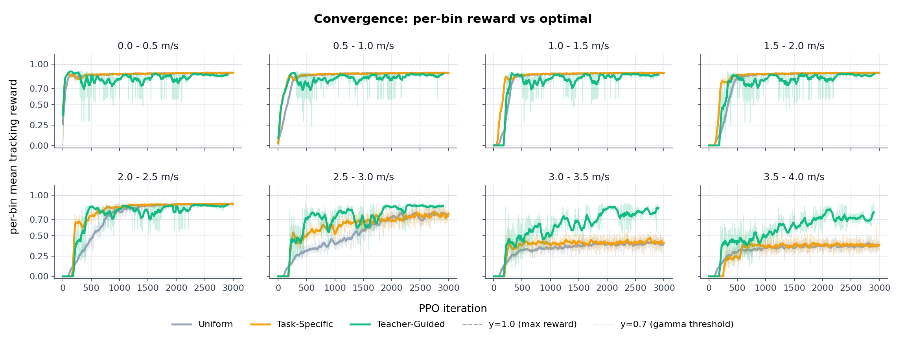
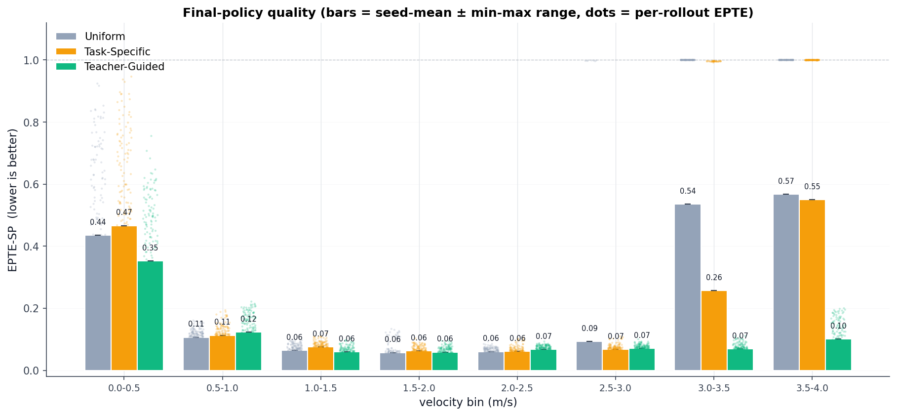
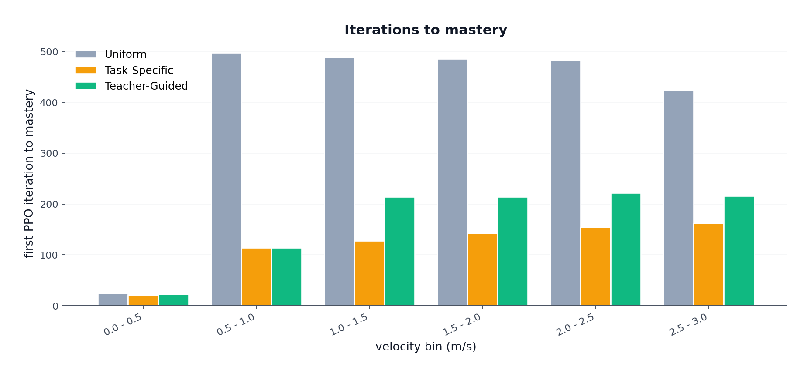
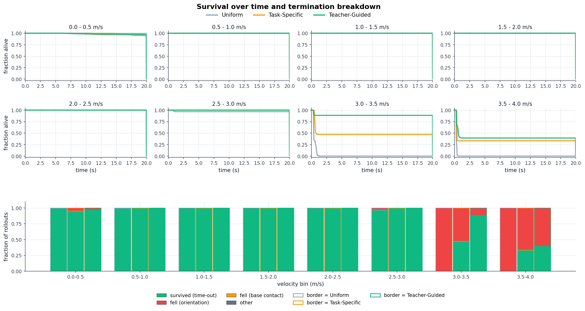
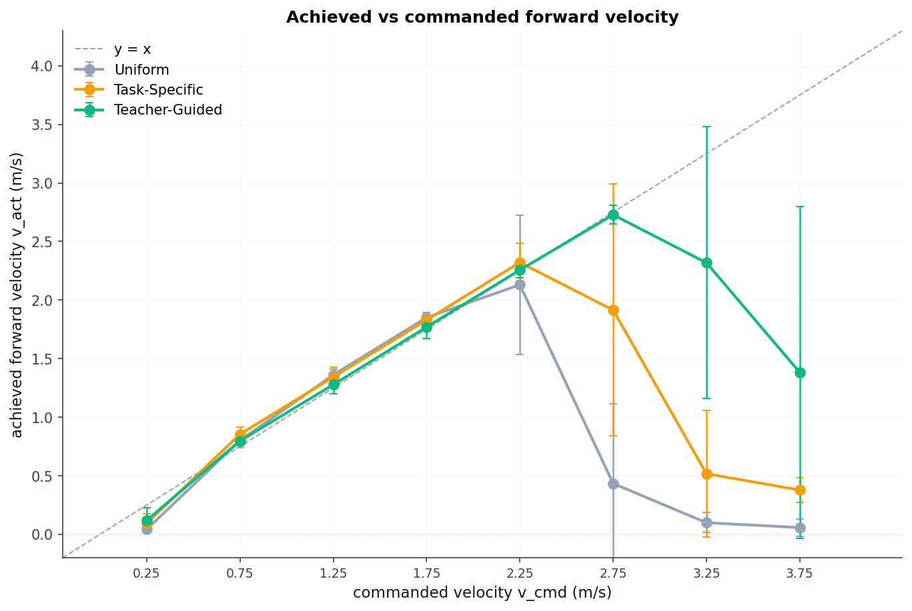
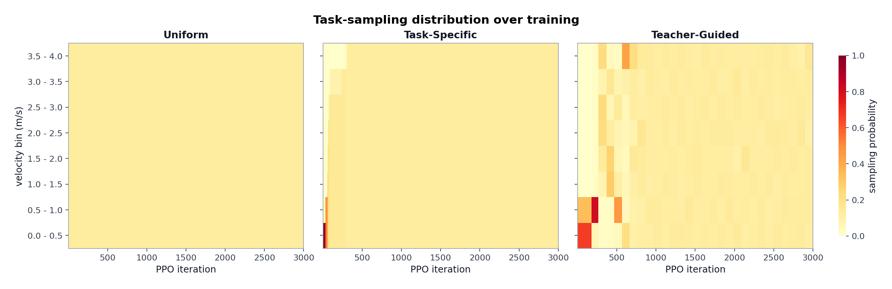
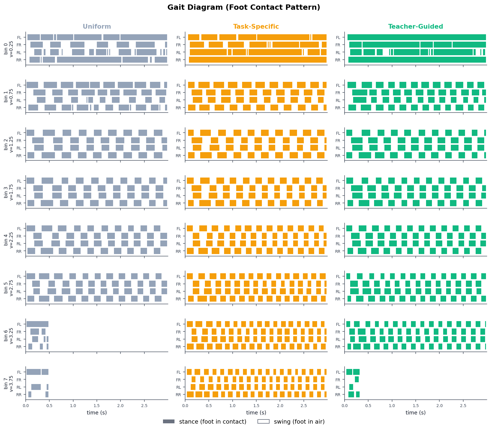
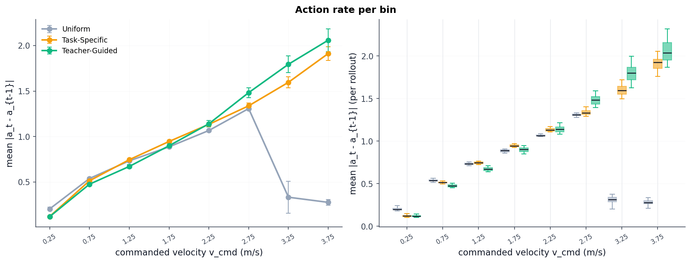

# Curriculum Training: Progress Update 1

**Author:** Phakin Boonchanachai (66340500037)
**Date:** 2026-04-28

---

**Project recap.** This project compares three velocity-command sampling strategies for a single PPO policy on the Unitree Go2 quadruped: *uniform* (baseline, no curriculum), *task-specific* (Box Adaptive, Margolis et al. [margolis2022rapid]), and *teacher-guided* (LP-ACRL, Li et al. [liacrl2026]). The comparison is run over the forward-velocity range $[0,V_{\max}]=[0,4.0]$ m/s, partitioned into $N=8$ bins of width $0.5$ m/s; lateral velocity and yaw rate are fixed at zero. Evaluation follows proposal §6: per-bin mean tracking reward, EPTE-SP, task-sampling heatmap, iterations-to-mastery.

**Departures from the proposal.** The proposal commits to using upstream `unitree_rl_lab` [unitree_rllab] reward, observation, termination, and PPO configuration without modification. To run the three-condition comparison fairly across the full forward-velocity range, the current implementation departs from that commitment in the following categories:

- **Reward shaping.** The smoothness and effort penalties (action rate, joint torques, joint velocity, joint acceleration) are weakened relative to upstream, and the feet-air-time swing target is shortened.
- **Action interface.** The joint-position action scale is increased relative to upstream.
- **Command space.** The continuous upstream velocity command is replaced with a binned forward-velocity command. Lateral velocity and yaw rate are fixed to zero, the forward axis is widened to $[0, 4.0]$ m/s, the resampling interval is lengthened to match the episode length, and the upstream behaviour of forcing a fraction of envs to a zero-velocity standstill at each resample is disabled.
- **Curriculum machinery.** The upstream sampler is replaced with three swappable strategies (uniform, task-specific, teacher-guided), wired through a custom curriculum step.
- **Scene.** The terrain is flattened to a plane (no terrain generator, no height scanner, no terrain-levels curriculum), to decouple the curriculum signal from terrain difficulty.
- **Training budget.** The sweep runs for $6000$ PPO iterations (vs proposal's $3000$) with $2048$ parallel environments (vs proposal's $4096$).

The full domain-randomization block, observation and critic specifications, terminations, PD gains, and the PPO algorithm hyperparameters ($T$, epochs, minibatches, clip $\epsilon$, $\gamma$, $\lambda$, learning rate, network architecture) are inherited from upstream unchanged.

Section 1 documents each category with the upstream and current value side by side. Section 2 reports the 6000-iteration sweep. Section 3 lists non-obvious observations grounded in code or log evidence. Section 4 compares observed results to the proposal's predicted ordering. Section 5 lists open decisions for the supervisor.

## 1. Setup / Current Configuration

This section enumerates the live configuration, component by component. Upstream values are taken from the vendored `unitree_rl_lab` commit at the project root; current values are read from the live config classes after their post-init hooks have applied. The sprint-retune block (six functional reward and action overrides plus one numerical no-op, see Q2) together with the command-class swap are the only sources of deviation; all other rows in the tables below are [same]. File-and-line citations for every value live in source comments above each table, not in prose.

### 1.1 Reward function

The reward is the upstream Isaac Lab reward, a weighted sum of sixteen terms,

$$
r_t \;=\; \sum_{i=1}^{16} w_i \, r_i(\zeta_t). \tag{1}
$$

The upstream weights are tuned for the velocity range $v_x \in [-1, 1]$ m/s. Stretching the command range to $[0, 4]$ m/s creates a standing-still local optimum, as follows. The positive contribution to $r_t$ from velocity tracking is bounded above by $w_{\text{lin}} + w_{\text{ang}} = 2.25$ (Eqs. (2)--(3), since the unweighted terms $r_{\text{lin}}, r_{\text{ang}} \in [0,1]$ and the weighted contributions therefore cap at $w_{\text{lin}}\cdot 1 = 1.5$ and $w_{\text{ang}}\cdot 1 = 0.75$). The smoothness contribution satisfies $r_{\text{smooth}} \le 0$ (Eq. (4)), and its magnitude grows roughly with the square of the commanded velocity, because a faster command forces faster joint motion, larger torques, and larger step-to-step action changes. At sprint commands, $|r_{\text{smooth}}|$ under upstream weights exceeds the $2.25$ tracking ceiling, so any trajectory in which the policy actually runs at $\sim 4$ m/s yields $r_t < 0$. Standing still keeps $r_{\text{smooth}} \approx 0$, and because the yaw command is fixed at zero (Section 1.6), $r_{\text{ang}}$ saturates at the unweighted value $1$ even at standstill, contributing $w_{\text{ang}} r_{\text{ang}} = 0.75$ to $r_t$. The standstill total is therefore small but strictly positive, while the running total is negative — and the policy gradient prefers standing still over running. To recover a non-degenerate optimum across the full velocity range, five upstream values are modified relative to the upstream defaults, all reducing the magnitude of $r_{\text{smooth}}$ (and, in the case of `feet_air_time.threshold`, removing the slow-gait shape of the air-time bonus) so that running again yields the higher total reward. The remaining eleven of the sixteen reward terms are inherited from upstream without modification.

| **Term / parameter** | **Upstream** | **Current** | **Rationale for the change** |
|---|---:|---:|---|
| `joint_vel.weight` | $-1{\times}10^{-3}$ | $-1{\times}10^{-4}$ | Penalises $\|\dot q\|^2$. Sustained running requires high joint angular velocities; the upstream weight makes high-$\dot q$ trajectories net-negative. Weakening encourages the policy to spin the legs fast enough to track the commanded speed. |
| `joint_acc.weight` | $-2.5{\times}10^{-7}$ | $-1{\times}10^{-7}$ | Penalises $\|\ddot q\|^2$. Fast strides require large joint accelerations during swing--stance transitions. Weakening allows the policy to actuate the legs aggressively rather than hold them quasi-static. |
| `joint_torques.weight` | $-2{\times}10^{-4}$ | $-2{\times}10^{-5}$ | Penalises $\|\tau\|^2$. Higher running speeds demand larger peak torques per joint; the upstream weight discourages the torque levels needed to push the body forward at sprint commands. |
| `action_rate.weight` | $-0.1$ | $-0.005$ | Penalises $\|a_t - a_{t-1}\|^2$. A sprint stride requires rapid step-to-step changes in joint targets; the upstream weight pushes the policy toward slowly varying actions, which corresponds to a slow gait. |
| `feet_air_time.threshold` | $0.5$ s | $0.1$ s | The feet-air-time term credits only foot swings whose duration exceeds the threshold. The upstream value rewards a slow gait cycle, incompatible with the higher stride frequency that running requires. |

*Table 1: Five reward-side modifications relative to upstream.*

The two velocity-tracking terms and the modified smoothness group are

$$
r_{\text{lin}} = \exp\!\Bigl(-\,\|v_{xy}^{\mathrm{cmd}} - v_{xy}\|^2 / \sigma_{\text{lin}}^{2}\Bigr), \qquad w_{\text{lin}}=1.5,\ \sigma_{\text{lin}}=0.5\ \text{m/s}, \tag{2}
$$

$$
r_{\text{ang}} = \exp\!\Bigl(-\,(\omega_z^{\mathrm{cmd}} - \omega_z)^2 / \sigma_{\text{ang}}^{2}\Bigr), \qquad w_{\text{ang}}=0.75,\ \sigma_{\text{ang}}=0.25\ \text{rad/s}, \tag{3}
$$

$$
r_{\text{smooth}} \;=\; -\,|w_{\dot q}|\,\|\dot q\|^2 \;-\; |w_{\ddot q}|\,\|\ddot q\|^2 \;-\; |w_{\tau}|\,\|\tau\|^2 \;-\; |w_{\Delta a}|\,\|a_t - a_{t-1}\|^2 \;\le\; 0, \tag{4}
$$

where the four weights $w_{\dot q}, w_{\ddot q}, w_{\tau}, w_{\Delta a}$ are listed in Table 1; each is negative in the cfg, which is why the leading sign of every term in Eq. (4) is negative. The yaw command is fixed at $\omega_z^{\mathrm{cmd}}=0$ (Section 1.6), so $r_{\text{ang}}$ always rewards holding zero yaw rate; the term itself is unmodified at upstream weight $w_{\text{ang}}=0.75$.

### 1.2 Control gains and action interface

PD gains, torque envelope, friction, and action clip all match upstream. The only change is the joint-position action scale:

$$
\texttt{JointPositionAction.scale}: \quad 0.25 \;\to\; 0.35.
$$

The action sets each joint's target angle as $q^{\text{default}} + \text{scale} \cdot a_t$, so a larger scale lets the policy command bigger joint angles per step. The upstream scale of $0.25$ is too small for the leg-swing amplitude that a $4$ m/s sprint requires; raising it to $0.35$ gives the policy enough range of motion to produce a sprint-speed stride.

This is complementary to, not in conflict with, the shortened `feet_air_time.threshold` in Table 1. The action scale controls how far the leg can travel per step (stride length); the air-time threshold controls how long the foot is allowed to remain in the air during that step (swing duration). A sprint requires both at once: a long stride taken quickly. Keeping the upstream action scale would cap stride length, and keeping the upstream air-time threshold would cap stride frequency, so either change alone would still lock the policy out of a sprint gait.

### 1.3 Observation and action space

Every observation term, scale, and noise band is inherited from upstream without modification. The policy receives six terms; the critic receives the same six (without noise) plus two privileged additions. All entries are clipped to $\pm 100$.

| **Term** | **Scale** | **Noise** |
|---|:---:|:---:|
| *Policy observation (6 terms)* | | |
| &nbsp;&nbsp;&nbsp;&nbsp;`base_ang_vel` | $0.2$ | $\pm 0.2$ |
| &nbsp;&nbsp;&nbsp;&nbsp;`projected_gravity` | --- | $\pm 0.05$ |
| &nbsp;&nbsp;&nbsp;&nbsp;`velocity_commands` | --- | --- |
| &nbsp;&nbsp;&nbsp;&nbsp;`joint_pos_rel` | --- | $\pm 0.01$ |
| &nbsp;&nbsp;&nbsp;&nbsp;`joint_vel_rel` | $0.05$ | $\pm 1.5$ |
| &nbsp;&nbsp;&nbsp;&nbsp;`last_action` | --- | --- |
| *Critic privileged additions (2 terms)* | | |
| &nbsp;&nbsp;&nbsp;&nbsp;`base_lin_vel` | --- | --- |
| &nbsp;&nbsp;&nbsp;&nbsp;`joint_effort` | $0.01$ | --- |

*Table 2: Observation terms.*

The action is a 12-D `JointPositionAction` on all joints; the only change relative to upstream is the action scale $0.25 \to 0.35$ (Section 1.2).

### 1.4 Domain randomization

The full domain-randomization block is inherited from upstream without modification: friction $(0.3, 1.2)$ static and dynamic, restitution $(0.0, 0.15)$, base mass perturbation $(-1.0, 3.0)$ kg, external force/torque disabled, reset pose $\pm 0.5$ m on $(x,y)$ with yaw uniform on $(-\pi, \pi)$, reset joint velocities $\pm 1.0$, and push events every $5$--$10$ s drawing $(-0.5, 0.5)$ m/s on $(x,y)$. No event was added, removed, or retuned.

### 1.5 PPO and training hyperparameters

| **Parameter** | **Upstream / Proposal** | **Current** | **Rationale for the change** |
|---|---:|---:|---|
| Parallel environments | 4096 (proposal) | 2048 (sweep) | In pilot timing, $4096$ envs ran slower per iteration than $2048$ on the same hardware. The cause was not investigated, so $2048$ was kept as the safer choice. |
| Total PPO iterations $I_{\max}$ | 3000 (proposal) | 6000 (sweep) | At $3000$ iterations the high-speed bins (5--7) had not converged for any condition. Doubling the budget gave the sweep enough room to plateau. |

*Table 3: PPO hyperparameters.*

Two rows of Table 3 differ from the proposal value, and the rest are inherited from upstream:

**Total iterations $I_{\max} = 6000$ vs proposal's $3000$.** The proposal's $3000$-iteration budget was set for a velocity range narrower than $[0, 4]$ m/s. With the command range stretched to the full sprint envelope and the sprint-retune reward shaping (Section 1.1) softening the per-step gradient pressure, pilot runs at $3000$ iterations did not converge on bins $5$--$7$ for any condition. Doubling the budget to $6000$ allowed all but one of the $24$ (condition, bin) cells to plateau within the sweep (the exception is teacher-guided bin $6$, marked with $\dagger$ in Table 5).

**Parallel envs $2048$ vs proposal's $4096$.** The proposal called for $4096$ envs; the sweep ran with $2048$. The reason is empirical and not fully understood: in pilot runs on the same hardware, the $4096$-env configuration appeared to take *longer* per PPO iteration than $2048$, opposite to what raw GPU throughput would predict. This was not benchmarked systematically and may be a real effect (memory pressure, GPU sub-tile mismatch, contention on the rollout buffer) or a misreading from a small pilot timing sample. The decision to use $2048$ for the sweep was conservative: it is the configuration that produced the per-run wall-clock figures in Section 2. Whether $4096$ is genuinely slower on this hardware is an open observation, not a confirmed finding.

### 1.6 Curriculum module and command space

The proposal specifies three conditions (uniform, task-specific, teacher-guided) over a single forward-velocity axis $[0, V_{\max}]$ partitioned into $N$ bins of width $\Delta v$. The current implementation matches the proposal's curriculum specification exactly (Section 2 of `proposal.tex`, lines 78--122) and replaces the upstream continuous `UniformLevelVelocityCommandCfg` with a custom `BinnedVelocityCommandCfg`.

| **Field** | **Upstream** | **Current** |
|---|---|---|
| $v_x$ training range (m/s) | $(-0.1, 0.1)$ | $(0.0, 4.0)$ |
| $v_x$ limit range (m/s) | $(-1.0, 1.0)$ | $(0.0, 4.0)$ |
| $v_y$ training range (m/s) | $(-0.1, 0.1)$ | $(0.0, 0.0)$ |
| $v_y$ limit range (m/s) | $(-0.4, 0.4)$ | $(0.0, 0.0)$ |
| $\omega_z$ training range (rad/s) | $(-1.0, 1.0)$ | $(0.0, 0.0)$ |
| $\omega_z$ limit range (rad/s) | $(-1.0, 1.0)$ | $(0.0, 0.0)$ |
| Number of bins $N$ | n/a | 8 |
| Bin width $\Delta v$ (m/s) | n/a | 0.5 |
| $V_{\max}$ (m/s) | n/a | 4.0 |
| Resampling interval (s) | $(10.0, 10.0)$ | $(20.0, 20.0)$ |
| Stand-still env fraction `rel_standing_envs` | $0.1$ | $0.0$ |

*Table 4: Command space.*

The three rows marked n/a (number of bins $N$, bin width $\Delta v$, and $V_{\max}$) are new fields with no upstream counterpart. Upstream samples the velocity command from a continuous range; the current implementation discretises the forward axis into $N=8$ contiguous bins of equal width $\Delta v=0.5$ m/s spanning $[0, V_{\max}]=[0, 4.0]$ m/s. Discretisation is required by the proposal's evaluation protocol — per-bin mean tracking reward, per-bin EPTE-SP, and a finite-bin sampling distribution $c_j(\zeta)$ for the curriculum operators — none of which is well-defined on a continuous command space. The values themselves ($N$, $\Delta v$, $V_{\max}$) match the proposal (proposal lines 148--172).

| **Curriculum knob** | **Proposal value** | **Current value** |
|---|---|---|
| Threshold $\gamma$ (task-specific) | $0.7$ (pilot-dependent) | $0.7$ |
| Seed bin | $[0, 0.5]$ m/s | bin 0 ($[0, 0.5]$ m/s) |
| Min episodes per bin (task-specific) | n/a | $50$ |
| Temperature $\beta$ (teacher-guided) | $1.0$ (pilot-dependent) | $0.05$ |
| Stage length $M$ (teacher-guided) | $100$ PPO iterations | $50$ ticks ($=100$ PPO iter) |
| Uniform mixture $\varepsilon$ (teacher-guided) | n/a | $0.15$ |
| Curriculum sampler update interval | n/a | 48 env steps |

*Table 5: Curriculum operator parameters.*

The three n/a rows in Table 5 are implementation knobs added during the build with no counterpart in the proposal:

**Min episodes per bin $= 50$ (task-specific).** The task-specific curriculum decides "this bin is mastered, unlock the next one" by comparing the bin's mean tracking reward against the threshold $\gamma=0.7$. If only two or three episodes have run in a bin, that mean is noisy: a single lucky episode could fake mastery and trip an early unlock. The rule says "do not trust the bin's mean until at least $50$ episodes have been collected in it." This is a smoothing buffer that keeps the unlock decision honest.

**Uniform mixture $\varepsilon = 0.15$ (teacher-guided).** The teacher-guided curriculum picks which bin to sample next based on which bin is improving fastest. Left alone, this can concentrate almost all training time on one "hot" bin and starve the rest. $\varepsilon$ reserves a slice of the sampling probability for an even spread across all bins, so every bin gets at least a small share even when its learning-progress signal is zero. With $\varepsilon=0.15$ and $N=8$ bins, each bin has a floor sampling probability of $\varepsilon/N \approx 0.019$ ($1.9\%$). It is an exploration floor that prevents bins from going silent.

**Curriculum sampler update interval $= 48$ env steps (one "tick").** Every environment step, the per-bin tracking reward is added to a running buffer. Once every $48$ env steps — call this a tick — the curriculum operator's `update(...)` method is invoked. This is the shared heartbeat for both operators. With rollout length $T=24$, one tick equals two PPO iterations.

The two operators consume the heartbeat differently:

- *Task-specific* acts on every tick. Each call checks whether the active bin's mean reward has crossed $\gamma=0.7$ and, if so, unlocks the next bin. One timescale: tick $\Rightarrow$ decide.
- *Teacher-guided* ignores most ticks. It accumulates per-bin rewards every tick but only recomputes the softmax-over-learning-progress weighting every $M=50$ ticks. $50 \text{ ticks} \times 48 \text{ env steps} = 2400 \text{ env steps} = 100$ PPO iterations at $T=24$, which matches the proposal's $M=100$. Two timescales: tick $\Rightarrow$ buffer; every $50$ ticks $\Rightarrow$ re-weight.

$48$ env steps was chosen because at $2048$ parallel envs each tick yields enough finished episodes per bin for the per-bin mean reward to be a stable signal; updating every step would be noise, updating less often would lag policy progress. The interval is exposed as the environment variable `CURRICULUM_STEPS_PER_ITER` for ablations.

---

## 2. Results from Current Configuration

A 6000-iteration sweep with three conditions and three seeds (9 runs total) was completed on 2026-04-27 to 2026-04-28. Total wall-clock training time was 13 h 1 m, with per-run training between 57 m and 87 m. All runs returned exit code 0.

### 2.1 Per-bin convergence

Each (condition, bin) cell aggregates 3 seeds. A run is labelled *converged* when the linear-fit slope of per-bin mean tracking reward over the final segment is below $1\!\times\!10^{-4}$ per iteration in absolute value, with std below $0.05$. *Suboptimal* indicates plateau below the upstream maximum of $1.0$.

| **Bin** | **Uniform** $\bar R$ | **Uniform** $\sigma$ | **Task-Specific** $\bar R$ | **Task-Specific** $\sigma$ | **Teacher-Guided** $\bar R$ | **Teacher-Guided** $\sigma$ |
|:---:|:---:|:---:|:---:|:---:|:---:|:---:|
| 0 | 0.897 | 0.002 | 0.898 | 0.002 | 0.867 | 0.016 |
| 1 | 0.897 | 0.001 | 0.898 | 0.002 | 0.875 | 0.005 |
| 2 | 0.897 | 0.001 | 0.899 | 0.001 | 0.873 | 0.008 |
| 3 | 0.897 | 0.001 | 0.898 | 0.001 | 0.874 | 0.007 |
| 4 | 0.897 | 0.002 | 0.897 | 0.002 | 0.873 | 0.012 |
| 5 | 0.827 | 0.007 | 0.796 | 0.015 | 0.869 | 0.010 |
| 6 | 0.415 | 0.010 | 0.429 | 0.018 | 0.812 $\dagger$ | 0.036 |
| 7 | 0.386 | 0.008 | 0.389 | 0.008 | 0.729 | 0.015 |

*Table 6: Per-bin mean tracking reward $\bar R$ and std $\sigma$ across 3 seeds. $\dagger$ = run did not converge by the criterion above (still improving at end of budget).*

### 2.2 Per-bin EPTE-SP

EPTE-SP per (condition, seed, bin) is computed via the equation in the proposal, with $K=1000$ steps and 100 deterministic rollouts per (condition, seed, bin). Each cell below is a mean over 300 samples (3 seeds $\times$ 100 rollouts).

| **Bin (m/s)** | **Uniform** | **Task-Specific** | **Teacher-Guided** |
|---|:---:|:---:|:---:|
| 0&nbsp;&nbsp;&nbsp;$[0.0, 0.5]$ | 0.439 | 0.312 | 0.251 |
| 1&nbsp;&nbsp;&nbsp;$[0.5, 1.0]$ | 0.120 | 0.123 | 0.095 |
| 2&nbsp;&nbsp;&nbsp;$[1.0, 1.5]$ | 0.083 | 0.076 | 0.058 |
| 3&nbsp;&nbsp;&nbsp;$[1.5, 2.0]$ | 0.063 | 0.063 | 0.056 |
| 4&nbsp;&nbsp;&nbsp;$[2.0, 2.5]$ | 0.070 | 0.066 | 0.071 |
| 5&nbsp;&nbsp;&nbsp;$[2.5, 3.0]$ | 0.178 | 0.063 | 0.073 |
| 6&nbsp;&nbsp;&nbsp;$[3.0, 3.5]$ | 1.000 | 0.779 | 0.149 |
| 7&nbsp;&nbsp;&nbsp;$[3.5, 4.0]$ | 1.000 | 1.000 | 0.383 |

*Table 7: Mean EPTE-SP per (condition, bin), $n=300$ per cell.*

### 2.3 Figures

*Figure 1: Per-bin mean tracking reward versus PPO iteration, three seeds aggregated per condition.*

*Figure 2: EPTE-SP per velocity bin, mean over 3 seeds, error bars are min--max range across rollouts.*

*Figure 3: First PPO iteration at which the smoothed per-bin mean tracking reward $r_{\text{lin}}$ crosses the mastery threshold $0.7$, per (condition, bin). Missing bars indicate the threshold was not crossed within the $6000$-iteration sweep.*

*Figure 4: Survival curves (top) and termination-cause breakdown (bottom), per (condition, bin).*

*Figure 5: Achieved forward velocity versus commanded forward velocity at bin centers.*

*Figure 6: Task-sampling distribution $c_j(\zeta)$ as a function of PPO iteration, per condition.*

*Figure 7: Foot-contact patterns over a 3-second window per (condition, bin), one rollout per cell. Filled = stance, empty = swing. FL/FR/RL/RR = front-left/front-right/rear-left/rear-right.*

*Figure 8: Per-rollout action rate $\overline{|a_t - a_{t-1}|}$ versus commanded velocity. Left: mean $\pm$ std across 300 rollouts per (condition, bin). Right: per-rollout distribution as box plots.*

### 2.4 Qualitative behaviour

From Figure 7 and Figure 4, observed at the level of raw data (no causal claims attached):

- Bins 0--4: all three conditions complete the 20-second episode at $\geq 95\%$ rollout survival; gait diagrams show continuous alternating contact patterns through the full window.
- Bin 5 ($[2.5, 3.0]$): uniform survival drops to $\sim 75\%$, task-specific $\sim 95\%$, teacher-guided $100\%$; uniform's primary termination is the orientation limit (red).
- Bin 6 ($[3.0, 3.5]$): uniform and task-specific gait diagrams terminate within $\leq 1$ second (the cell becomes empty after that); teacher-guided maintains a contact pattern through the full window.
- Bin 7 ($[3.5, 4.0]$): uniform and task-specific terminate within $\leq 0.5$ second; teacher-guided survives $\sim 67\%$ of rollouts to time-out.
- Figure 5: all three conditions match the $y=x$ diagonal up to $v_x^{\mathrm{cmd}} \approx 2.25$ m/s. Above that, achieved velocity for uniform and task-specific drops sharply (to $\leq 0.2$ m/s at $v_x^{\mathrm{cmd}} = 3.75$ m/s); teacher-guided maintains $\geq 2.3$ m/s at the same command.

## 3. Interesting Findings

### F1. Task-specific gets stuck at bin 6 before unlocking the top bins

Looking at the task-specific column of Figure 6:

- Bins 0 through 5 unlock quickly, one after another, and most of the run's sampling mass lands on them.
- Then the curriculum sits on bin 6 for a long stretch: bin 6's mean reward stays below the unlock threshold, so bin 7 stays locked.
- Eventually bin 6 crosses the threshold and bin 7 unlocks and starts being sampled, but only late in the $6000$-iteration run.

The proposal's $3000$-iteration budget would have stopped while the curriculum was still parked on bin 6, and bin 7 would never have been sampled at all. The late unlock of bin 7 is only visible because the budget was doubled --- and even with the doubled budget, the time spent on bin 7 after unlock is too short for the policy to reach mastery (Table 7 bin 7 task-specific EPTE-SP $= 1.000$).

### F2. Teacher-guided barely samples the top two bins

Looking at the teacher-guided column of Figure 6, top two rows (bins 6 and 7):

- For nearly the entire $6000$-iteration run, the weight on bins 6 and 7 sits at the exploration floor of about $1.9\%$ per bin --- visually a faint, near-uniform stripe with no peak.
- By contrast, bin 5 shows a clear peak during mid-training where the weight rises well above the floor before fading. Bins 6 and 7 never receive that kind of focused attention.
- Most of the sampling mass through the run is parked on bins 0--5.

### F3. Bin-$\bar R$ on the high-speed bins does not match eval kinematics

**Uniform and task-specific at bins 6/7.** The policy does not stand still --- it falls within the first second (Fig. 4, Fig. 7); achieved velocity drops to $\leq 0.2$ m/s (Fig. 5). But Table 6 reports a stable $\bar R \approx 0.39$--$0.43$ for these cells across thousands of iterations. The reward formula is $r_{\text{lin}} = \exp(-\|v^{\mathrm{cmd}} - v_{\text{act}}\|^2 / 0.25)$ (Eq. (2)). For $v_{\text{act}} \approx 0$ against a commanded $\sim 3$ m/s, this evaluates to nearly zero. To average $0.42$ over an episode, the velocity error needs to be roughly $0.5$ m/s, i.e. the policy would have to be close to the commanded sprint speed. The eval data does not show this.

**Teacher-guided at bin 7.** A related mismatch in the opposite direction: the policy survives most of the episode (${\sim}67\%$ of rollouts to time-out, Fig. 4) and sustains $v_{\text{act}} \approx 2.4$ m/s for $v_x^{\mathrm{cmd}} = 3.75$ m/s (Fig. 5). That gives err $\approx 1.35$ m/s and $r_{\text{lin}} \approx \exp(-7.29) \approx 7\!\times\!10^{-4}$ per step. Yet Table 6 reports $\bar R = 0.73$. For $\bar R = 0.73$ the policy would have to sustain err $\approx 0.28$ m/s, i.e. $v_{\text{act}} \approx 3.5$ m/s. The eval data does not show this either.

The source of these mismatches is therefore an open question. Possible explanations: training-time stochasticity occasionally produces brief moments closer to the commanded velocity than the deterministic-mean eval rollouts; or the per-bin reward signal is being averaged in a way that does not match the eval rollouts. Worth pinning down before drawing conclusions from Table 6.

### F4. Slow-bin gait shows very short foot swings rather than sustained strides

In Figure 7 on bins 0--3, each foot is in the air for only a brief flash before touching down again. The pattern is many short swings rather than a few long stride swings; that is what produces the staccato look in the videos.

- **Shortened feet-air-time threshold** ($0.5$ s $\to 0.1$ s, Table 1) is the direct cause. The policy steps every $0.02$ s, so the threshold rewards any swing longer than five policy steps. The policy minimises swing duration just above this floor and earns the bonus repeatedly, instead of holding longer strides.
- **Weakened action-rate penalty** ($20\times$ reduction, Table 1) makes the rapid lift--plant--lift toggling cheap, since consecutive actions can differ a lot for negligible cost.

Whether to add an explicit gait-pattern reward (e.g. a duty-cycle target) is recorded as Q5.

### F5. Iterations-to-mastery is non-monotonic for teacher-guided

Figure 3 reports the first PPO iteration at which the smoothed per-bin tracking reward crosses $0.7$.

- Uniform and task-specific: bar heights increase with bin index up to bin 5 and are missing on bins 6--7 (no mastery within $6000$ iterations). Consistent with the difficulty ordering.
- Teacher-guided: bins 5, 6, and 7 cross the threshold *before* bin 4. Faster commands are nominally harder, so a monotone pattern would be expected.

Three caveats on reading this figure:

- The per-bin curves are smoothed with a rolling mean before the crossing is read.
- The reward signal is only the linear-velocity tracking term, not the total reward.
- The bins each condition samples at a given iteration differ; a bin can show a low-confidence mean if it has not yet been sampled enough.

The mechanism producing the bin-$5$/$6$/$7$-before-$4$ ordering is not established.

### F6. The slowest bin (bin 0) is harder to track than the next few bins

Table 7 shows bin-$0$ EPTE-SP at $0.25$--$0.44$, while bins 1--4 all sit between $0.06$ and $0.12$. So the easiest bin by command magnitude is the worst-tracking one (after the failing top bins).

- Bin 0 is not a survival problem: only $0$--$1$ falls per $300$ rollouts.
- Bin 0 is not a learning problem either: training reward $\bar R \approx 0.897$ is on par with bins 1--4 (Table 6).
- The issue is tracking precision. Bin 0 centres at $v^{\mathrm{cmd}} = 0.25$ m/s, which is below the slowest velocity at which a steady quadruped trot can be sustained. The policy oscillates around the command rather than holding it tightly --- absolute tracking error is $0.06$--$0.11$ m/s.
- EPTE-SP normalises tracking error by the commanded velocity. Dividing those small absolute errors by the small denominator $0.25$ inflates the relative error to $0.25$--$0.44$.

So bin-$0$ EPTE looks bad for two compounding reasons: a physical limit (cannot trot below some minimum speed) and a metric quirk (normalisation by a small command).

## 4. Expectation Gap Analysis

The proposal made specific guesses about how the three curricula would compare on four things: per-bin reward $\bar R$, EPTE-SP, the sampling heatmap, and iterations-to-mastery. Three of the four came out different from expected. Each subsection below takes one mismatch and explains the mechanism in plain terms. Most of the surprises are the algorithms doing exactly what they were designed to do --- just not what we intuitively guessed.

### How each curriculum reads reward

Both task-specific and teacher-guided need a per-bin score to decide what to do next. The score they both consume is the same: the running mean of the linear-velocity tracking reward $r_{\text{lin}}$ (Eq. (2)) over recent episodes whose command landed in that bin, smoothed by a rolling buffer.

What they do with that score differs:

- **Task-specific** compares the active bin's smoothed mean directly to a fixed threshold $\gamma = 0.7$. The instant it crosses $0.7$, the bin counts as mastered and the unlock rule pumps weight onto bins $b{-}1$, $b$, $b{+}1$. "Mastery" is a single threshold-crossing event.
- **Teacher-guided** doesn't use a threshold. It tracks the *change* in the smoothed mean over each stage of $M=50$ ticks, calls that change the bin's learning progress, and feeds those into a softmax to get sampling weights. "Mastery" is implicit: when LP falls to zero, the bin's softmax weight collapses to roughly the uniform floor.

So when this section says "task masters bin 0", it means a single moment when the smoothed $\bar R$ on bin 0 crossed $0.7$. When it says "teacher abandoned bin 0", it means bin 0's LP signal flatlined and the softmax moved its mass elsewhere. Different mechanisms, same per-bin reward feeding both.

### G1. Task and uniform reach mastery on easy bins faster than teacher

*Expected.* Teacher gets curriculum benefit on every bin, including the easy ones, so teacher should master bins 0--3 at least as fast as task-specific.

*Observed* (Fig. 3). Task-specific and uniform cross the $0.7$ threshold on bins 0--3 noticeably earlier than teacher-guided.

*Reason.* Task-specific seeds at bin 0 and gives it essentially $100\%$ of the sampling budget until it masters. Bin 0 is easy, so it crosses $0.7$ quickly. The unlock then puts most of the budget onto bins $0$--$2$, all easy, so they too cross fast. The active easy bin doesn't have to compete for attention with anything.

Teacher splits attention from the start. The uniform mixture $\varepsilon = 0.15$ guarantees every bin some samples, and the LP signal on bins that have only been touched briefly is noisy --- so even when bin 0 is teacher's clear front-runner, it never gets the same focused exposure that task-specific gives it. The same number of training iterations buys less progress on the easy bin under teacher. Teacher catches up later; it isn't bad at easy bins, it's just that focused attention is faster than spread attention when the bin is genuinely solvable.

### G2. Teacher's terminal $\bar R$ on easy bins is lower than task and uniform

*Expected.* Teacher $\geq$ task $\geq$ uniform on every bin, gap widening at the hard end.

*Observed* (Table 6). On bins 0--4, uniform and task-specific both sit at $\bar R \approx 0.897$--$0.899$; teacher-guided sits at $0.867$--$0.875$, i.e. $0.02$--$0.03$ *lower* than the supposedly weaker conditions. The expected ordering only holds from bin 5 onward.

*Reason.* The flip side of G1. As soon as a bin's LP drops, teacher's softmax mass collapses to roughly the uniform floor of $0.05/8 = 0.6\%$ per bin. Uniform and task-specific keep training every unlocked bin at $12$--$16\%$ exposure for the rest of the run, so they keep polishing those bins long after they've "mastered". Less polish on the easy bins is the cost teacher pays to redirect compute to where progress is still happening. The $0.02$--$0.03$ residual is not a defect; it's exactly what an LP-driven curriculum is supposed to do.

### G3. EPTE-SP: bin 0 is high for everyone; uniform falls off a cliff at bin 6

*Expected.* Teacher $<$ task $<$ uniform at every bin, with curriculum benefit visible across the whole range.

*Observed* (Table 7). Bins 1--4: all three conditions within $0.04$, basically tied. Bin 0: high for everyone ($0.25$--$0.44$). Bin 5: uniform at $0.18$, task/teacher at $0.07$. Bin 6: uniform $1.00$, task $0.78$, teacher $0.15$. Bin 7: uniform/task both $1.00$.

*Three different reasons, one per anomaly.*

*Bins 1--4 tied.* The proposal's claim there was about *time to master*, not terminal EPTE-SP. By $6000$ iter, all three conditions have plateaued at the noise floor on these bins, so the early sample-efficiency gap that ITM still records (Fig. 3) is no longer visible in the terminal metric. Reading curriculum benefit off Table 7 on bins 1--4 is reading the wrong axis.

*Bin 0 high.* Same mechanism as F6: EPTE-SP normalises tracking error by the commanded velocity. Bin 0 centres at $0.25$ m/s, so a small absolute error ($\sim 0.07$ m/s) blows up after dividing by such a small denominator. Plus a real Go2 cannot trot below some minimum speed, so the policy oscillates around the command instead of holding it cleanly. Both effects compound.

*Uniform's cliff between bin 5 and bin 6.* Uniform's $\bar R$ drops from $0.83$ to $0.42$ across one bin while exposure stays flat at $12.5\%$. That's a phase transition, not gradual decay. The most plausible cause is a gait-regime boundary near $\sim 3$ m/s on the Go2: trotting saturates, and continued tracking would need either much larger ground reaction forces per stride or a different gait (gallop, bound). With no focused training the policy slips into the absorbing minimum --- stand still, fall, collect zero tracking reward but avoid the smoothness penalty of attempting a high-speed gait. Below the transition, $12.5\%$ unfocused exposure is enough; above it, no amount of unfocused exposure escapes the absorbing minimum.

### G4. Heatmap: the proposal's predicted patterns are on the wrong condition

*Expected.* Task-specific = stepwise expansion outward from bin 0. Teacher-guided = diagonal walk from easy to hard, then redistribution back.

*Observed* (Fig. 6). Task-specific: bins 0--5 light up almost simultaneously by mid-training, then a long stall on bin 6, late unlock of bin 7. Teacher: each bin 0--5 takes a turn as the high-weight focus; bins 6--7 stay near the floor. Teacher's pattern *is* the stepwise focus the proposal expected from task-specific.

*Reason.* The two rules have opposite shapes:

- Task-specific only *adds* weight; it never decreases. Once bin $b$ unlocks, it stays at weight $1.0$ for the rest of the run. So once bins 0--5 have all unlocked, the sampling distribution over them is essentially uniform --- not stepwise.
- Teacher-guided actively *redistributes*. When bin $b$ stops improving, its softmax weight collapses and the next-highest-LP bin takes over. That *is* the stepwise focus pattern.

The proposal had the labels on the wrong condition; the observed patterns follow directly from each rule.

*Why task-specific then can't reach bin 7.* Once bin 6 unlocks, all of bins 0--6 share the budget roughly uniformly, so bin 6 gets only $\sim 14\%$ of samples --- not focused training. Combined with the bin-$6$ phase transition from G3, $14\%$ unfocused exposure isn't enough to push bin 6 past $\gamma$, so bin 7 never unlocks. Task-specific's accumulation rule is therefore inadvertently *weaker* than uniform on the hardest bin: its coverage dilutes any focused effort.

### G5. Teacher's ITM is non-monotone: bins 5/6/7 master before bin 4

*Expected.* Higher bin index = more iterations to master.

*Observed* (Fig. 3, F5). Uniform and task-specific are monotone. Teacher crosses the $0.7$ threshold on bins 5, 6, 7 *before* bin 4.

*Partial reason.* While bins 0--3 are still being trained directly, bin 4's reward rises through generalisation alone --- it sits in the same speed range as bin 3, so a policy good at bin 3 is automatically pretty good at bin 4. The moment bin 3 plateaus, teacher's softmax has to pick the next focus. Bins 5--7 all still have nonzero LP from their long climb out of zero; bin 4 is sitting at near-plateau (low LP). Softmax with $\beta = 0.05$ is winner-take-most, so it picks bin 5 over bin 4. Bin 4 gets the floor exposure $\sim 0.6\%$ for the rest of the run; bins 5--7 get the focus.

*Open part.* The above explains how a non-monotone ordering can arise, but not why the dip lands specifically on bin 4 and not on bin 3 or bin 5. Adjacent-bin generalisation should pre-load every bin from its neighbour, not just one of them. Whether bin 4 is special for some reason (gait-regime boundary, reward-shaping plateau at mid velocity) or whether the dip is a noise artefact of the 3-seed sample is not established by the current data. Settling it would require per-bin reward curves vs iteration for the teacher run and ideally more seeds. Recorded as open.

### G6. The top bin (bin 7)

Independent of the four gaps above, bin 7 ($[3.5, 4.0]$ m/s) doesn't measure what it was meant to. The trained policy outputs $\sim 2.4$ m/s when commanded $3.75$ m/s (Fig. 5). Three stories are consistent with $\bar R = 0.73$: a Go2 hardware ceiling near $2.4$ m/s, an under-trained policy at end-of-budget, or a residual smoothness floor from the sprint-retune. The current data can't separate them. So bin 7 is currently a stress test, not a clean evaluation point. Q5 is the corresponding decision.

## 5. Discussion / Open Questions

- **Q1. Why is training so slow?**
- **Q2. Is the sprint retune our problem? Without it the robot just stands still, so we cannot simply revert --- but how much of the bin-6/7 noise is the retune versus the curriculum itself?**
- **Q3. Should we add an explicit gait-pattern reward, or leave gait emergent?**
- **Q4. Why does the curriculum fail to cover every bin? Why is the coverage not what we expected?**
- **Q5. Can the top bin really be reached on the Go2?**
- **Q6. Should we record per-bin text logs and videos at every (seed, condition, bin) cell? Right now the eval covers $3\times 3\times 8 = 72$ cells; capturing both per-bin and overall artefacts would roughly double that.**
- **Q7. Should we disable any reward term that pays out unconditionally ("free" reward), e.g. yaw tracking when the yaw command is locked at zero?**
- **Q8. We do not actually know how each motor is behaving.** Action-rate is a single scalar averaged over all 12 joints, so a smooth average can hide individual motors that are jerking violently. Should we log per-joint velocity / acceleration / jerk traces and look at the motors one by one, instead of trusting the aggregate?

---

## References

- **[margolis2022rapid]** G. B. Margolis, G. Yang, K. Paigwar, T. Chen, and P. Agrawal, "Rapid Locomotion via Reinforcement Learning," *Robotics: Science and Systems*, 2022.
- **[liacrl2026]** Z. Li, C. Li, and M. Hutter, "Scaling Rough Terrain Locomotion with Automatic Curriculum Reinforcement Learning," arXiv:2601.17428, 2026.
- **[unitree_rllab]** Unitree Robotics, "unitree_rl_lab," GitHub repository, accessed 2026-04-28. <https://github.com/unitreerobotics/unitree_rl_lab>
