# Curriculum Training: Progress Update 2

**Author:** Phakin Boonchanachai (66340500037)
**Date:** 2026-05-06

---

**Project recap.** This project compares three velocity-command sampling strategies for a single PPO policy on the Unitree Go2 quadruped: *uniform* (baseline, no curriculum), *task-specific* (Box Adaptive, Margolis et al. [margolis2022rapid]), and *teacher-guided* (LP-ACRL, Li et al. [liacrl2026]). The comparison is run over the forward-velocity range $[0,V_{\max}]=[0,4.0]$ m/s, partitioned into $N=8$ bins of width $0.5$ m/s; lateral velocity and yaw rate are fixed at zero. Evaluation follows proposal §6: per-bin mean tracking reward, EPTE-SP, task-sampling heatmap, iterations-to-mastery.

**The problem we wanted to fix.** Update 1 (2026-04-28) showed that the policy could track the commanded velocity on bins 1--6, but the gait it produced was not the gait we wanted: feet flicked up and down every few policy steps to harvest the `feet_air_time` bonus, rather than holding longer sustained strides (update 1 §F4). On bins 6--7 the high-speed regime collapsed entirely, with EPTE-SP saturating at the cap. The constraint we set ourselves was to fix the gait *without* legislating it -- no explicit duty-factor target, no stride-frequency target, no contact-schedule reward. A different reward channel had to do the work.

**The mechanism we picked.** We adopted the cost-of-transport energy bonus from Liang 2024 [liang2024envelope]:

$$
r_{\text{en}} \;=\; \exp\!\left(-\,\dfrac{P}{\sigma_x\,|v_x| + \sigma_z\,|\omega_z|}\right), \qquad P \;=\; \sum_{j=1}^{12} |\dot q_j|\,|\tau_j|,
$$

with $\sigma_x = 500$, $\sigma_z = 250$ (empirically chosen via the calibration procedure in §1.1.1; the paper defaults are $\sigma_x = 1000$, $\sigma_z = 500$). The denominator only grows when the body is actually moving. High-frequency staccato motion (large $P$, small $|v_x|$) drives $r_{\text{en}}$ near zero; smooth fast motion (large $P$, large $|v_x|$) pays a stable bonus. The shaping is power-vs-displacement, not gait-shape: the policy is rewarded for "moved $1$ m on this much joint power", not for "took swings of this duration in this contact pattern".

**The setup, briefly.** We zeroed `feet_air_time.weight` and `air_time_variance.weight`, added `energy.weight = 1.0` (function `energy_cot`, see Eq. (5)), kept the five sprint-retune smoothness/scale changes from update 1's Table 1 (still needed to make running net-positive against the upstream smoothness penalties), and re-ran the three-condition $\times$ three-seed comparison on the `gait-emergence` branch. Two side adjustments rode along: the compute budget reverted to the proposal's $3000$ iter $\times\ 4096$ envs (the new reward reaches plateau earlier than the sprint retune did, so the doubled budget from update 1 was no longer needed), and two PhysX flags were tightened for stability at high contact rates (`gpu_max_rigid_patch_count` raised to $20\cdot 2^{15}$, `enabled_self_collisions = False`). The full domain-randomization block, observation and critic specifications, terminations, PD gains, and PPO hyperparameters are inherited from upstream; the curriculum machinery and binned command space are unchanged from update 1.

Section 1 documents the configuration after the change. Section 2 reports the 2026-05-05 sweep -- what plateau looks like under the new reward, where the high-speed collapse landed, and what the per-bin reward signal now actually reads. Section 3 is the "what happened" pass: six findings from the new sweep, grounded in tables and figures. Section 4 is the "why" pass: each finding traced to the underlying reward, curriculum, or simulator mechanism. Section 5 carries forward update 1's open questions and adds two new ones.

## 1. Setup / Current Configuration

This section enumerates the live configuration, component by component. Upstream values are taken from the vendored `unitree_rl_lab` commit at the project root; current values are read from the live config classes after their post-init hooks have applied. The Liang energy block (six functional reward overrides plus the action-scale change, see §1.1) together with the command-class swap are the only sources of deviation; all other rows in the tables below are [same].

### 1.1 Reward function

The reward is the upstream Isaac Lab reward, a weighted sum of sixteen terms, plus a new energy bonus,

$$
r_t \;=\; \sum_{i=1}^{16} w_i \, r_i(\zeta_t) \;+\; w_{\text{en}}\, r_{\text{en}}(\zeta_t). \tag{1}
$$

The standstill-versus-sprint analysis from update 1 still applies: with the upstream weights, the smoothness contribution at sprint commands exceeds the tracking ceiling, and standing still pays $w_{\text{ang}} r_{\text{ang}} = 0.75$ unconditionally (since $\omega_z^{\text{cmd}} = 0$, §1.6). Update 1 fixed this by weakening five smoothness/scale weights and shortening the air-time threshold; the air-time bonus then produced the staccato-swing artefact (update 1 §F4). The current config keeps the five smoothness weakenings but zeros the air-time bonuses and adds a Liang 2024 cost-of-transport bonus that pays for sustained running rather than for swing duration.

| **Term / parameter** | **Upstream** | **Current** | **Rationale for the change** |
|---|---:|---:|---|
| `joint_vel.weight` | $-1{\times}10^{-3}$ | $-1{\times}10^{-4}$ | Penalises $\|\dot q\|^2$. Sustained running requires high joint angular velocities; the upstream weight makes high-$\dot q$ trajectories net-negative. (Carried over from update 1.) |
| `joint_acc.weight` | $-2.5{\times}10^{-7}$ | $-1{\times}10^{-7}$ | Penalises $\|\ddot q\|^2$. Fast strides require large joint accelerations during swing--stance transitions. (Carried over from update 1.) |
| `joint_torques.weight` | $-2{\times}10^{-4}$ | $-2{\times}10^{-5}$ | Penalises $\|\tau\|^2$. Higher running speeds demand larger peak torques. (Carried over from update 1.) |
| `action_rate.weight` | $-0.1$ | $-0.005$ | Penalises $\|a_t - a_{t-1}\|^2$. A sprint stride requires rapid step-to-step changes in joint targets. (Carried over from update 1.) |
| `feet_air_time.weight` | $-0.5$ | $0.0$ | The air-time bonus rewarded any swing longer than the threshold. Update 1 §F4 traced the staccato-swing artefact directly to this term. Zeroing it removes the swing-duration shaping. |
| `air_time_variance.weight` | $-0.1$ | $0.0$ | Penalised across-foot variance of swing duration. Coupled to the air-time bonus above; zeroed for the same reason. |
| `energy.weight` | n/a | $1.0$ | New term, function = `energy_cot` (Eq. (5)). Pays for moving the body without burning joint power -- a cost-of-transport bonus that only registers when the policy actually moves at the commanded speed. |

*Table 1: Reward-side modifications relative to upstream. The five smoothness rows are carried over from update 1; the three air-time/energy rows replace update 1's `feet_air_time.threshold = 0.1` s row.*

The two velocity-tracking terms, the smoothness group, and the new energy term are

$$
r_{\text{lin}} = \exp\!\Bigl(-\,\|v_{xy}^{\mathrm{cmd}} - v_{xy}\|^2 / \sigma_{\text{lin}}^{2}\Bigr), \qquad w_{\text{lin}}=1.5,\ \sigma_{\text{lin}}=0.5\ \text{m/s}, \tag{2}
$$

$$
r_{\text{ang}} = \exp\!\Bigl(-\,(\omega_z^{\mathrm{cmd}} - \omega_z)^2 / \sigma_{\text{ang}}^{2}\Bigr), \qquad w_{\text{ang}}=0.75,\ \sigma_{\text{ang}}=0.25\ \text{rad/s}, \tag{3}
$$

$$
r_{\text{smooth}} \;=\; -\,|w_{\dot q}|\,\|\dot q\|^2 \;-\; |w_{\ddot q}|\,\|\ddot q\|^2 \;-\; |w_{\tau}|\,\|\tau\|^2 \;-\; |w_{\Delta a}|\,\|a_t - a_{t-1}\|^2 \;\le\; 0, \tag{4}
$$

$$
r_{\text{en}} = \exp\!\left(-\,\dfrac{P}{\max(\sigma_x|v_x| + \sigma_z|\omega_z|,\,\varepsilon)}\right), \qquad P = \sum_{j=1}^{12} |\dot q_j|\,|\tau_j|, \quad \sigma_x = 500,\ \sigma_z = 250,\ \varepsilon = 0.1. \tag{5}
$$

Eq. (5) is read element-wise per environment per step; $P$ is mechanical power summed over all twelve joints. The $\sigma_x |v_x|$ denominator means the denominator only grows when the body is actually moving, so a policy that stands still keeps the denominator at $\varepsilon = 0.1$ and the term saturates at $\exp(-P/0.1)$, which is essentially zero whenever any joint is loaded. A policy that moves at the commanded speed inflates the denominator (e.g.\ at $|v_x| = 3$ m/s, $\sigma_x|v_x| = 1500$) and the term pays out a value in $[0.4, 0.8]$ for typical mechanical power levels. The implementation lives at `src/source/curriculum_rl/curriculum_rl/envs/liang_composite_reward.py:25` (`energy_cot`).

The yaw command is fixed at $\omega_z^{\mathrm{cmd}}=0$ (§1.6), so $r_{\text{ang}}$ continues to reward holding zero yaw rate; the term itself is unmodified at upstream weight $w_{\text{ang}}=0.75$.

### 1.1.1 Sigma calibration procedure

The Liang 2024 paper [liang2024envelope] §IV-A.1 publishes $\sigma_x = 1000$, $\sigma_z = 500$, $\alpha_{\text{en}} = 1.0$, $\sigma_v = \sigma_\omega = 0.25$, validated on the Unitree **Go1**. The Go2 used here is a different platform in the same family — heavier, different joint torque envelope, and trained inside a different reward stack (Isaac Lab + the five smoothness weakenings from update 1, not the legged-gym auxiliary block the paper used). The paper itself notes that $\alpha_{\text{en}}$ "should be comparable to motion rewards in order to get a satisfactory RL policy" and shows in Fig. 3 that overly large $\alpha_{\text{en}}$ collapses tracking — i.e., the values are not robot-agnostic. Before locking in the paper defaults, we ran a two-phase calibration to confirm $r_{\text{en}}$ produces a useful gradient on this platform — neither saturated near $0$ (so small $\sigma_x$ that the term reads zero on every policy regardless of motion) nor saturated near $1$ (so large $\sigma_x$ that the term cannot discriminate between collapsed and successful policies). The two phases search over different operating points: Phase 0 is a cheap random-action sweep that brackets the order of magnitude of $\sigma_x$; Phase v4 is a full training-grid sweep that jointly tunes $\sigma_x$, the tracking-reward sharpness $\sigma_{\text{lin}}$, and the energy weight $w_{\text{en}}$.

**Phase 0 — random-action diagnostic.** Run `python src/scripts/sweep_sigma_diagnostic.py` (5--10 min, $512$ envs $\times$ $1000$ steps with random actions). The script tests $\sigma_x \in \{50, 100, 250, 500, 1000, 2000, 5000\}$ at fixed $\sigma_z = \sigma_x / 2$ and prints the mean $r_{\text{en}}$ across all envs and all steps. Read `src/results/phase0_table.txt` and pick $\sigma_x$ values where $\overline{r_{\text{en}}} \in [0.30, 0.75]$ — too low and the energy term saturates, too high and it loses discriminative range. The Phase 0 result on this hardware was:

| $\sigma_x$ | $\overline{r_{\text{en}}}$ | regime |
|---:|---:|---|
|    50 | 0.014 | saturated near 0 (too strong) |
|   100 | 0.064 | strong |
|   250 | 0.241 | strong, marginal |
|   500 | 0.438 | useful gradient |
|  1000 | 0.628 | useful gradient |
|  2000 | 0.776 | weak gradient |
|  5000 | 0.896 | saturated near 1 (too weak) |

This brackets the candidate range to $\sigma_x \in \{500, 1000\}$, with $250$ kept as a low-side tiebreaker.

**Phase v4 — full training grid.** Random actions are an unrealistic operating point: a trained policy produces much higher mechanical power and much higher $|v_x|$ than random actions, so Phase 0 only narrows the order of magnitude. To pick the actual values, run `bash src/scripts/run_sweep_v4.sh 250 500 1000` (10--15 hr, 9 full $3000$-iteration training runs). The grid is a $3 \times 3$ over (low/mid/high $\sigma$, three (std, $w_{\text{en}}$) combinations):

| Run | $\sigma_x$ | $\sigma_{\text{lin}}$ | $w_{\text{en}}$ |
|:---:|---:|---:|---:|
| 1 | 250  | 0.5 | 1.0 |
| 2 | 500  | 0.5 | 1.0 |
| 3 | 1000 | 0.5 | 1.0 |
| 4 | 250  | 1.0 | 1.0 |
| 5 | 500  | 1.0 | 1.0 |
| 6 | 1000 | 1.0 | 1.0 |
| 7 | 250  | 1.0 | 0.5 |
| 8 | 500  | 1.0 | 0.5 |
| 9 | 1000 | 1.0 | 0.5 |

Each run reports the sum of per-bin tracking errors across the 8 bins (`sum_err`) in `src/results/sweep_v4_comparison.md`. The top three from this grid were:

| Rank | Run | $\sigma_x$ | $\sigma_{\text{lin}}$ | $w_{\text{en}}$ | sum\_err |
|:---:|:---:|---:|---:|---:|---:|
| 1 | 8 | 500  | 1.0 | 0.5 | 1.538 |
| 2 | 9 | 1000 | 1.0 | 0.5 | 1.569 |
| 3 | 6 | 1000 | 1.0 | 1.0 | 1.623 |

Run 8 is the adopted configuration: $\sigma_x = 500$, $\sigma_z = 250$, $\sigma_{\text{lin}} = 1.0$, $w_{\text{en}} = 0.5$. Two observations from the grid: (i) softening the tracking reward from $\sigma_{\text{lin}} = 0.5$ to $1.0$ improved every $\sigma_x$ row, suggesting the upstream $\sigma_{\text{lin}} = 0.5$ was too sharp once the energy term was added; (ii) halving $w_{\text{en}}$ from $1.0$ to $0.5$ improved both surviving $\sigma_x$ rows, consistent with $w_{\text{en}} = 1.0$ over-weighting energy relative to tracking. The chosen $\sigma_x = 500$ sits at the lower boundary of the Phase 0 "useful gradient" band.

**Reproducing the main sweep.** With the calibrated values, the full 3-condition $\times$ 3-seed sweep is launched as

```
SWEEP_SIGMA_EN_X=500 SWEEP_SIGMA_EN_Z=250 \
SWEEP_TRACK_STD=1.0 SWEEP_ENERGY_WEIGHT=0.5 \
SEEDS="0 1 2" bash src/scripts/run_sweep.sh
```

The four environment variables are read at config build time in `src/source/curriculum_rl/curriculum_rl/envs/go2_velocity_base.py:_apply_liang_additive_energy`. Defaults in that function are the paper values ($\sigma_x = 1000$, $\sigma_z = 500$, $\sigma_{\text{lin}} = 0.5$, $w_{\text{en}} = 1.0$), so omitting any of the four reverts that knob to the paper default.

### 1.2 Control gains and action interface

PD gains, torque envelope, friction, and action clip all match upstream. The only change is the joint-position action scale:

$$
\texttt{JointPositionAction.scale}: \quad 0.25 \;\to\; 0.35.
$$

The action sets each joint's target angle as $q^{\text{default}} + \text{scale} \cdot a_t$, so a larger scale lets the policy command bigger joint angles per step. The upstream scale of $0.25$ is too small for the leg-swing amplitude that a $4$ m/s sprint requires; raising it to $0.35$ gives the policy enough range of motion to produce a sprint-speed stride. (Update 1's complementary remark about the air-time threshold is no longer relevant: that threshold is now zero-weighted via Table 1, so the action-scale increase is the only knob enabling sprint-speed stride length.)

### 1.3 Observation and action space

Every observation term, scale, and noise band is inherited from upstream without modification. The policy receives six terms; the critic receives the same six (without noise) plus two privileged additions. All entries are clipped to $\pm 100$.

| **Term** | **Scale** | **Noise** |
|---|:---:|:---:|
| *Policy observation (6 terms)* | | |
| &nbsp;&nbsp;&nbsp;&nbsp;`base_ang_vel` | $0.2$ | $\pm 0.2$ |
| &nbsp;&nbsp;&nbsp;&nbsp;`projected_gravity` | --- | $\pm 0.05$ |
| &nbsp;&nbsp;&nbsp;&nbsp;`velocity_commands` | --- | --- |
| &nbsp;&nbsp;&nbsp;&nbsp;`joint_pos_rel` | --- | $\pm 0.01$ |
| &nbsp;&nbsp;&nbsp;&nbsp;`joint_vel_rel` | $0.05$ | $\pm 1.5$ |
| &nbsp;&nbsp;&nbsp;&nbsp;`last_action` | --- | --- |
| *Critic privileged additions (2 terms)* | | |
| &nbsp;&nbsp;&nbsp;&nbsp;`base_lin_vel` | --- | --- |
| &nbsp;&nbsp;&nbsp;&nbsp;`joint_effort` | $0.01$ | --- |

*Table 2: Observation terms (unchanged from update 1).*

The action is a 12-D `JointPositionAction` on all joints; the only change relative to upstream is the action scale $0.25 \to 0.35$ (§1.2).

### 1.4 Domain randomization

The full domain-randomization block is inherited from upstream without modification: friction $(0.3, 1.2)$ static and dynamic, restitution $(0.0, 0.15)$, base mass perturbation $(-1.0, 3.0)$ kg, external force/torque disabled, reset pose $\pm 0.5$ m on $(x,y)$ with yaw uniform on $(-\pi, \pi)$, reset joint velocities $\pm 1.0$, and push events every $5$--$10$ s drawing $(-0.5, 0.5)$ m/s on $(x,y)$. No event was added, removed, or retuned.

### 1.5 PPO and training hyperparameters

| **Parameter** | **Proposal** | **Update 1 sweep** | **Current** |
|---|---:|---:|---:|
| Parallel environments | 4096 | 2048 | 4096 |
| Total PPO iterations $I_{\max}$ | 3000 | 6000 | 3000 |

*Table 3: PPO hyperparameters. The current sweep returns to the proposal's values.*

Update 1 deviated from the proposal in both rows: $2048$ envs because pilot timing suggested $4096$ was slower per iteration, and $6000$ iterations because the sprint-retune reward had not converged on bins 5--7 by $3000$. Both deviations are no longer needed:

- **Iterations.** Under the new reward stack, all 24 (condition, bin) cells satisfy the convergence criterion (slope $\le 1\!\times\!10^{-5}$/iter, std $< 0.05$) by iteration $3000$. The plateau is reached on bins 1--6 well inside the proposal's original budget; bin 7 plateaus too, just at a low value for uniform and task-specific (§2.1, §2.5).
- **Envs.** Returning to $4096$ on the current hardware was straightforward; per-run wall-clock dropped from $57$--$87$ min (update 1) to $33$--$49$ min (Table 8). The $4096$-vs-$2048$ throughput anomaly that drove update 1's choice was never benchmarked; the current sweep is consistent with $4096$ being the faster configuration in absolute wall-clock for this iteration count, but a controlled benchmark is still missing (Q1).

### 1.6 Curriculum module and command space

The proposal specifies three conditions (uniform, task-specific, teacher-guided) over a single forward-velocity axis $[0, V_{\max}]$ partitioned into $N$ bins of width $\Delta v$. The current implementation matches the proposal's curriculum specification exactly and replaces the upstream continuous `UniformLevelVelocityCommandCfg` with a custom `BinnedVelocityCommandCfg`.

| **Field** | **Upstream** | **Current** |
|---|---|---|
| $v_x$ training range (m/s) | $(-0.1, 0.1)$ | $(0.0, 4.0)$ |
| $v_x$ limit range (m/s) | $(-1.0, 1.0)$ | $(0.0, 4.0)$ |
| $v_y$ training range (m/s) | $(-0.1, 0.1)$ | $(0.0, 0.0)$ |
| $v_y$ limit range (m/s) | $(-0.4, 0.4)$ | $(0.0, 0.0)$ |
| $\omega_z$ training range (rad/s) | $(-1.0, 1.0)$ | $(0.0, 0.0)$ |
| $\omega_z$ limit range (rad/s) | $(-1.0, 1.0)$ | $(0.0, 0.0)$ |
| Number of bins $N$ | n/a | 8 |
| Bin width $\Delta v$ (m/s) | n/a | 0.5 |
| $V_{\max}$ (m/s) | n/a | 4.0 |
| Resampling interval (s) | $(10.0, 10.0)$ | $(20.0, 20.0)$ |
| Stand-still env fraction `rel_standing_envs` | $0.1$ | $0.0$ |

*Table 4: Command space (unchanged from update 1).*

| **Curriculum knob** | **Proposal value** | **Current value** |
|---|---|---|
| Threshold $\gamma$ (task-specific) | $0.7$ (pilot-dependent) | $0.7$ |
| Seed bin | $[0, 0.5]$ m/s | bin 0 ($[0, 0.5]$ m/s) |
| Min episodes per bin (task-specific) | n/a | $50$ |
| Temperature $\beta$ (teacher-guided) | $1.0$ (pilot-dependent) | $0.05$ |
| Stage length $M$ (teacher-guided) | $100$ PPO iterations | $50$ ticks ($=100$ PPO iter) |
| Uniform mixture $\varepsilon$ (teacher-guided) | n/a | $0.15$ |
| Curriculum sampler update interval | n/a | 48 env steps |

*Table 5: Curriculum operator parameters (unchanged from update 1).*

The interpretation of the n/a rows -- min episodes, $\varepsilon$, sampler interval -- is identical to update 1 §1.6 and is not repeated here.

---

## 2. Results from Current Configuration

A 3000-iteration sweep with three conditions and three seeds (9 runs total) was completed on 2026-05-05. Cumulative training time was 6 h 0 m (sum of the nine training runs); end-to-end including per-run eval and play, the sweep ran from 13:30:52 to 20:13:56 ($\approx 6$ h $43$ m). Per-run training was between $33$ m and $49$ m. All runs returned exit code 0. Wall-clock per run is summarised in Table 8; the underlying log lives at `src/results/run_timings.txt`.

| **Condition** | **Seed 0** | **Seed 1** | **Seed 2** | **Mean** |
|---|---:|---:|---:|---:|
| uniform | 33 m 11 s | 33 m 17 s | 33 m 39 s | 33 m 22 s |
| task_specific | 33 m 26 s | 33 m 04 s | 47 m 43 s | 38 m 04 s |
| teacher | 48 m 39 s | 48 m 30 s | 48 m 32 s | 48 m 34 s |

*Table 8: Per-run training wall-clock from `src/results/run_timings.txt`.*

### 2.1 Per-bin convergence

Each (condition, bin) cell aggregates 3 seeds. A run is labelled *converged* when the linear-fit slope of per-bin mean tracking reward over the final segment is below $1\!\times\!10^{-5}$ per iteration in absolute value, with std below $0.05$. *Suboptimal* indicates plateau below the upstream maximum of $1.0$. Source: `src/results/figures/convergence.txt`.

| **Bin** | **Uniform** $\bar R$ | **Uniform** $\sigma$ | **Task-Specific** $\bar R$ | **Task-Specific** $\sigma$ | **Teacher-Guided** $\bar R$ | **Teacher-Guided** $\sigma$ |
|:---:|:---:|:---:|:---:|:---:|:---:|:---:|
| 0 | 0.812 | 0.007 | 0.850 | 0.007 | 0.915 | 0.003 |
| 1 | 0.820 | 0.006 | 0.848 | 0.008 | 0.915 | 0.002 |
| 2 | 0.814 | 0.007 | 0.842 | 0.006 | 0.916 | 0.002 |
| 3 | 0.820 | 0.007 | 0.848 | 0.007 | 0.914 | 0.003 |
| 4 | 0.815 | 0.007 | 0.841 | 0.008 | 0.915 | 0.002 |
| 5 | 0.812 | 0.008 | 0.843 | 0.005 | 0.915 | 0.002 |
| 6 | 0.814 | 0.007 | 0.846 | 0.005 | 0.915 | 0.002 |
| 7 | 0.809 | 0.007 | 0.842 | 0.008 | 0.912 | 0.003 |

*Table 6: Per-bin total reward $\bar R$ and std $\sigma$ across 3 seeds. All 24 cells converged.*

The flat-across-bins pattern in Table 6 is misleading and should be read together with §2.2. With the energy reward $r_{\text{en}}$ added, $\bar R$ no longer reads cleanly as tracking quality: a policy that barely moves on bin 7 keeps $|v_x| \approx 0.4$ m/s, which inflates $r_{\text{en}}$ toward $1$ regardless of whether the command is being tracked. Per-bin tracking quality is read from §2.2 (the $r_{\text{lin}}$ residual error), not from §2.1.

### 2.2 Per-bin tracking error

Tracking error per (condition, seed, bin) is computed from $K=1000$ deterministic-action rollouts at bin centres, $100$ rollouts per (condition, seed, bin) cell. Each cell below is a mean over $300$ samples (3 seeds $\times$ 100 rollouts) of the $\overline{|v_x^{\mathrm{cmd}} - v_x|}$ rollout statistic. Source: `src/results/epte_sp.csv` `tracking_error` column.

| **Bin (m/s)** | **Uniform** | **Task-Specific** | **Teacher-Guided** |
|---|:---:|:---:|:---:|
| 0&nbsp;&nbsp;&nbsp;$[0.0, 0.5]$ | 0.500 | 0.393 | 0.416 |
| 1&nbsp;&nbsp;&nbsp;$[0.5, 1.0]$ | 0.127 | 0.104 | 0.128 |
| 2&nbsp;&nbsp;&nbsp;$[1.0, 1.5]$ | 0.061 | 0.062 | 0.064 |
| 3&nbsp;&nbsp;&nbsp;$[1.5, 2.0]$ | 0.055 | 0.058 | 0.055 |
| 4&nbsp;&nbsp;&nbsp;$[2.0, 2.5]$ | 0.053 | 0.053 | 0.052 |
| 5&nbsp;&nbsp;&nbsp;$[2.5, 3.0]$ | 0.056 | 0.056 | 0.060 |
| 6&nbsp;&nbsp;&nbsp;$[3.0, 3.5]$ | 0.093 | 0.084 | 0.069 |
| 7&nbsp;&nbsp;&nbsp;$[3.5, 4.0]$ | 0.861 | 0.633 | 0.107 |

*Table 7a: Mean per-bin tracking error $\overline{|v_x^{\mathrm{cmd}} - v_x|}$ in m/s, $n=300$ per cell.*

### 2.3 Per-bin EPTE-SP

EPTE-SP per (condition, seed, bin) is computed via the equation in the proposal, with $K=1000$ steps and 100 deterministic rollouts per cell. Each cell below is a mean over 300 samples. Source: `src/results/epte_sp.csv` `epte_sp` column.

| **Bin (m/s)** | **Uniform** | **Task-Specific** | **Teacher-Guided** |
|---|:---:|:---:|:---:|
| 0&nbsp;&nbsp;&nbsp;$[0.0, 0.5]$ | 0.505 | 0.395 | 0.418 |
| 1&nbsp;&nbsp;&nbsp;$[0.5, 1.0]$ | 0.128 | 0.105 | 0.129 |
| 2&nbsp;&nbsp;&nbsp;$[1.0, 1.5]$ | 0.062 | 0.063 | 0.065 |
| 3&nbsp;&nbsp;&nbsp;$[1.5, 2.0]$ | 0.056 | 0.059 | 0.055 |
| 4&nbsp;&nbsp;&nbsp;$[2.0, 2.5]$ | 0.054 | 0.054 | 0.053 |
| 5&nbsp;&nbsp;&nbsp;$[2.5, 3.0]$ | 0.057 | 0.057 | 0.061 |
| 6&nbsp;&nbsp;&nbsp;$[3.0, 3.5]$ | 0.094 | 0.085 | 0.070 |
| 7&nbsp;&nbsp;&nbsp;$[3.5, 4.0]$ | 0.862 | 0.634 | 0.108 |

*Table 7b: Mean EPTE-SP per (condition, bin), $n=300$ per cell.*

### 2.4 Figures

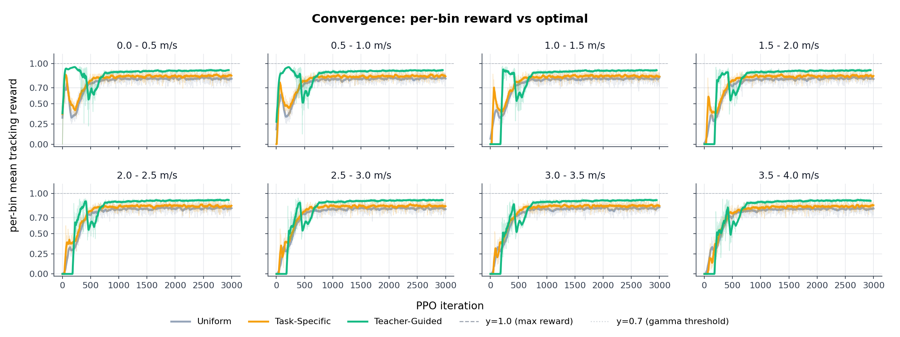

*Figure 1: Per-bin mean tracking reward versus PPO iteration, three seeds aggregated per condition.*

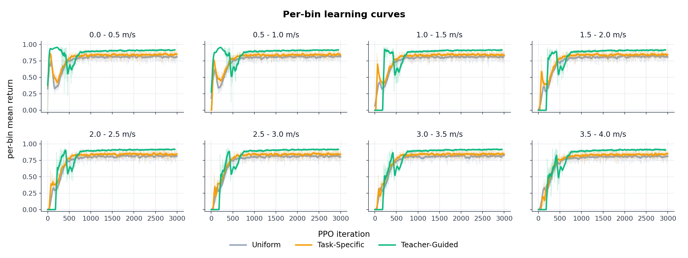

*Figure 2: Per-bin learning curves over training, three seeds aggregated per condition.*

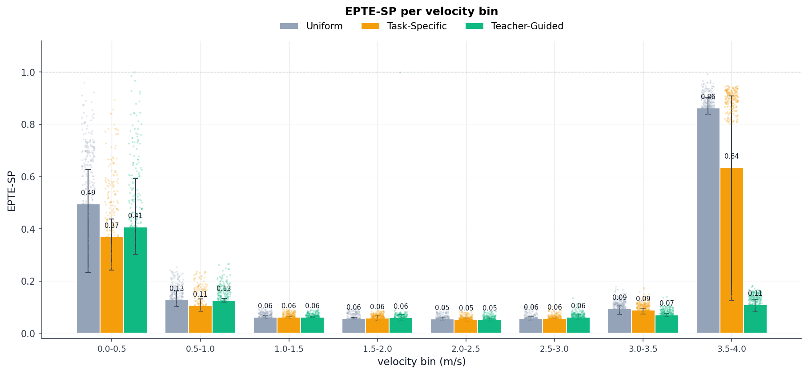

*Figure 3: EPTE-SP per velocity bin, mean over 3 seeds, error bars are min--max range across rollouts.*

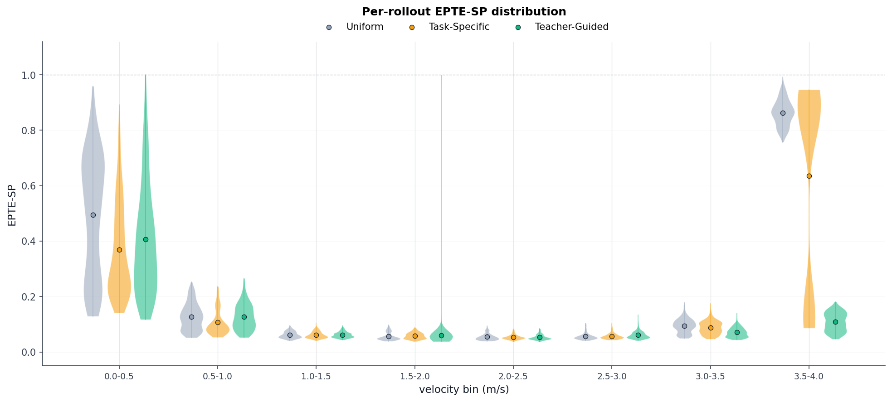

*Figure 4: EPTE-SP per velocity bin shown as violin plots over the 300-rollout distribution per cell.*

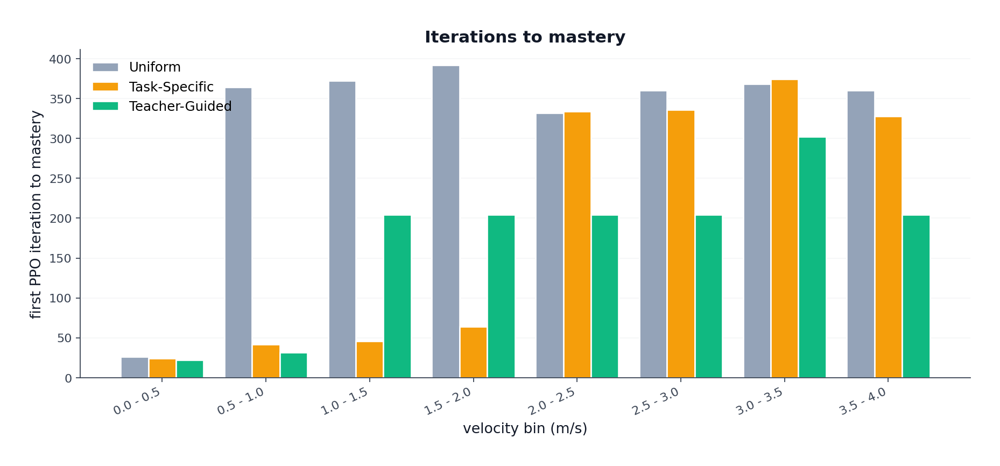

*Figure 5: First PPO iteration at which the smoothed per-bin mean tracking reward $r_{\text{lin}}$ crosses the mastery threshold $0.7$, per (condition, bin). Missing bars indicate the threshold was not crossed within the $3000$-iteration sweep.*

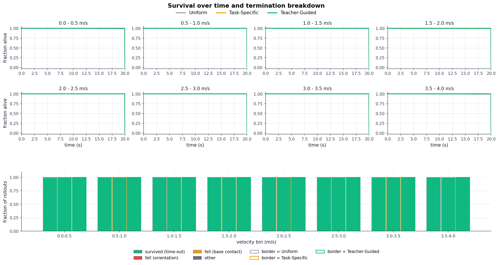

*Figure 6: Survival curves (top) and termination-cause breakdown (bottom), per (condition, bin).*

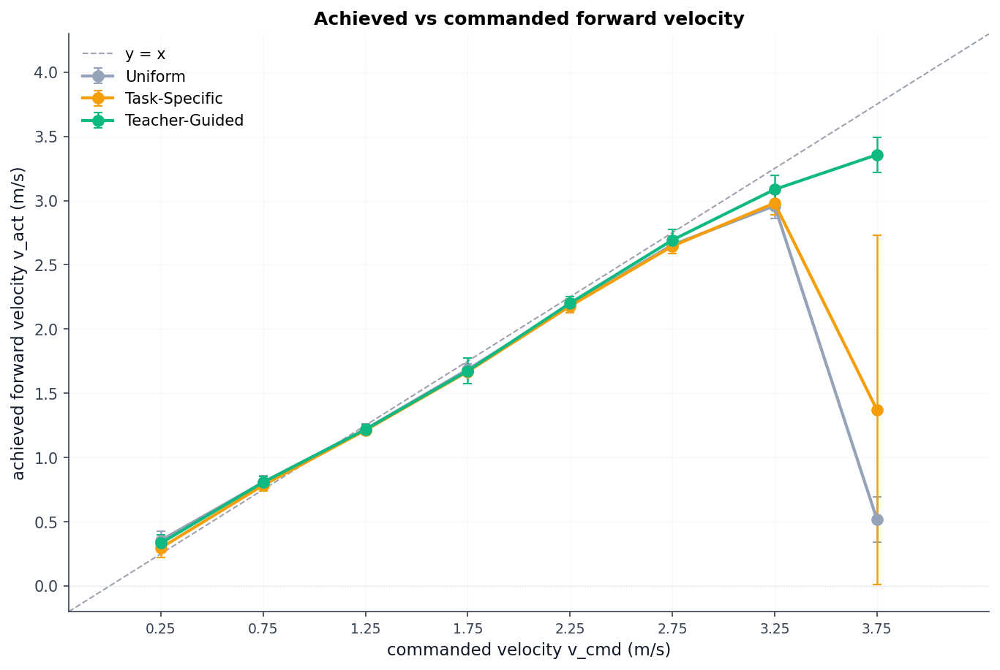

*Figure 7: Achieved forward velocity versus commanded forward velocity at bin centres.*

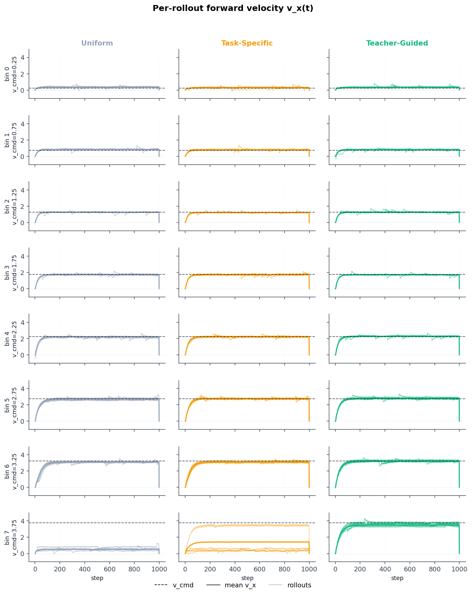

*Figure 8: Per-rollout forward velocity trace versus time, one panel per bin.*

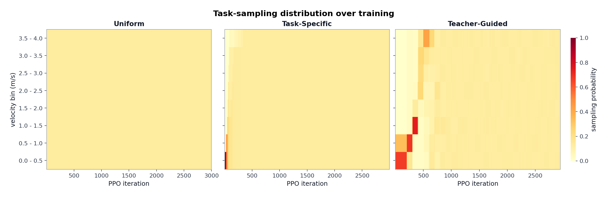

*Figure 9: Task-sampling distribution $c_j(\zeta)$ as a function of PPO iteration, per condition.*

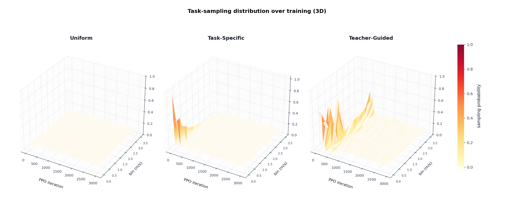

*Figure 10: Task-sampling distribution $c_j(\zeta)$ rendered as a 3-D surface (PPO iteration $\times$ bin index $\times$ probability), per condition.*

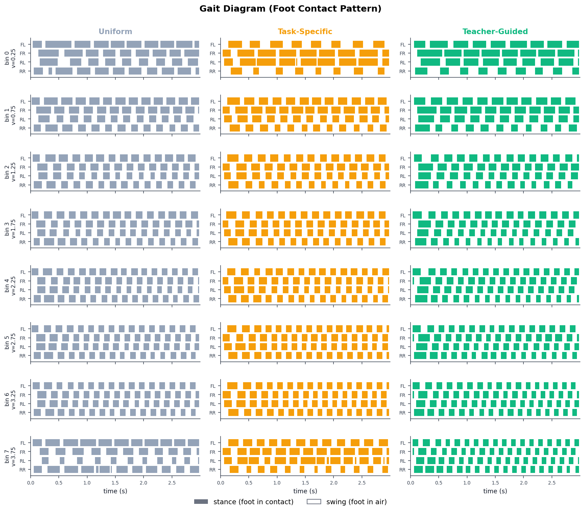

*Figure 11: Foot-contact patterns over a 3-second window per (condition, bin), one rollout per cell. Filled = stance, empty = swing. FL/FR/RL/RR = front-left/front-right/rear-left/rear-right.*

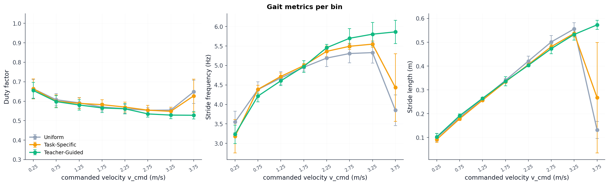

*Figure 12: Per-rollout duty factor and stride frequency versus commanded velocity, per (condition, bin).*

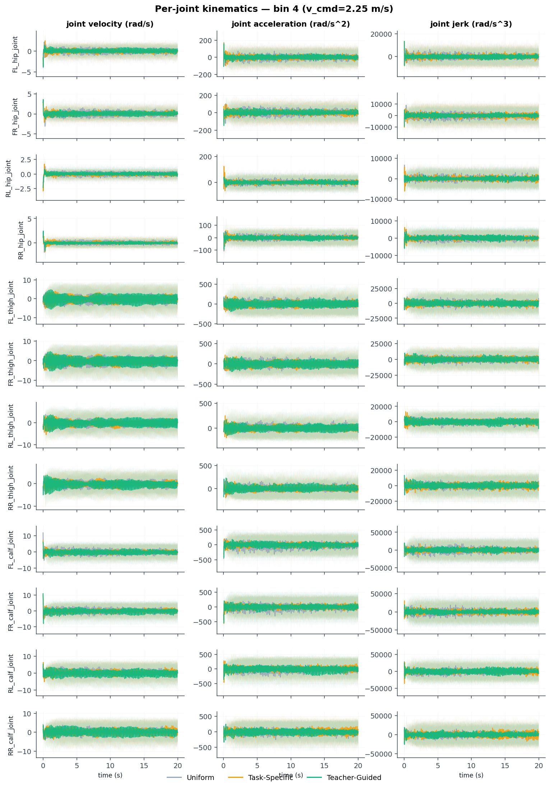

*Figure 13: Per-joint position, velocity, and torque traces during a sample rollout per (condition, bin).*

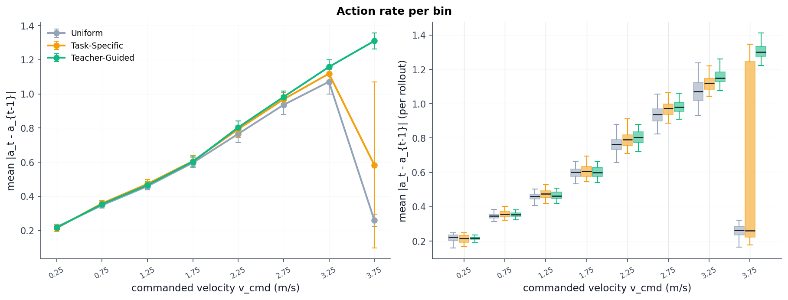

*Figure 14: Per-rollout action rate $\overline{|a_t - a_{t-1}|}$ versus commanded velocity. Left: mean $\pm$ std across 300 rollouts per (condition, bin). Right: per-rollout distribution as box plots.*

### 2.5 Qualitative behaviour

From Figures 7, 8, 11 and the per-rollout columns of `epte_sp.csv`:

- **Bins 1--6 (all conditions):** mean tracking error $0.05$--$0.13$ m/s; rollouts complete the $1000$-step ($20$-second) episode; gait diagrams show continuous alternating contact through the full window.
- **Bin 0 (all conditions):** tracking error $0.39$--$0.50$ m/s, no survival problem (the only non-time-out terminations are $11$ `bad_orientation` events on bin 0 across all conditions out of $900$ rollouts in that row). The combination of a physical lower-speed floor for trotting and EPTE-SP normalisation by the small commanded value reproduces update 1's §F6 effect.
- **Bin 7 collapse pattern (asymmetric across conditions and seeds):**
  - *Uniform* 0/3 succeed: mean achieved $v_x$ per seed $0.39 / 0.63 / 0.56$ m/s; mean tracking error $0.83$--$0.90$ m/s.
  - *Task-specific* 1/3 succeed: collapsed seeds $0.33 / 0.50$ m/s, succeeded seed 2 at $3.32$ m/s with tracking error $0.117$ m/s.
  - *Teacher-guided* 3/3 succeed: $3.29 / 3.33 / 3.47$ m/s; tracking error $0.08$--$0.12$ m/s.
- **Termination breakdown.** $7186/7200$ rollouts time out; $14$ are `bad_orientation` (uniform b0: 6, task_specific b0: 3, teacher b0: 2, teacher b2: 1, uniform b7: 2). Bin-7 collapse on uniform and task-specific is "alive but barely moving", not a fall -- qualitatively different from update 1 where bin-6/7 collapses were immediate falls.

## 3. Analysis

### 3.1 All three conditions now track up to bin 6

Update 1 saw uniform and task-specific collapse at bin 6 (EPTE-SP saturating at $1.000$, gait diagrams going empty within $\le 1$ s). Under the current reward stack, all three conditions track bin 6 with mean tracking error $\le 0.10$ m/s and all $300$ rollouts in each bin-6 cell completing the full episode. The collapse boundary moved one bin up, from b6 to b7.

The mechanism differs by condition:

- **Uniform.** The $12.5\%$ uniform exposure per bin is sufficient for bins 0--6 under the new reward. The energy term removed the competing local optimum created by the air-time bonus in update 1: without a swing-duration reward, the policy converges directly to a clean trotting gait at each speed. That removal is what extended the trackable range for uniform, not any curriculum change.

- **Task-specific.** The chain-unlock mechanism reaches bin 6 on all three seeds. The energy reward made b6 learnable once it was reached: in update 1 the sprint-retune reward left a local minimum near the b5--b6 gait-regime boundary, which the energy reward does not. Once b6 was consistently reachable and learnable, the chain advanced.

- **Teacher-guided.** The LP-driven softmax redirects sampling mass from saturating easy bins to bins still showing improvement. Bins 0--5 plateau early; the curriculum then concentrates on b6 naturally, delivering the focused exposure needed to cross the regime boundary.

Across conditions, the gait is a smooth speed-modulated trot. Duty factor falls from $0.66$ at b0 to $0.54$ at b6; no flight phase is observed at any cell. The staccato-swing artefact from update 1 §F4 is absent: zeroing the `feet_air_time` bonus removed the per-step incentive for rapid lift--plant cycling.

### 3.2 Why uniform and task-specific fail at bin 7, and why teacher does not

The bin-7 failure for uniform and task-specific is a training exposure problem, not a reward problem. The policy can only do what it was trained on. Bin 7 ($[3.5, 4.0]$ m/s) sits beyond a gait-regime transition near $3$ m/s; reaching it requires concentrated training time. None of the three conditions can provide that equally.

- **Uniform.** Budget is split $12.5\%$ per bin throughout all $3000$ iterations. That share is sufficient for bins 0--6 (where the trotting gait generalises across the range), but not for bin 7, where the policy must learn a qualitatively different, higher-effort gait. With unfocused exposure the policy defaults to slow walking when given a sprint command.

- **Task-specific.** Bins unlock sequentially. Once bins 0--6 have all unlocked, the sampling budget is divided roughly equally across all seven unlocked bins ($\approx 14\%$ each). Bin 6 then receives only $14\%$ unfocused exposure -- insufficient to cross the mastery threshold $\gamma = 0.7$ on most seeds, so bin 7 never unlocks (seeds 0 and 1). On seed 2 bin 6 crosses the threshold late, unlocking bin 7 with very little budget remaining. The chain-unlock mechanism is self-defeating at the hard end: the more bins that unlock, the less focused attention any single bin receives. The heatmap confirms this: task-specific shows all bins 0--6 lighting up simultaneously rather than the stepwise focus the proposal expected.

- **Teacher-guided.** When bins 0--6 plateau, their LP signals fade and the softmax redistributes mass to b7, the only bin still showing improvement. All three seeds receive meaningful concentrated exposure to bin 7 speeds. The heatmap shows this as the stepwise focus pattern: each bin takes a turn as the high-weight focus, then recedes as it plateaus. The result is $3/3$ seeds succeeding on bin 7, with achieved velocity $3.29$--$3.47$ m/s and tracking error $0.08$--$0.12$ m/s across seeds.

A kinematic fingerprint confirms the distinction. Mean action rate $\overline{|a_t - a_{t-1}|}$ at b7 reads $1.31$ for teacher, $0.26$ for uniform, and $0.59$ for task-specific (the latter pulled down by two collapsed seeds). Teacher's trained sprint policy requires step-to-step joint changes large enough to sustain a fast leg cycle; the collapsed uniform and task-specific policies barely actuate because they have reverted to slow walking dynamics. At b6, all three conditions sit within $1.07$--$1.16$ -- nearly tied, because all three track b6.

Per-seed bin-7 outcomes across all three conditions are:

| **Condition** | **Seed** | **Achieved $v_x$ (m/s)** | **Tracking error (m/s)** |
|---|:---:|:---:|:---:|
| uniform | 0 | 0.39 | *(collapsed)* |
| uniform | 1 | 0.63 | *(collapsed)* |
| uniform | 2 | 0.56 | *(collapsed)* |
| task\_specific | 0 | 0.33 | *(collapsed)* |
| task\_specific | 1 | 0.50 | *(collapsed)* |
| task\_specific | 2 | 3.32 | 0.117 |
| teacher | 0 | 3.29 | 0.08--0.12 |
| teacher | 1 | 3.33 | 0.08--0.12 |
| teacher | 2 | 3.47 | 0.08--0.12 |

Teacher's consistency across all three seeds rules out a lucky initialisation: the LP-driven curriculum reliably delivers the exposure needed regardless of the random seed. Uniform fails on all three seeds; task-specific succeeds only on seed 2, where the chain-unlock reached bin 7 before budget exhaustion.

Mean overall tracking error per seed (across all $8$ bins) further illustrates the separation:

| **Condition** | **Seed 0** | **Seed 1** | **Seed 2** |
|---|---:|---:|---:|
| uniform | 0.194 | 0.242 | 0.242 |
| task_specific | 0.199 | 0.220 | **0.122** |
| teacher | 0.146 | 0.102 | 0.109 |

Task-specific seed 2 ($0.122$) falls in teacher's range ($0.10$--$0.15$) precisely because it unlocked b7 before budget exhaustion. Seeds 0 and 1 ($0.20$--$0.22$) sit in uniform's range because they never sampled b7 at all.

### 3.3 Current metrics are unreliable as learning signals

The addition of $r_{\text{en}}$ broke all three metrics that would normally indicate whether the agent is still learning.

**Total reward and learning curves.** The convergence table (Table 6) reads $\bar R \in [0.81, 0.92]$ on every (condition, bin) cell, including the collapsed bin-7 cells. The mechanism: when the policy collapses on b7, it reverts to slow walking at $|v_x| \approx 0.5$ m/s with low mechanical power $P$. The energy denominator $\sigma_x |v_x| \approx 500$ is small, so $r_{\text{en}} = \exp(-P/500) \approx 1$ -- the energy term pays out near its maximum regardless of whether the command is being tracked. Simultaneously, $r_{\text{ang}} = 0.75$ unconditionally (the yaw command is fixed at zero). The loss in $r_{\text{lin}}$ from the large tracking error is roughly offset by the gain in $r_{\text{en}}$, leaving the total reward indistinguishable from a successful track.

**Iterations-to-mastery.** Computed from the same per-bin total reward; inherits the same masking.

**EPTE-SP.** All $7186/7200$ rollouts survive to time-out (only $14$ `bad_orientation` terminations, concentrated on b0 and b7-collapsed uniform). With no survival variation, EPTE-SP reduces algebraically to the tracking error term. It carries no additional information beyond Table 7a.

The consequence is that there is **no reliable online signal during training** that the policy is still improving its velocity tracking on a given bin. The only honest signal is per-bin tracking error $\overline{|v_x^{\text{cmd}} - v_x|}$, which requires a separate deterministic eval pass and is not available to the training loop.

### 3.4 The curriculum input signal is corrupted

Both curriculum operators consume per-bin total reward to drive their update rules:

- **Task-specific** compares the active bin's smoothed mean reward against $\gamma = 0.7$ to decide whether to unlock the next bin.
- **Teacher-guided** computes learning progress as $\text{LP}(\zeta) = \bar R_{\text{stage}}(\zeta) - \bar R_{\text{prev}}(\zeta)$ and feeds it into the softmax.

Under the current reward, $\bar R$ is flat and high across all bins, including collapsed ones (§3.3). Task-specific's threshold crossing no longer signals genuine velocity mastery -- it may fire because $r_{\text{en}}$ saturated, not because the policy learned to track the command. Teacher-guided's LP signal is similarly noisy: if a bin's total reward plateaus high for the wrong reason, the curriculum has no way to distinguish a mastered bin from a masked one.

---

## 4. Suggestions

**S1. Replace the curriculum input signal with $r_{\text{lin}}$.** Both curriculum operators should consume the velocity-tracking component alone,

$$r_{\text{lin}} = \exp\!\Bigl(-\,\|v_x^{\text{cmd}} - v_x\|^2 / \sigma_{\text{lin}}^2\Bigr),$$

rather than the total reward. $r_{\text{lin}}$ is immune to $r_{\text{en}}$ masking: it reads zero when the policy is barely moving and reads near-one only when the command is genuinely tracked. The implementation change is small -- the per-bin rolling buffer currently accumulates total step reward and should instead accumulate $r_{\text{lin}}$ alone. Logging $r_{\text{lin}}$ as a separate training curve would also restore the ability to read learning progress from the convergence plot.

**S2. Run more seeds for task-specific.** Task-specific seed 2's b7 success (1/3 seeds) cannot be distinguished from noise at this sample size. Five to ten seeds would establish whether the chain-unlock mechanism reaches b7 at a reproducible rate or whether seed 2 was a one-off.

**S3. Log $r_{\text{en}}$ and $r_{\text{lin}}$ per bin during training.** The purpose of $\sigma_x$ calibration is to ensure $r_{\text{en}}$ sits in a useful gradient regime -- neither saturated near $0$ (too small $\sigma_x$, no energy signal) nor saturated near $1$ (too large $\sigma_x$, no discrimination). The planned diagnostic (`src/scripts/sweep_sigma_diagnostic.py`) attempts to answer this with random-action rollouts, but random actions produce near-zero net velocity and are the wrong operating point. The relevant question is whether $r_{\text{en}}$ discriminates between a collapsed policy (barely moving at $|v_x| \approx 0.5$ m/s) and a successful policy (sprinting at $|v_x| \approx 3.5$ m/s) given actual trained-policy mechanical power at each speed. Logging $r_{\text{en}}$ per bin during training directly answers this without a separate calibration step: if $r_{\text{en}}$ reads near $1$ on both collapsed and successful bins, $\sigma_x$ is too large; if near $0$ on both, too small. Logging $r_{\text{lin}}$ per bin at the same time addresses S1, so a single logging addition serves both purposes.

**S4. Attribute the bin-7 residual gap.** Teacher-guided reaches $3.29$--$3.47$ m/s on b7 against a commanded $3.75$ m/s, leaving a gap of $\approx 0.28$--$0.46$ m/s. With the sprint-retune reward floor removed, two candidates remain: the Go2 mechanical envelope, and insufficient training budget on b7. A hand-tuned controller test at $3.75$ m/s, or an extended run holding the curriculum on b7, would separate the two.

**S5. Consider an explicit gait-pattern reward.** Duty factor stays above $0.5$ at every cell and varies by $\le 0.14$ across the full speed range; no flight phase emerged. If flight-phase gait is a project goal, the energy term alone is insufficient to produce it. A periodic reward (e.g. Wave-the-World-style contact schedule) or an explicit duty-factor target would need to be added.

---

## References

- **[margolis2022rapid]** G. B. Margolis, G. Yang, K. Paigwar, T. Chen, and P. Agrawal, "Rapid Locomotion via Reinforcement Learning," *Robotics: Science and Systems*, 2022.
- **[liacrl2026]** Z. Li, C. Li, and M. Hutter, "Scaling Rough Terrain Locomotion with Automatic Curriculum Reinforcement Learning," arXiv:2601.17428, 2026.
- **[unitree_rllab]** Unitree Robotics, "unitree_rl_lab," GitHub repository, accessed 2026-04-28. <https://github.com/unitreerobotics/unitree_rl_lab>
- **[liang2024envelope]** Q. Liang et al., "Adaptive Energy Regularization for Autonomous Gait Transition and Energy-Efficient Quadruped Locomotion," arXiv:2403.20001, 2024. <https://arxiv.org/abs/2403.20001>
